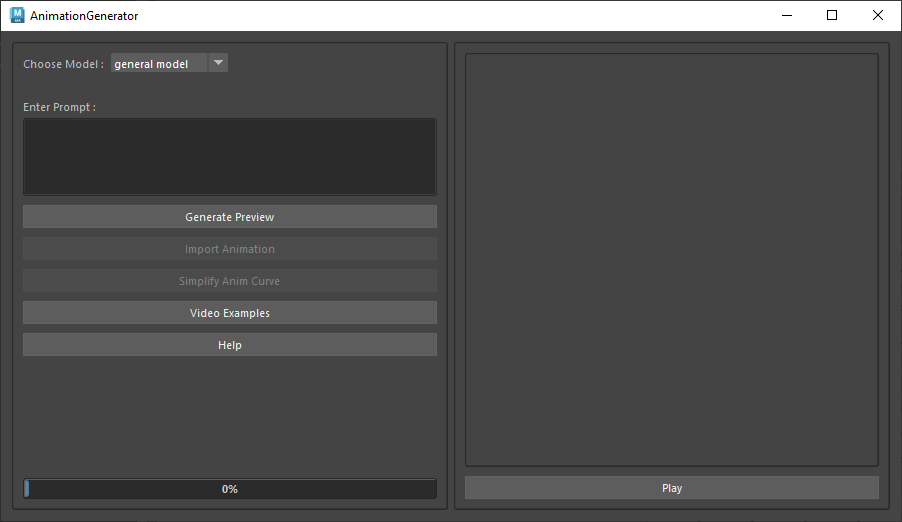
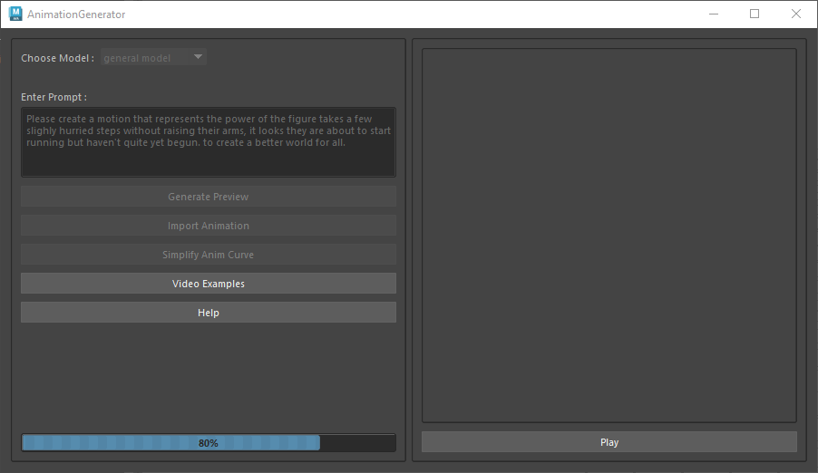
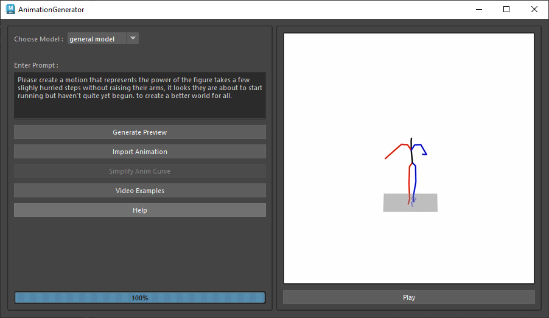
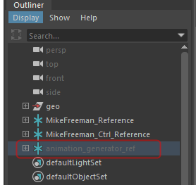
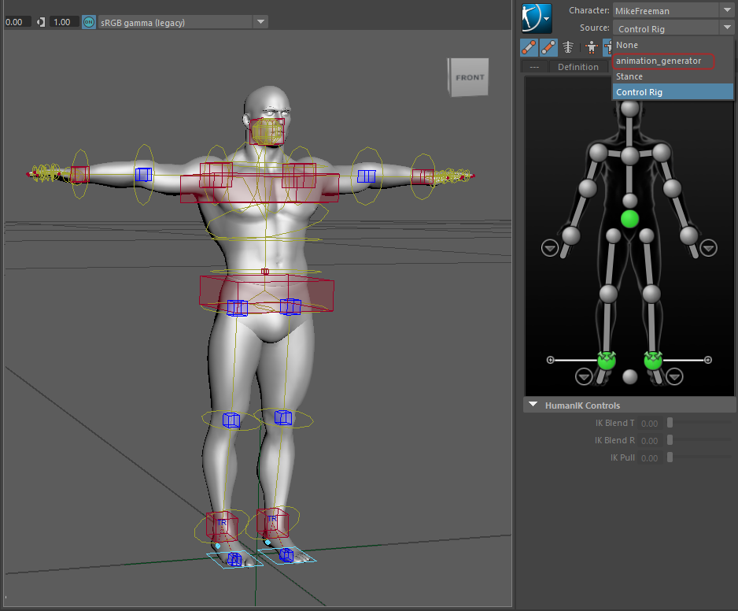
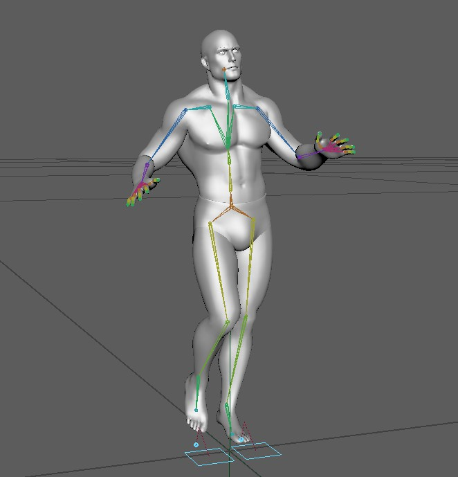

# Animation Generators Help

Animation generator tool creates animation based on user prompt, you can preview the result and then import it and apply it in any Human IK definition available in maya scene.

This tool eventually gonna import the animation and retarget it into your HumanIK definition, so it makes sense to open your target rig before you start to generate the animation process.

Run the tool animation shelf, it will open the animation generator UI.

From the *Choose Model* drop down you can select the animation generation model type, Currently we have two animation models, general model and combat model.

For all animation generations you can keep the general model as default.

Combat model has specific martial arts/sword fight related motions( which to some extend general model can generate as well)

Type your animation action text in the *Enter prompt* text box. Here are a couple of animation prompt samples for each model.

**General Prompt Sample 1** 
Please create a motion that represents the power of the figure takes a few slightly hurried steps without raising their arms, it looks they are about to start running but haven't quite yet begun. to create a better world for all.

**General Prompt Sample 2:** 
I need a motion that represents the power of a man steps forward, then picks something up with his right hand, then with his right hand, brings them close together, and sets them back down in the same order. to create progress. Can you generate it for me?

**General Prompt Sample 3:** 
Describe the movements of a person walking down a flight of stairs in person walks up then takes a large step to their left and then goes back onto the same path they were on.

**Combat Prompt Sample 1:** 
Weapon attack a man holding a Katana, executing a Charged Heavy Attack, Dual Wielding, root motion get Forward, Steady, Powerful and Relative Slow, First slow then fast, Cleanly.

**Combat Prompt Sample 2:** 
Weapon attack a man holding a Katana, executing a Charged Heavy Attack, Dual Wielding, root motion get Forward, Steady, Powerful and Relative Slow, First slow then fast, Cleanly, which make a sense of Piercing, Wide Open, Charged, Accumulating strength.

**Combat Prompt Sample 3:** 
The character grips the wedge with both hands and charges for a powerful strike. They firmly lower their body, twist to the left, lunge forward with a bow step, and stab with the sword held in both hands.

After you enter the appropriate prompt, Click the generate preview button. This process will take some time(seven mins approx, depending on the network), once the anim is generated, you can see the result in the preview window.

After preview is loaded you can play the result and see if you like it.

If the result are ok, then click the import animation button. This process should take 3 minutes(network dependent). It will import the generated animation data as human Ik rig (which is hidden in outliner)into your scene named "animation_generator_ref".

 
 

## **Retargeting**

Select your existing human ik character. Choose 'animation_generator' as source from the source dropdown

After selecting the animation_generator HumanIK as a source you will see the animation in your HumanIK.

> 
>
> We have implemented an optional step to smooth out the animation curves in **Simplify Anim Curve** button. That will be more handy for jittery motions and that happened more in combat model results.(***Please note simplify results are not always accurate***)

 
## 50 Sample Prompt for General Model

1. Please create a motion that represents the power of the figure takes a few slighly hurried steps without raising their arms, it looks they are about to start running but haven\'t quite yet begun. to create a better world for all. 
 

2. I need a motion that represents the power of a man steps forward, then picks something up with his right hand, then with his right hand, brings them close together, and sets them back down in the same order. to create progress. Can you generate it for me? 
 
    
3. Describe the movements of a person walking down a flight of stairs in person walks up then takes a large step to their left and then goes back onto the same path they were on. 
 
    
4. I need a motion that represents the power of a person lifts both hands above their head, moves both hands rapidly outwards and back to above their head, then lowers both arms. to create positive change in the fight against hunger and malnutrition. Can you generate it for me? 
 
    
5. Generate a motion that embodies the idea of a person takes two steps forward, then walks sideways three steps, then walks forward diagonally and to the right three steps. 
 
    
6. Give me a gesture that visualizes a person walks forward one foot in front of the other until he loses his balance and tilts far to the left then stumbles to his left. 
 
    
7. Produce a movement that visualizes Input: a person\'s right hand moves towards the ground, the left hand, left leg, and right leg touch the ground in order. the person turns and starts the same movement beginning with the person\'s left hand. 
 
    
8. I need a motion that represents the power of a person\'s squats down using mainly their right leg, their left leg crosses their right leg, and then they stand back up to create a better world for future generations. Can you generate it for me? 
 
    
9. hands go to the chest moving back and forth, left hand place on the right upper arm as while as right hand is place on the left upper arm. describes the movements of someone practicing swing dance. 
 
    
10. Create a sequence of movements that exemplifies person walks to the right then turns around and walks to the left before turning around and returning to starting position 
 
    
11. Describe the movements of a person doing a plank in a person stands with arms out partway to each side, lifts his right leg, swings it forward briefly, then sweeps it in a semicircle behind him before moving it forward and standing again; he then repeats the action.. 
 
    
12. I would like to see the motion of a person is attempting to jump rope by hopping from one leg to the other as if running in place, but has to reset every two to three jumps. 
 
    
13. Demonstrate a dance that symbolizes the feeling of the figure walks from the bottom right to the top left of the square, and bends down as if picking something up twice. then it turns around. 
 
    
14. I need a motion that represents the power of a man waves his hands from side to side then does a submersion move and passes his right hand from the top left to right lower. to create a better world for future generations. Can you generate it for me? 
 
    
15. Give me a motion that reflects the idea of a person standing up throws something forward from above their head, then throws something again forward from above their head with more force which makes them take one step forward with their right foot. 
 
    
16. Give me a motion that expresses a person walks to the right makes a u-turn clockwise and returns to the left of their initial position facing away 
 
    
17. I need a motion that represents the transformation of a person makes a shaking motion in front of their face with their right hand and then makes the motion of picking up an object and taking a drink with their right hand.. Can you generate it for me? 
 
    
18. Create a dance that symbolizes a person bends down to pick something up with their left arm, sets it down with their right arm, and then starts to pour something into it. 
 
    
19. I want a motion that represents the power of a man gets up from the ground pushing off with his right hand then walks in a counter counterclockwise circle back to where he began then lays down flat on the ground on his back. to create positive change in the arts. Can you generate that? 
 
    
20. Develop a movement that represents Input: the person is in a sitting position with his arms in front them when they raise their arms out to the side, lower them, and raise their arms again before bringing them back to their original position. 
 
    
21. Please create a motion that represents the power of someone put their arms on their chest, put one hand on their hip and put the other end out like a teapot, and then moved head around in a circle. to inspire change. 
 
    
22. Describe the movements of a person doing a handstand press in the person throws out their right arm in front of them then brings both hands to their mouth before lowering them together to the center of their body.. 
 
    
23. Create a motion that depicts Input: a person rotates their head, then rotates the arms from the shoulders left, right, then left, and then rotates the arms from the elbows in each direction. 
 
    
24. Develop a motion that symbolizes a person lifts up their arm at a 120 degree angle twice and then reverts their arm to the opposite lower part of their body. 
 
    
25. Describe the movements of a person walking down a flight of stairs in a person who is standing with his arms by his sides does three straight jumping jacks and returns to standing with his arms by his sides.. 
 
    
26. Please create a motion that represents the magic of the person steps a little wider than shoulder width apart first with their right foot, then with their left before squatting 4 times.. 
 
    
27. Please create a motion that represents the uniqueness of a man is mixing something infront of his body and seems to pick it up with his right hand and then proceed to mix it back. then picks it up with his left hand while standing still. 
 
    
28. Create a motion for the caption: a person takes a step forward, squats down, places their left hand on the ground in front of them, moves their hand slightly counter counterclockwise then stands up. 
 
    
29. Create a choreography for the caption: a person makes an underhanded throw with his right arm, as if rolling a ball, before raising both arms into the air as if throwing a ball, then he takes two steps back and runs forwards quickly. 
 
    
30. Generate a motion that conveys a person does a single knee down with left leg with right leg stepping forward while raising right arm up to head level and placing its forearm in front of face, and then resume the original position. 
 
    
31. I need a human motion that conveys the feeling of a person is holding his arms straight out to the sides then lowers them, claps, and steps forward to sit in a chair. Can you generate it for me? 
 
    
32. Please create a motion that represents the chaos of subject is sitting flat on the ground feat straight in front then the subject stands straight up then sits back down with feet straight out in front again. 
 
    
33. Show me a sequence of movements that evokes with hips swaying like a woman walking, this person takes 4 steps up the stairs, turns to the right on steps 5 & 6, then walks down the stairs in 4 more steps, walking back to where they started. 
 
    
34. Develop a motion that captures the idea of a person who is standing with his arms extended at shoulder height drops his hands to his knees and holds that position before raising his arms to his original position. 
 
    
35. Generate a dance that interprets Input: a man walks forward and picks up an object with his right hand, then puts the object back down and steps backward. 
 
    
36. Create a person squats down to the ground, picks up a box, then stands back up, and places the box on a higher surface. to describe a person playing volleyball. 
 
    
37. Generate Motion: a person walks up to shake with their right hand, turns slightly right to shake again, and turns right again to shake for a final time. 
 
    
38. Can you generate a motion that portrays a person steps forward with their left foot, then steps with their right foot, does a 180 degree turn to the right on their right foot, steps forward with their left foot and right again. in a realistic way? 
 
    
39. Show me a motion that represents man stands holding both arms up at his sides at a right anglefor 7 seconds then brings both hands down together to his left side and squeezed an object. 
 
    
40. Show me a gesture that conveys a person is standing and moves their arms up to their face to take a sip of something in their hand. 
 
    
41. I want a motion that represents the power of the person is in a sitting position with his arms in front them when they raise their arms out to the side, lower them, and raise their arms again before bringing them back to their original position. to create positive change in the world. Can you generate that? 
 
    
42. I want to see a motion that represents the pain of a person is appears to be holding a broom, left hand over right hand, and sweeps toward the left, and then starts rotating to the right while sweeping toward the right.. Can you generate that? 
 
    
43. Generate a person steps forward and shakes both hands together in a begging manner, and then steps back. the person steps forward again and shakes both hands in a begging manner but more aggressively. for a person practicing bouldering. 
 
    
44. I want a motion that represents the power of a person standing on one foot holds their left hand up while moving their right foot in a side to side motion. to create a better world. Can you generate that? 
 
    
45. I want a motion that represents the power of starting from their left foot in the air, person stands ready with fists up then takes two swings with their right hand downward then two more high and to their right and finally two lefts downward mirroring the rights from before. to create positive change in the field of peacebuilding and conflict resolution. Can you generate that? 
 
    
46. Create a sequence of movements that embodies the meaning of man reaches down to the left as to pick up item and then reaches to the right as if emptying item then replaces it to the left. 
 
    
47. Create person turns around from front to rear and whilst holding his hand and arm stomach level then turns around again and goes to original position to describe a person performing a tap dance. 
 
    
48. Show me a motion that exemplifies the sentiment of Input: a person is running on the spot, then turns left and jabs with both arms, then turns right and continues running on the spot. 
 
    
49. Demonstrate a dance that conveys Input: a person who is standing with his arms by his sides jumps in place twice and then shifts his body right and left while remaining in place. 
 
    
50. I need a motion that represents the power of a man is locking his hands behind his back and sweeping his legs left and right, in a dance like motion. to create progress. Can you generate it for me? 
 

## 50 Sample Prompt for Combat Model

1. Weapon attack a man holding a mist raven, executing a left-handed, light attack, root motion get towards leftbackward, light-weighted, straightforward and swift, cleanly, which make a sense of featherlike. 
 
    
2. Weapon attack a man holding a umbrella, executing a left-handed, charging, root motion get in-place, steady and. 
 
    
3. The character attacks with a charged attack using a mechanical umbrella in their left hand. Starting from a squatting position with their left hand raised, they lean to the left after being hit, stagger their legs once, and then return to the squatting position with the umbrella. 
 
    
4. Weapon attack a man holding a sabimaru, executing a left-handed, light attack, attack underwater, root motion get in-place, light-weighted, straightforward and relative fast, first slow then fast, which make a sense of slash, featherlike, smooth and coherent, roundabout. weapon attack a man holding a mist raven, executing a left-handed, light attack, dual wielding, root motion get in-place, light-weighted, straightforward and swift, cleanly, which make a sense of featherlike, smooth and coherent. 
 
    
5. Weapon attack a man holding a katana, executing a right-handed, dual wielding, charged heavy attack, root motion get forward, steady, powerful, charged, accumulating strength and relative slow. 
 
    
6. The character slightly bends their legs, floats in the air with a light feeling, and raises their right hand to charge. 
 
    
7. Weapon attack a man holding a fan, executing a right-handed, light attack, chasing slice, root motion get forward, steady, powerful, straightforward and relative fast, cleanly. 
 
    
8. The character uses the mist crow in their left hand to perform a swift and direct attack, doing so lightly and quickly. 
 
    
9. The character swings the wedge ball from left to right with their right hand, and then flips backward with their left hand on the ground. 
 
    
10. Weapon attack a man holding a mist raven, executing a left-handed, light attack, root motion get forward, light-weighted, straightforward and swift, cleanly. 
 
    
11. The character faces to the left, steps forward with their left foot in a bow stance, and swings their right hand from upper left to right. Finally, they return to the standing position. 
 
    
12. Weapon attack a man holding a katana, executing a right-handed, root motion get in-place, steady, charged, accumulating strength and . 
 
    
13. The character performs a left-handed heavy attack with a mechanical lance, turning their body heavily to the left, right leg stretched forward, left leg in a bow stance. Then, they rotate their body back, thrust forward with both hands, leaning their body forward. Finally, they swing their left hand downward once and return to the standing position. 
 
    
14. Weapon attack a man holding a mist raven, executing a left-handed, light attack, root motion get backward, light-weighted, straightforward and swift, cleanly, which make a sense of featherlike. 
 
    
15. Weapon attack a man holding a finger whistle, executing a left-handed, light attack, attack underwater, root motion get in-place, light-weighted, straightforward and uniform speed, which make a sense of smooth and coherent, relaxing. 
 
    
16. Weapon attack a man holding a sabimaru, executing a left-handed, light attack, root motion get forward, light-weighted, straightforward and relative fast, first slow then fast, which make a sense of slash, featherlike, smooth and coherent. 
 
    
17. Weapon attack a man holding a axe, executing a left-handed, dual wielding, chasing slice, light attack, root motion get forward, steady, powerful, straightforward and uniform speed, cleanly. 
 
    
18. The character uses the mist crow in their left hand to perform a swift and direct aerial attack, floating lightly in the air, swinging their left hand from the upper right to the left, and leaning forward with their body. 
 
    
19. The character uses the ninja righteous hand to perform a right-hand light attack with a kunai pursuit. They solidly dash forward to the left, draw a knife from their waist with their right hand, and step forward with their left foot in a bow stance. At the same time, they swing the knife from the upper left to the lower right. Then, they return to the standing position. 
 
    
20. Weapon attack a man holding a umbrella, executing a left-handed, light attack, root motion get in-place, steady and uniform speed. 
 
    
21. Weapon attack a man holding a umbrella, executing a left-handed, charging, root motion get in-place, steady and uniform speed. 
 
    
22. Weapon attack a man holding a katana, executing a right-handed, root motion get forward, steady, charged, accumulating strength and relative slow. 
 
    
23. The character leans forward while floating in the air, thrusts their right hand forward, then flips forward before floating in the air again and standing on one foot. 
 
    
24. The character attacks with a charged attack using a mechanical umbrella in their left hand. Starting from a squatting position with their left hand raised, they lean back after being hit, let their left hand hang down once, and then return to a standing position. 
 
    
25. Weapon attack a man holding a umbrella, executing a left-handed, charging, root motion get in-place, light-weighted and swift, which make a sense of featherlike, resisting. 
 
    
26. Weapon attack a man holding a katana, executing a right-handed, root motion get in-place, steady, charged, accumulating strength and swift. 
 
    
27. The character hovers in the air and lands, then turns to the right and violently strikes forward with the left elbow, and then returns to a standing position. 
 
    
28. The character floats in the air, then lands and charges to the right while simultaneously preparing to attack. They thrust their right hand with the wedge forward, slide forward, and then rise again while floating in the air. 
 
    
29. The character steps forward with alternating feet, slightly lowers their body, and swings their left hand from right to left. Finally, they return to the standing position. 
 
    
30. The character performs a light attack with a mechanical spear in their right hand, using a chasing attack with a wedge projectile. They solidly sprint forward with their body facing to the left, draw the sword from their waist with their right hand, step forward with their right foot in a lunge towards the right front, and swing the sword from left to right. Then, they return to a standing position. 
 
    
31. Weapon attack a man holding a katana, executing a right-handed, air attack, root motion get forward, steady, powerful, straightforward and relative fast, which make a sense of slash, smooth and coherent, wide open. 
 
    
32. Weapon attack a man holding a katana, executing a right-handed, dual wielding, root motion get forward, steady, powerful, straightforward and relative fast, which make a sense of slash, wide open, relaxing, instant burst. 
 
    
33. The character uses a rusted blade in their left hand to perform a light attack. They move forward with light steps, their left hand raised to head height. The character alternately paces forward with their feet until they come to a stop, turning to face the right side. Then, they step forward with their right foot in a lunge, swinging their left hand downwards. Finally, they return to a standing position. 
 
    
34. Weapon attack a man holding a katana, executing a right-handed, root motion get in-place, steady, straightforward and swift. 
 
    
35. The character runs forward, stops with their right foot, spreads their legs in a horse stance, leans their body forward, and lifts both hands high, swinging them forward and crossing them. They return to a standing posture. The movement is light and consistent, giving a sense of lightness and expansiveness. 
 
    
36. The character used both hands, charging forward with a solid sprint. Then, they rotated their body to the right side and stepped forward with their right foot in a bow stance. Holding the rusty blade in both hands, they thrust it forward from the right side. Finally, they returned to a standing position. 
 
    
37. Weapon attack a man holding a, executing a right-handed, charged heavy attack, run attack, root motion get forward, heavy-weighted, powerful and swift. 
 
    
38. Weapon attack a man holding a sabimaru, executing a left-handed, light attack, dual wielding, root motion get forward, steady, straightforward and relative fast, cleanly, which make a sense of slash, wide open, instant burst. 
 
    
39. Weapon attack a man holding a umbrella, executing a left-handed, light attack, root motion get in-place, light-weighted and swift, which make a sense of featherlike, resisting. 
 
    
40. The character uses undead slasher to perform a right-handed aerial attack. They crouch on the ground, pull the sword out of the scabbard on their back with their right hand, touch the blade with their left hand, and then swing it forward. Afterward, they stand up straight. 
 
    
41. Weapon attack a man holding a katana, executing a right-handed, dual wielding, air attack, root motion get falling, steady, powerful, straightforward and relative fast. 
 
    
42. The character jumps up into the air and rotates clockwise twice, swinging the wedge in the air. weapon attack a man holding a katana, executing a right-handed, charging, root motion get falling, steady and uniform speed, which make a sense of smooth and coherent. 
 
    
43. The character holds the wedge-shaped object high and then releases it with their right hand, striking the ground, before standing back up. 
 
    
44. Weapon attack a man holding a katana, executing a right-handed, run attack, root motion get forward, powerful, charged, accumulating strength, light stagger and first slow then fast, uniform speed. 
 
    
45. The character draws the undead slayer from behind with their right hand, raising the sword blade high to the left. They touch the sword blade with their left hand, then swing it forward. Finally, they sheathe the sword back into its scabbard. 
 
    
46. The character jumps in place, swings their left hand to the upper right while turning their body towards the front, and then lands back to the standing position. 
 
    
47. The character deftly places the whistle by their mouth with their left hand, then tilts their head back and blows the whistle forcefully upwards, before returning to a standing position. 
 
    
48. The character uses a mechanical axe to lightly strike with their left hand, using both hands, and performs a wedging follow-up attack. In a position facing the rear, they stand on their left leg with their right leg bent. After kicking up their left leg, they rotate in the air and swing downward, landing in a squat position facing the right side. Finally, they return to a standing position.
