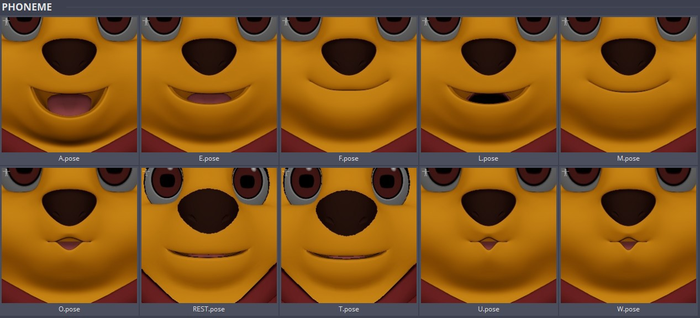
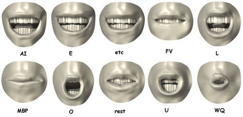
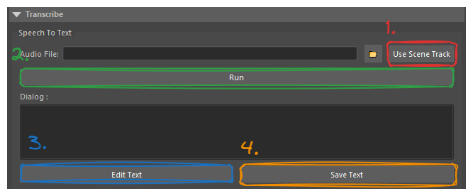
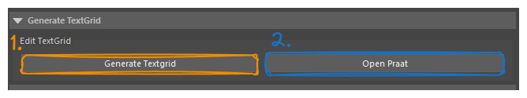
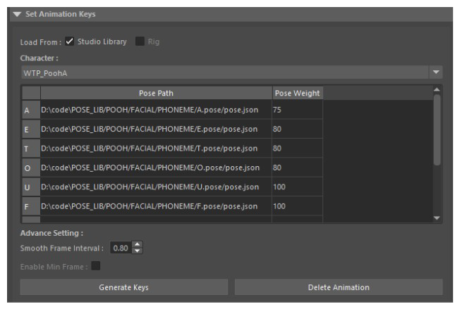

> **Version 1.0.0**

# Pose Library

## Prepare Pose Library

1.  Directory Path Setting

    1.  Make sure the pose are save in {CHARACTER}/FACIAL/PHONEME

    2.  The tools is scripted read for the project pose library path

    3.  Sample

```
//sun/Anim-Jobs/ODDBOT/WTP2/PRODUCTION/07_Libraries/05_A nims/01_StudioLibrary/POOH/FACIAL/PHONEME/A.pose/pose.json
```

## Prepare Pose

1.  To generate facial animation use need to create 10 pose

> Phoneme Pose Example : [Phoneme Example](https://www.garycmartin.com/phoneme_examples.html)



> 

## User Interface Intro

### Transcribe

1.  Use Scene Track Used current scene file audio track

2.  Run Transcribe the audio file into .txt file

3.  Edit Text Edit the transcribe (.txt) file

4.  Save Text Save the edited file


### Generate TextGrid

1.  Generate Text Grid Run MFA used transcribe txt and audio to generate textgrid

2.  Open Praat External software for visualize/edit the textgrid data


### Set Animation Keys

1.  Load From Load the data from Studio Library or Rig

2.  Character Query Scene Referenced Character

3.  Smooth Frame Interval Ignores keyframe closer in timeline with the value

4.  Generate Keys Used Pose Path and Pose weight to set keys (This will create animation layer)

5.  Delete Animation Used select character in the UI to delete the animation layer


## Example

> Check the MOV : 
```
L:/LEMONSKY/LSA_PIPELINE/02_RnD/Tools_Library/Animation/Animation/Animation/audio_to_animation/doc/video
```
<br>


## Credits

> Joaen https://github.com/joaen - Convert Text-gird Phoneme to Libri-speech English pronunciations
>
> Open AI whiper https://github.com/openai/whisper - Used Model to do the transcribe
>
> Advance Sekeleton [https://www.animationstudios.com.au/advanced-skeleton](http://www.animationstudios.com.au/advanced-skeleton) - Learn Different language dictionary pronunciations
>
> ultimatevocalremovergui https://github.com/Anjok07/ultimatevocalremovergui - Used this tool to remove background music
