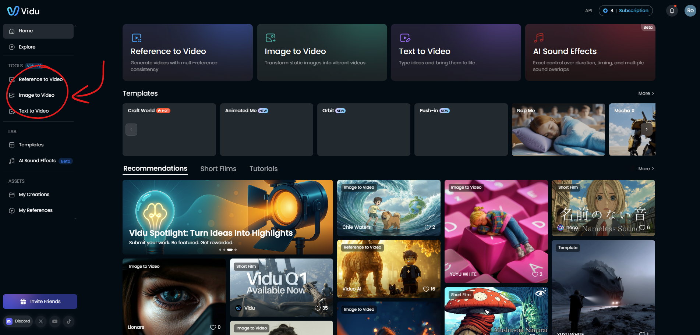
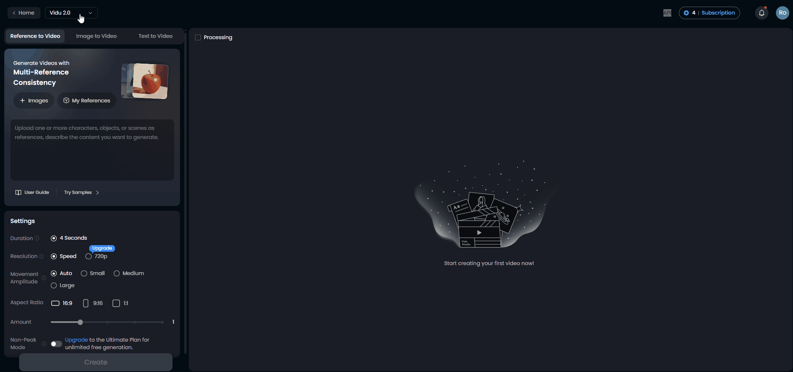
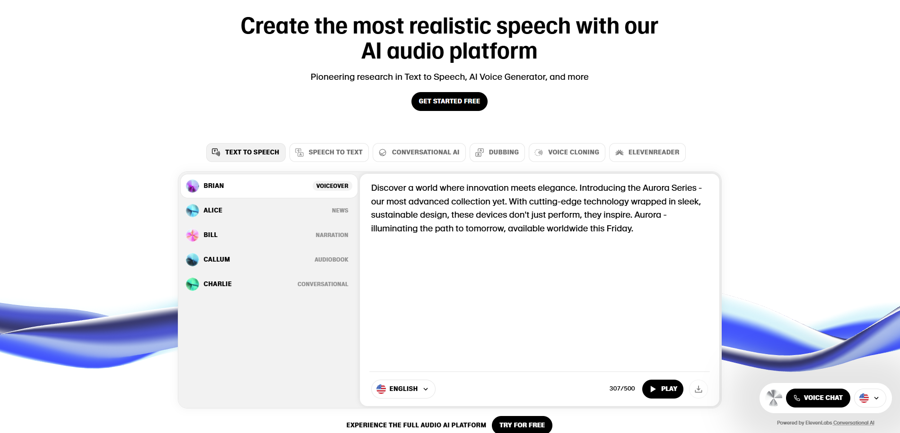
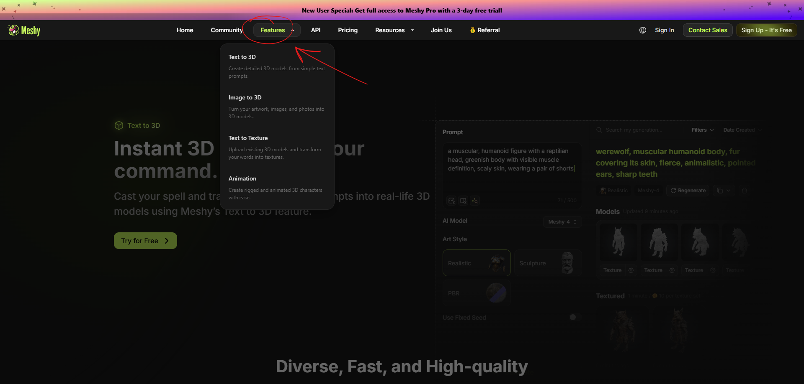
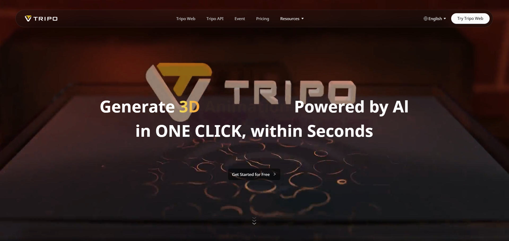
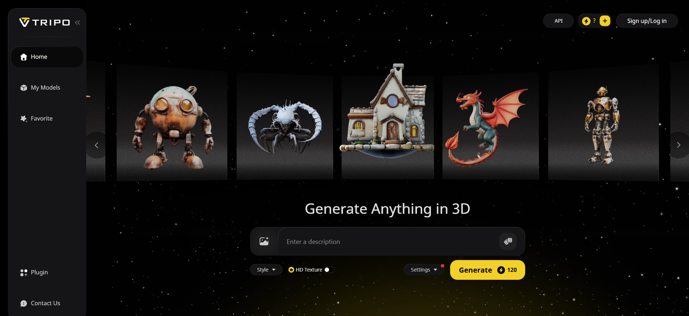
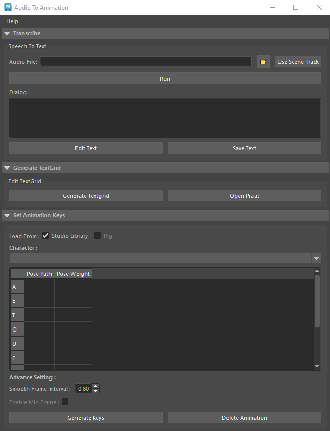
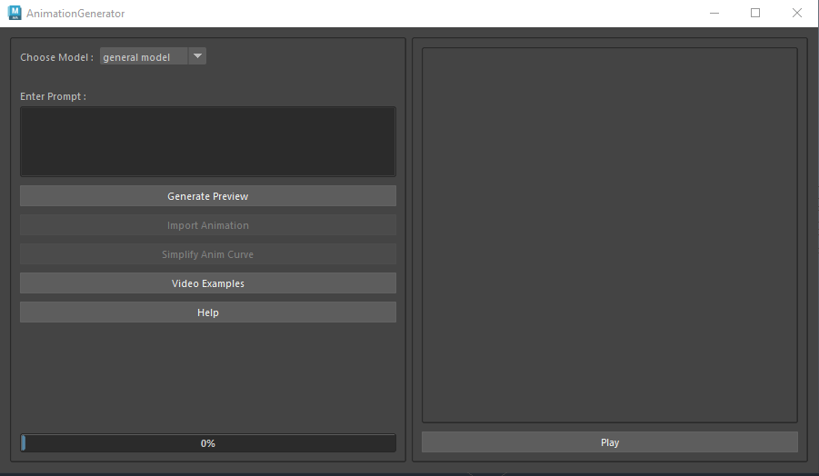
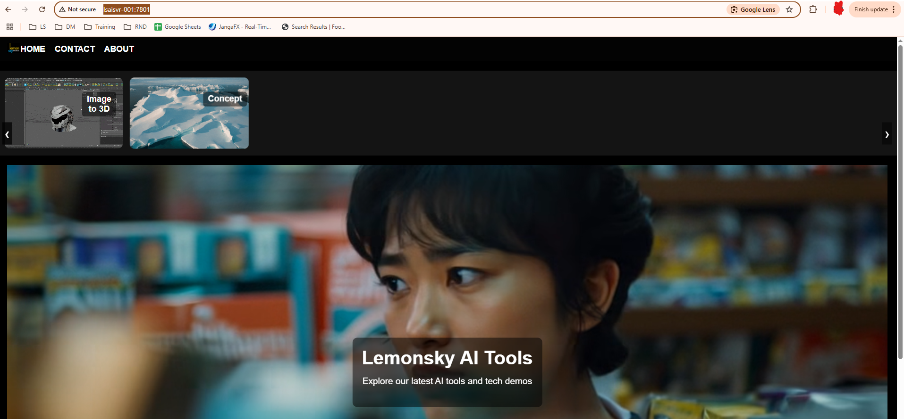

# **LS AI Generators**

**last updated**

Author - Robin Koh \| Kung Sheng<br>
Collaborators - Sumesh<br>
<br>
Communication is what makes a team strong.<br>
Google is your best friend.<br>


*For content page:\
Go to **View \> Show outline** to see outline navigation on the left side*

<br>

## **💬 ChatGPT Plus**

- [https://chatgpt.com/](https://chatgpt.com/)

<br>

## **🎥 Vidu**

- [https://www.vidu.com/create](https://www.vidu.com/create)

- Able to generate videos based on 3 options;



1.  Reference to Video

    - Using multiple character/objects/scenes as references, describe the content that you would like to generate

2.  Image to Video

    - Using a single image, describe the content that you would like to generate

3.  Text to Video

    - The most basic form of describing the content that you would like to generate

- Vidu is also dependant on the model type that you are using




<br>

## **🦜 ElevenLabs**

- [https://elevenlabs.io/](https://elevenlabs.io/)



- Speech Synthesiser

  - Text to Speech

  - Speech to Text

  - Voice Changer

  - Dubbing

  - Text to SFX

  - Voice Cloning
 

<br>

## **👨‍🏭 Meshy**

- [https://www.meshy.ai/](https://www.meshy.ai/)



- 3D Model Generator

  - Text to 3D Model

  - Image to 3D Model (tourism)

  - AI Texturing

<br>

## **👩‍🏭 Tripo**

- [https://www.tripo3d.ai/](https://www.tripo3d.ai/)



- 3D Model Generator

  - Text to 3D Model

  - Image to 3D Model (haro kitty)

    - With the aid of images, the 3D silhouette of the object is pretty close to the actual object's silhouette and the details are also quite okay

<br>

##  **Audio to Animation**



- Able to generate a basic facial animation (lip sync) using an audio file inside Maya

  - The audio file will generate lines of text in the dialogue box which will be integrated and synced into the facial poses that have been set based on the mouth shape of certain sounds

- Refer to: [Audio_to_Animation_ReadMe](./AI_Audio_to_Animation_ReadMe.md)
```
N:/pipeline/Tools/Maya/scripts/anim/Audio_To_Animation/doc/ReadMe_local.pdf
```
<br>

##  **Animation Generator**



- Able to generate animation based on the text prompt inside Maya

- More towards HIK (game side)

Refer to:

- [Animation Generator Examples MP4](N:\pipeline\Tools\Maya\scripts\anim\animation_generator\doc\examples)
```
N:\pipeline\Tools\Maya\scripts\anim\animation_generator\doc\examples
```
- [**Animation_generators_help**](./AI_Animation_Generator_Help.md)<br>

  
<br>

## **🤖 Lemonsky AI**

- WIP tools web interface to access our AI tools (WIP to including more tools)

[http://lsaisvr-001:7801/](http://lsaisvr-001:7801/)


