# 3DS MAX Documentations

# 👉🏻 Picker 👈🏻

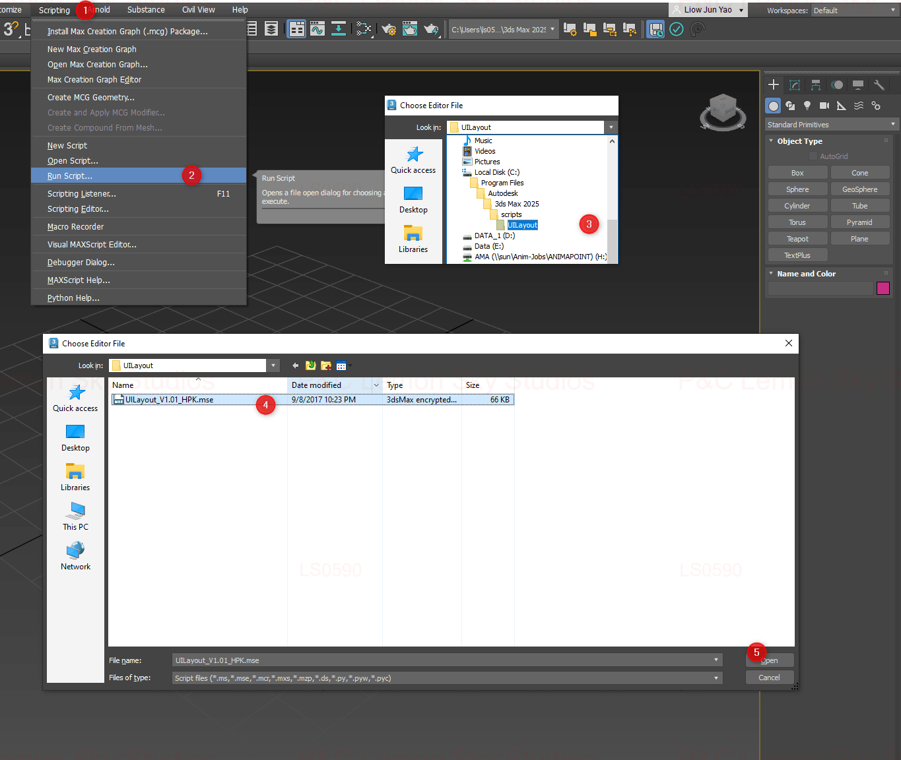

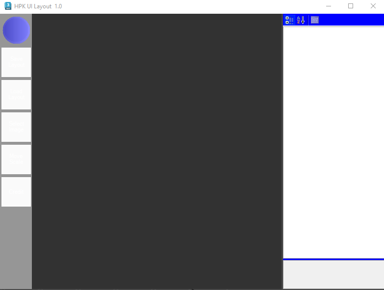

# 💻 Getting Started

Before doing anything, it is advisable to do the necessary setting changes to make your user experience better and to further understand the Do’s and Don’ts of using this software

## **🧾 3ds Max Terminology**

**Maya terms			➡	3ds Max terms**

Bake 				**➡** 	Collapse

Graph Editor 			**➡**	Curve Editor	

Hypergraph (Shader) 	**➡** 	Slate Material Editor

Hypergraph (Hierarchy) 	**➡** 	Schematic View

Outliner 			**➡** 	Scene Explorer		

Playblast 			**➡** 	Preview

### **🎮 Interaction Mode**

** \
	**If you are coming from Maya, then 3ds Max’s key bindings would be 

a complete 180 degrees change, fret not for you are able change your mouse and keyboard’s key bindings to follow the other software of your choice

**Customize ➡ Preferences ➡ Interactive Mode**

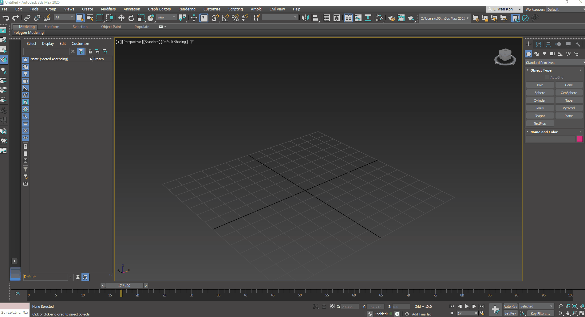

# 📹 Preview (Playblast)

	In 3ds Max, a Playblast is known as a **Preview**. There are 3 ways to create a preview;

**Method 1**

- Click on the [+] icon at the top left of your viewport

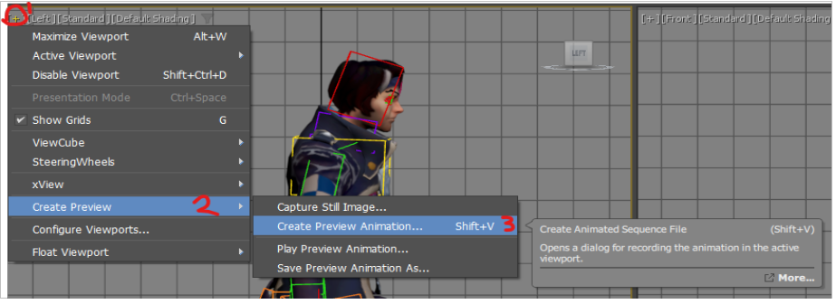

**Method 2**

- Click on the Tools at the menu

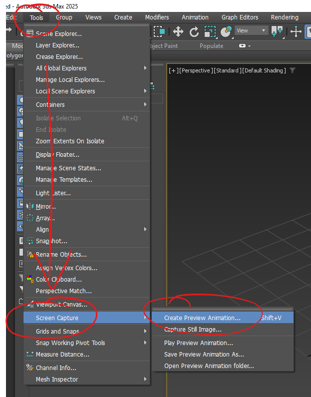

**Method 3**

- Press [ Shift ] + [ V ]

After you have clicked on “Create Preview Animation…”, you should see this window

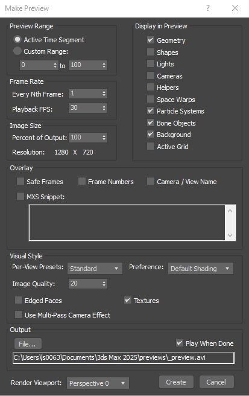

1. Under the Preview Range, ensure the frame range is set correctly

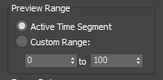

1. Under the Frame Rate, make sure your FPS is set correctly…

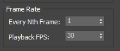

…As for the “Every Nth Frame”, looking at the above image, it means that it is playblasting on every frame. For example, if you set it to 5, it means that it is playblasting on every 5 frames

1. Under Image Size, you are can set the correct resolution by heading to the Render Setup

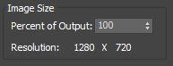

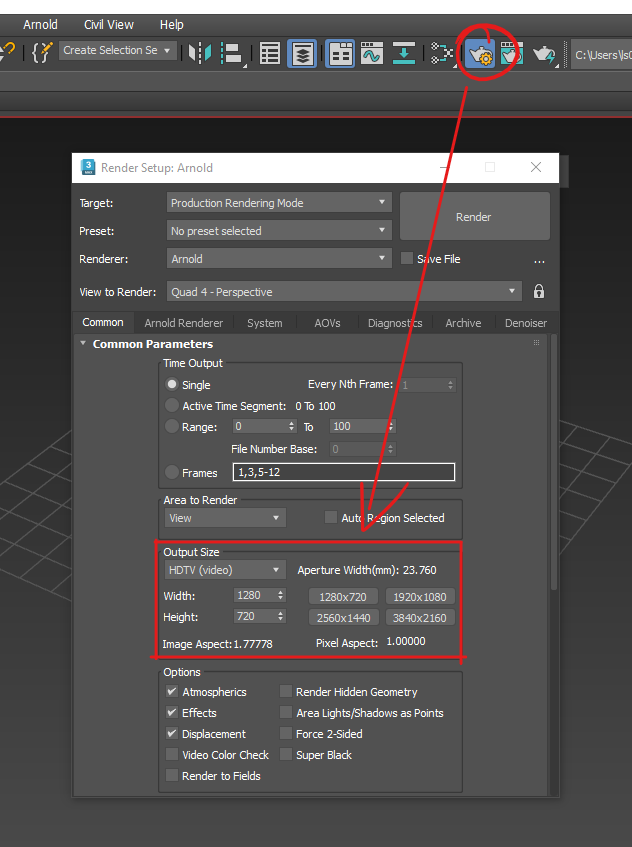

1. Under “Display in Preview”, please select what you would like to show

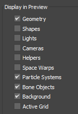

1. Under “Overlay”, please turn on the Frame Numbers and Camera/View Name. Safe frames will depend on the situations (consult your lead if necessary)

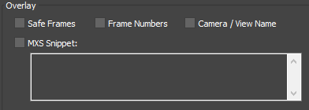

1. Under “Visual Style”, you can bump up the Image Quality to 100 while the rest can be left as it is

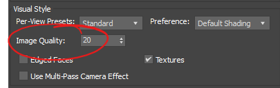

1. For “Output”, once you have clicked File, it will open up another window…

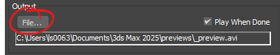

…which you need to click on Setup, which again opens up another window…

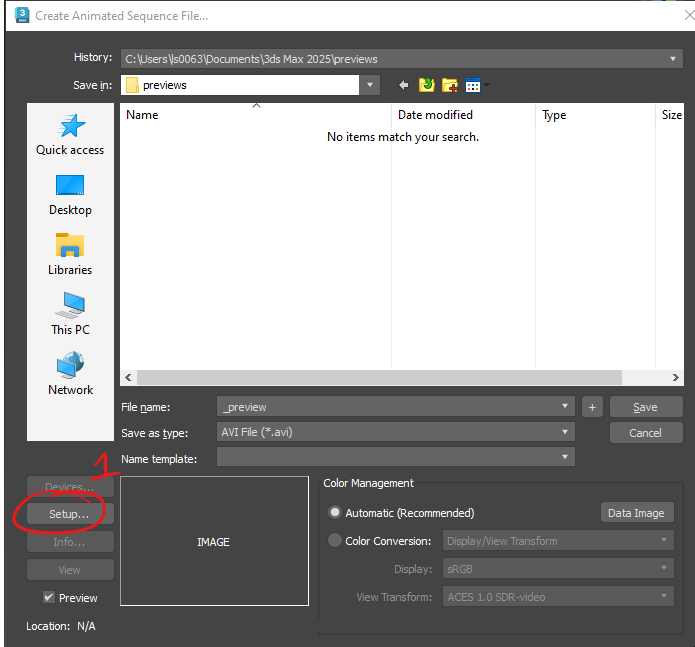

Depending on the client, choose the type of compressor that suits the project. By default, we can go with the standard H.264 compressor. Once you have selected your compressor choice, click on “Setup”...

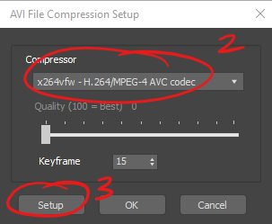

…Another window will open, you will need to turn on Zero Latency and set the Ratefactor to 1

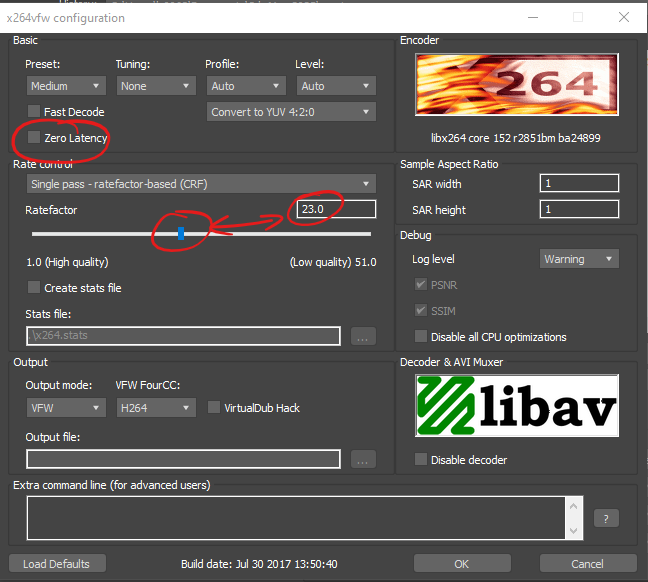

1. Once all that is settled, please ensure you playblasting based on the correct viewport and hit “Create”

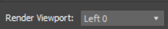

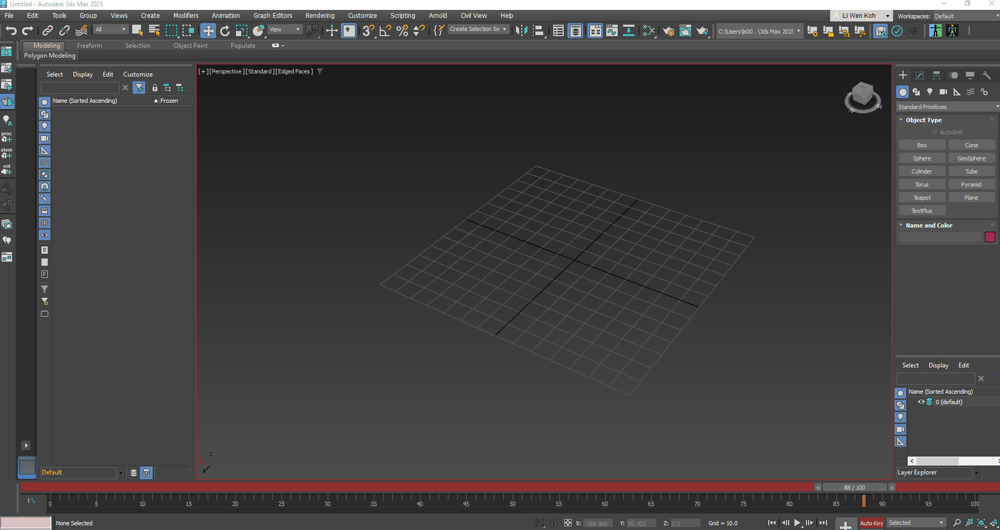

# 📏 Working Units

To change your working units, select **Customize ➡ Units Setup**

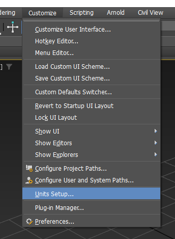
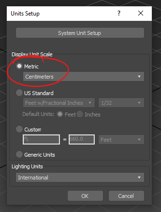

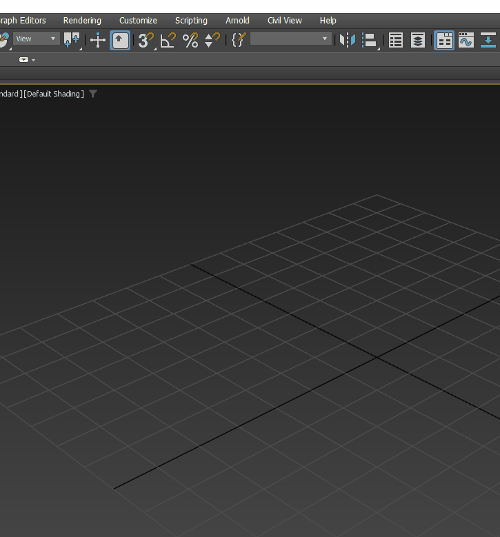

- 1cm ➡ 1 unit (u)

- u is for Unreal units

# 🔑 Shortcut Keys

| Select All | [ Ctrl ] + [ A ] |
|---|---|
| Deselect | [ Ctrl ] + [ D ] |
| Selection | [ Q ] |
| Deselect | [ Shift ] + [ D ] |
| Translation | [ W ] |
| Rotation | [ E ] |
| Scale | [ R ] |
| Set Key (only works if you toggle on) | [ K ] |
| Auto Keyframe | [ N ] |
| Save | [ Ctrl ] + [ S ] |
| Save as | [ Shift ] + [ Ctrl ] + [ S ] |
| Open Scene | [ Ctrl ] + [ O ] |
| New Scene | [ Ctrl ] + [ N ] |
| Undo | [ Ctrl ] + [ Z ] |
| Redo | [ Ctrl ] + [ Y ] |
| Play / Stop | [ / ] |
| Next Frame | [ . ] |
| Previous Frame | [ , ] |
| End Frame | [ End ] |
| Start Frame | [ Home ] |
| Front \| Left \| Top \| Perspective View | [ F ] [ L ] [ T ] [ P ] |
| Viewports | [ V ] |
| Orthographic | [ U ] |
| Maximize Viewport | [ Alt ] + [ W ] |
| Hide Selection (Isolate single object) | [ Alt ] + [ H ] |
| Unhide All  | [ Alt ] + [ U ] |
| Zoom / Scroll Out/In | [ Ctrl ] + [ Alt ] + [ Middle Mouse Hold & Drag] |
| Rotate Camera | [ Alt ] + [ Middle Mouse Hold & Drag ] |
| Pan Camera | [ Ctrl]  + [ Middle Mouse Hold & Drag ] / Middle Mouse |
| Pan Camera with One Direction | [ Shift ] + [ Middle Mouse Click ] |
| Expert Mode Toggle | [ Ctrl ] + [ Alt ] + [ X ] |
| Pan Viewport (base on mouse cursor) | [ I ] |
| Safe Frame | [ Shift ] + [ F ] |
| Camera View | [ C ] |
| Show Statistics | [ 7 ] |
| Hide / Show Grid | [ G ] |
| Hide Camera | [ Shift ] + [ C ] |
| Hide All Geometry / Mesh (Isolate everything) | [ Shift ] + [ G ] |
| Hide Helpers (controls) | [ Shift ] + [ H ] |
| Hide Lights | [ Shift ] + [ L ] |
| Hide Shapes  | [ Shift ] + [ S ] |
| Hide Controllers (bone controller) | [ Shift ] + [ K ] |
| Material / Hypershade Editor | [ M ] |
| Frame Selected Object (focus on object) | [ Z ] |
| Frame Extent All | [ Shift ] + [ Ctrl ] + [ Z ] |
| Frame Extent | [ Alt ] + [ Ctrl ] + [ Z ] |
| Wireframe On/Off | [ F3 ] |
| Edged Faces On/Off | [ F4 ] |
| Select Ancestor | [ Pg Up ] |
| Select Child | [ PgDown ] |
| Select Children | [ Shift ] + [ PgDown ] |
| Select Invert | [ Ctrl ] + [ I ]  |
| Angle Snap Toggle | [ A ] |
| Cycle Active Snap Type | [ Alt ] + [ S ] |
| Enable Axis Constraints in Snaps Toggle | [ Alt ] + [ F3 ] |
| Snaps Toggle  | [ S ] |
| Spacing Tool | [ Shift ] + [ I ] |
| Transform Gizmo (manipulator) Size DOWN | [ - ] |
| Transform Gizmo Size UP | [ = ] |
| Create Preview / Playblast | [ Shift ] + [ V ] |
| Render Setup & Advance Lighting | [ 9 ] |

# 🎭 Reference

Please refer to the link below or if you find something that piqued your interest,

let your lead know, so that it may be downloaded and stored here 👇🏻

**L:\LEMONSKY\LSATRG_GENERAL\PRODUCTION\06_References\05_Anims**

# ✨ Tips & Tricks

## **📉 Motion Trail**

There are 2 ways to enable the motion trail;

	**	Method 1**

1. Select object

2. Right click ➡ Object Properties

3. Tick on “Motion Path”

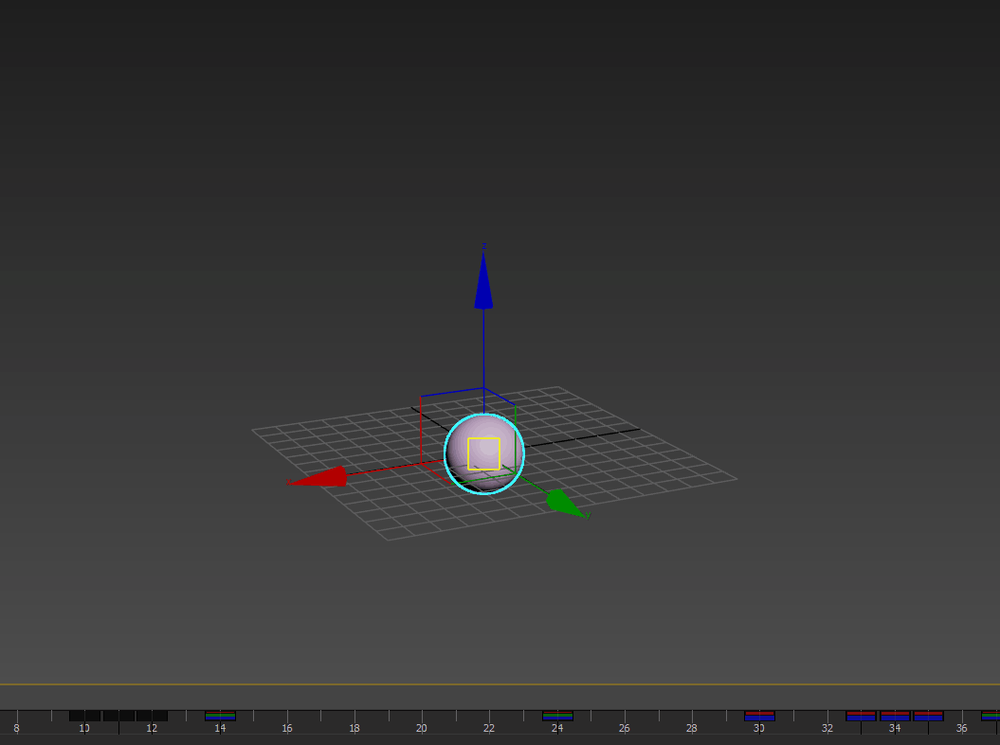

**Method 2**

1. Select object

2. Go to the command panel for motions

3. Select “Motion Paths”

4. Tick on “Always Show Motion Path”

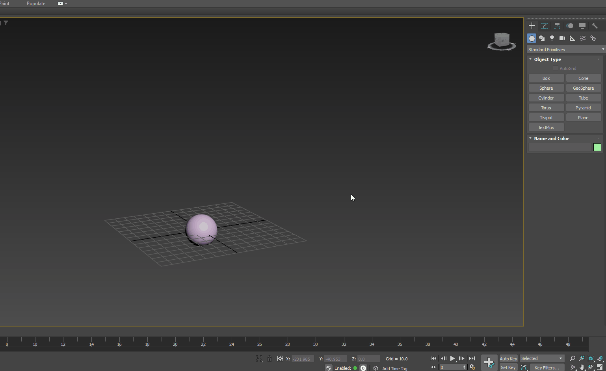

## **📈 Curve Editor (Graph Editor)**

In 3ds Max, Curve Editor is the equivalent of Maya’s Graph Editor

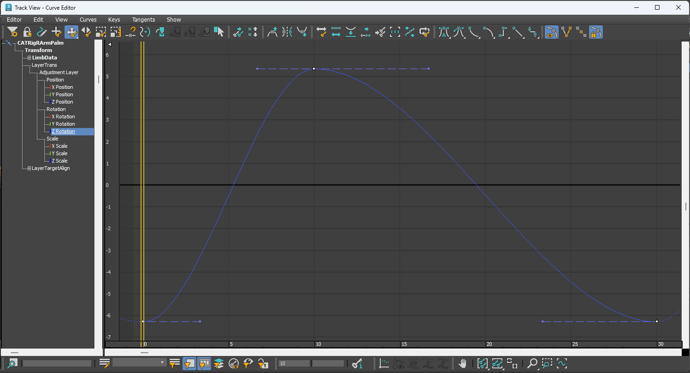

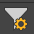
Filters

➡ Show/Hide the material in the curve editor

Lock Selection

➡ Will lock everything else except for the selected key

Draw Curves

➡ It will help add a key on every frame based on the the drawn

graph

Add/Remove Key

➡ Add the key of your choice or click [Shift] + [Left Click] to remove

the key

Move Key

➡ You are able to move around the key that you have selected

Slide Keys

➡ This allows you to slide the keys towards the left/right direction,

however, it will affect the keys at the back and at the front

Scale Keys

➡ This allows you to scale the curve on the x value (horizontal) of

the curve editor

Scale Values

➡ This allows you to scale the curve on the y value (vertical) of the

curve editor

➡ The orange horizontal line is basically the pivot point

to snap the center line to

your selection key and scale from there

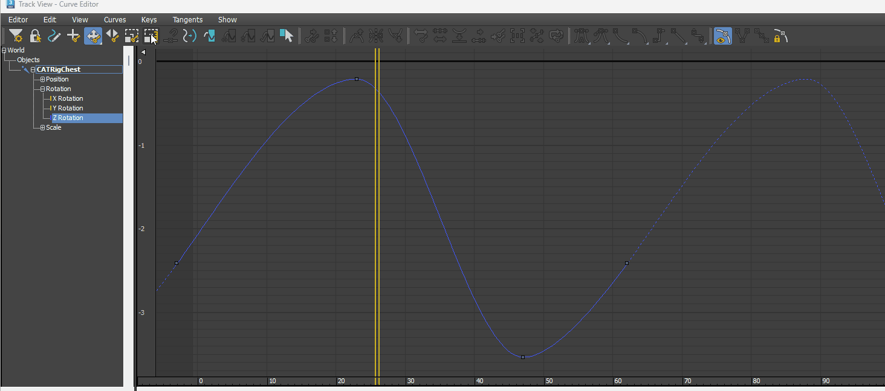

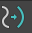
Simplify Curve

➡ You can set the threshold on how much you want to simplify the

curve

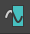
Parameter Curve Out-of-Range Type

➡ This is basically the same as Maya’s infinity (clicking this icon

will open another window for you to select the type of infinity

curve you want)

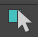
Region Key Tools

➡ Similar like maya, once you select a bunch of keys, it will allow

you to scale based on the selected region

Select Next Key

➡ The key selection will move to the next selectable key

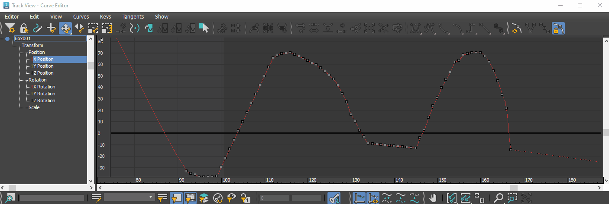

will have the key selection move in reverse

Grow Key Selection

➡ The key selection will expand outwards

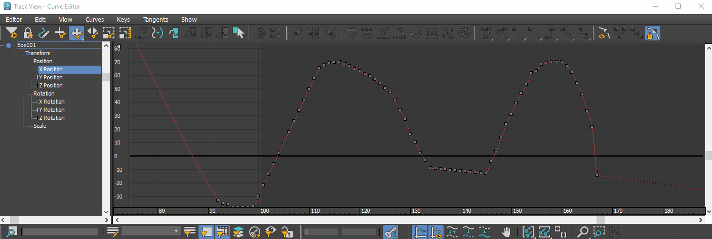

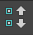
will have the key selection contract inwards

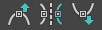

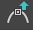
Scale Tangents Up

➡ It will scale (elongate) the tangents

, the

tangents will scale up on the inner side only

 Mirror Tangents **(****NOT RECOMMENDED**** 👎🏻👎🏻👎🏻)**

➡ Mirrors the tangent of the selected key to the adjacent tangent

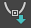
Scale Tangents Down

➡ Basically the opposite of Scale Tangents Up (works similarly)

Nudge

➡ It will simply move the selected key to screen right

would move the key to screen left

Flatten to Average Value

➡ It will average out the value and flatten the key

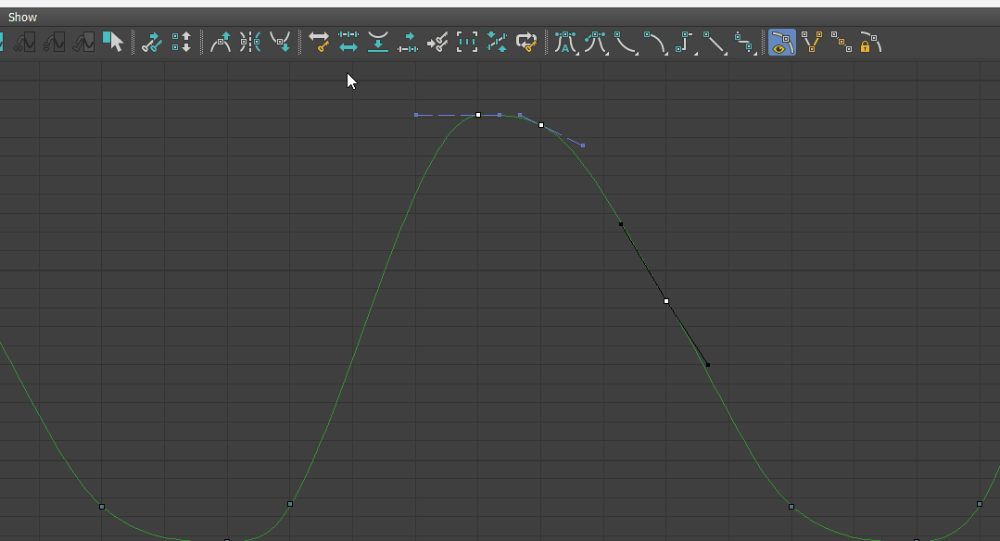

will flatten not only the average value but on the

time value too

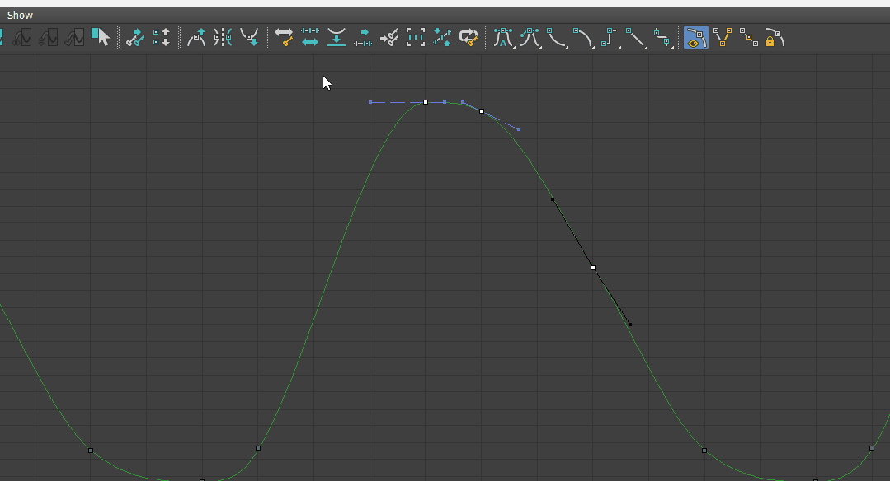

Flatten

➡ The flattening will follow based on the first selected key

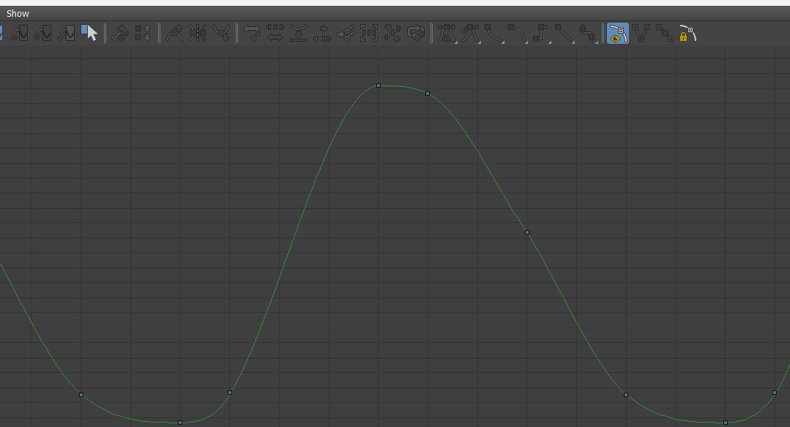

will follow based on the last key

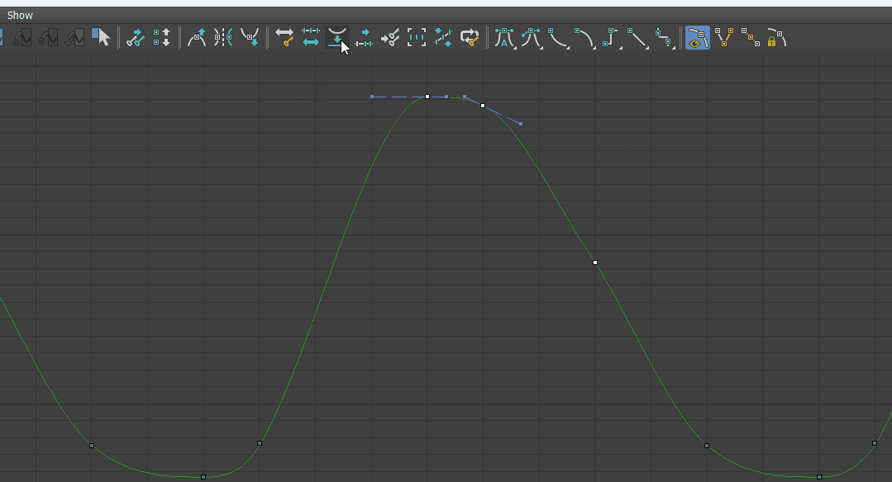

Ease

➡ Basically ease in/cushion into next the keys

will basically ease out

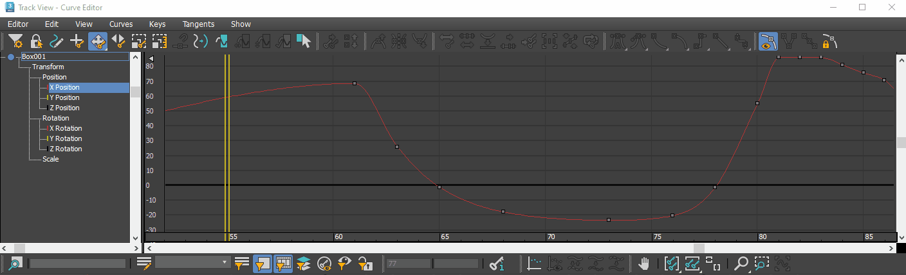

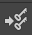
Split

➡ The selected key basically splits into 2 keys (the original

selected key will no longer be there)

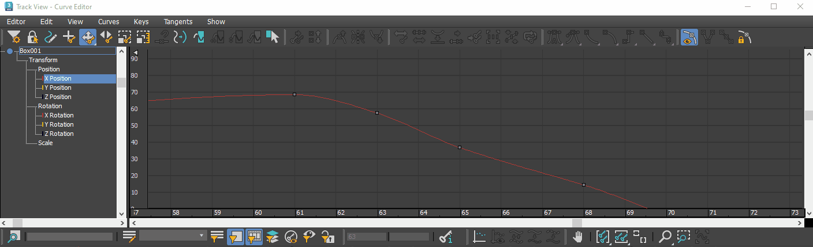

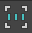
Space Keys Evenly

➡ This will adjust the uneven spacing between keys

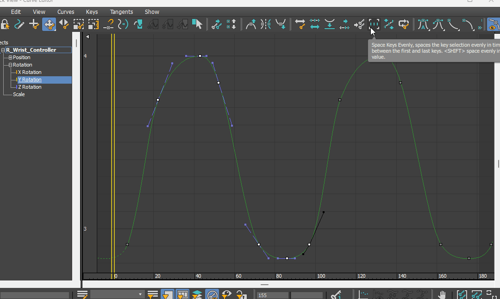

Relax Keys / Align Keys

➡ Relax Keys will just simply ease and soften the curve

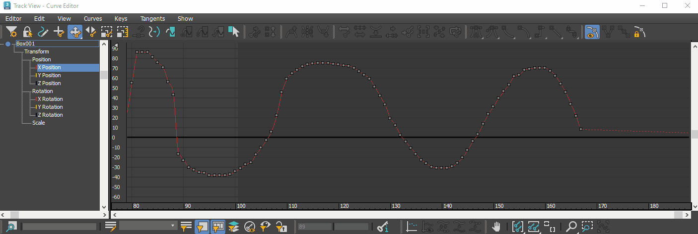

will simply flatten, straighten and align the keys

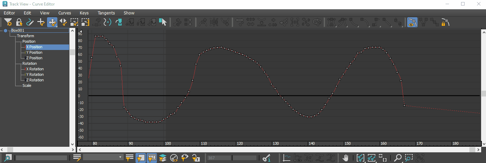

Loop

➡ It will create a new key at the end of your curve based on the

first key to allow your curve to loop

will basically copy the first key and override the

last key so that they are the same and able to loop (it will not

create new keys)

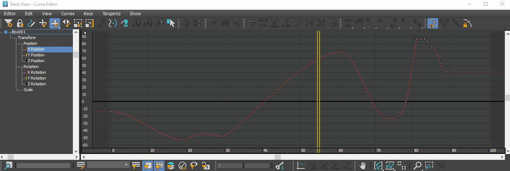

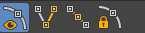

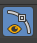
Show/Hide Tangents

➡ Hiding tangents will allow easier shifting of keys

➡ Having the tangents visible can sometimes cause it to be

dragged when your intention is to move the keys only

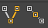
Break & Unify Tangents

➡ Very similar function as the one in Maya

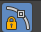
Lock Tangents

➡ You will be unable to move the tangent at all

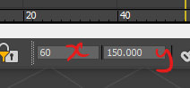

➡ Similar like Maya, your x and y values for the curve

Show Selected Key Stats

➡ Shows the key’s curve xy values in the curve editor

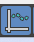
Use Buffer Curve

➡ Enable/Disablebuffer curve

Hide/Show Buffer Curve

➡ No explanation is needed for this…lol

Swap Curve With Buffer

➡ Basically interswap between the original curve and the buffer

curve

➡ Good in a sense that you can see how big of a difference you

have made

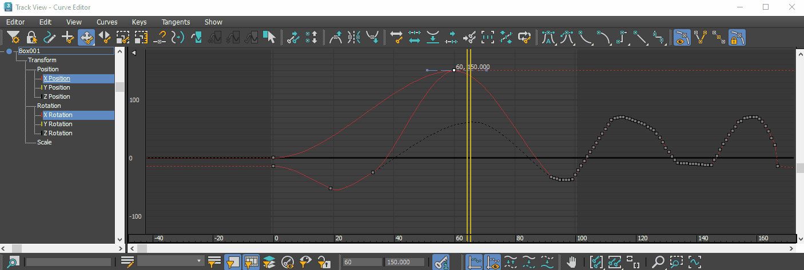

Snapshot

➡ Snaps the buffer curve to the current curve

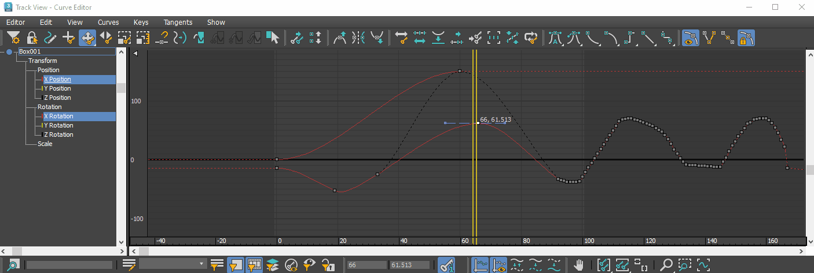

Revert to Buffer Curve

➡ Basically the opposite of Snapshot

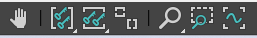

Pan

➡ Middle mouse click works like a charm!

Frame Horizontal Extents Selected Keys

➡ It will frame the selected keys to fill the horizontal view of the

curve editor

Frame Vertical Extents Selected Keys

➡ It will frame the selected keys to fill the vertical view of the curve

editor

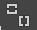
Frame Horizontal and Value Extents

➡ Basically a combination of framing both the vertical and

horizontal extents

Zoom ⭐⭐⭐

➡ **Hold & drag to screen left to zoom out **

➡ **Hold & drag to screen right to zoom in** 

**Extra Note ⤵  👎🏻👎🏻👎🏻👎🏻👎🏻**

- There is an Auto Zoom function under the View tab in the Curve Editor but its pretty **USELESS (Not recommended)**

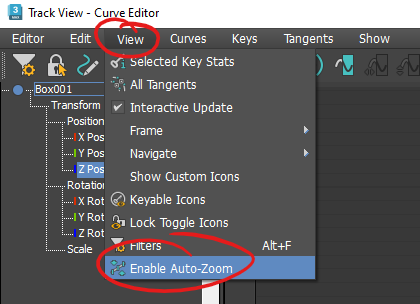

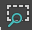
Zoom Region

➡ It’s like focusing on a specific area

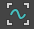
Isolate Curve

➡ Good if you have a lot of messy curves and just want to focus on

one only

## **✂ Clip Manager**

- The clip manager is similar to Maya’s PAIE / Studio Library to a certain degree (copy + paste poses & animations)

- The clip manager will not appear on its own, you need to have a character already in the scene for it to be activated

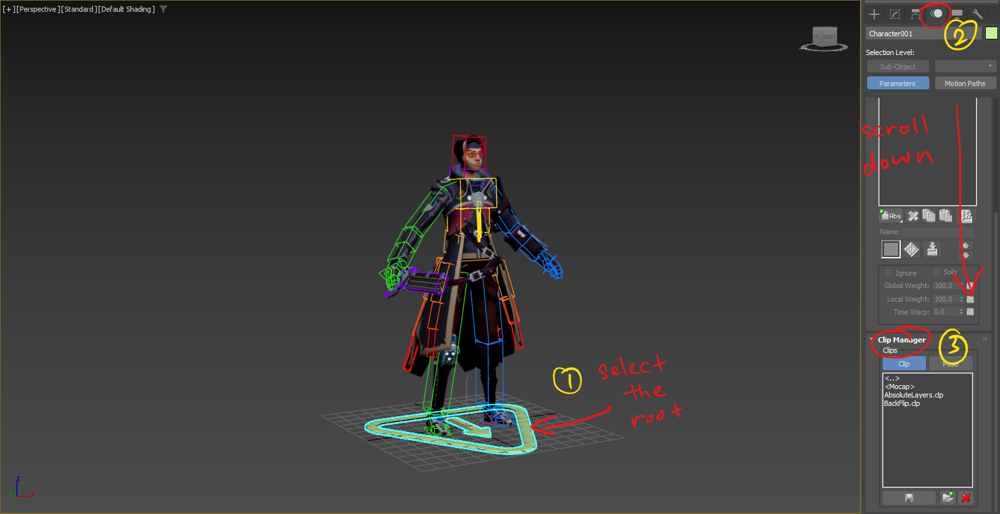

## **🧪 Euler Filter**

1. Curve Editor

2. Edit ➡ Track View Utilities

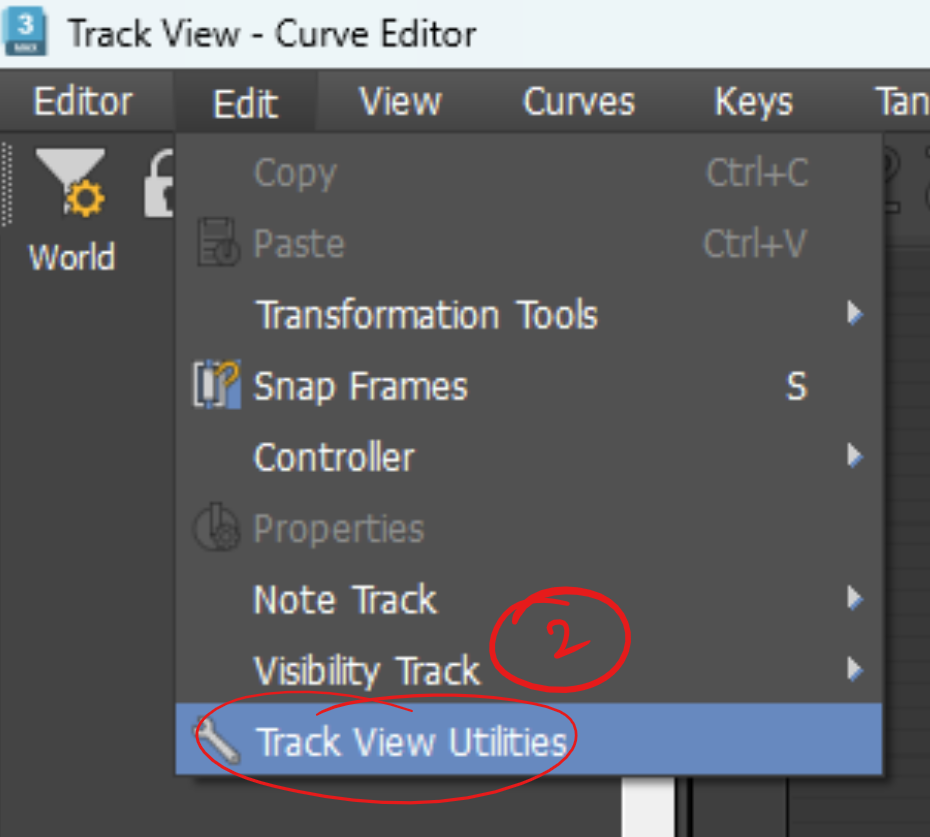
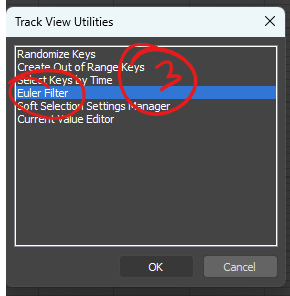

## **🥧 Bake**

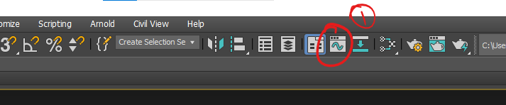

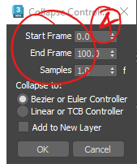

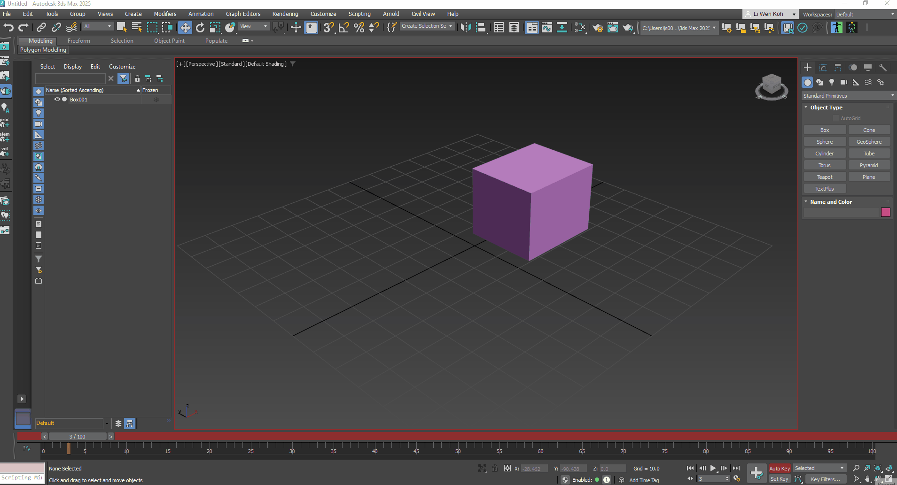

## **👨‍👩‍👦 Parenting**	

### **👫 Link and Select**

In 3ds Max, ***Link and Select is the equivalent of Maya’s parent***

**To link objects ⤵**

1. Click Select and Link icon (icon will turn blue)

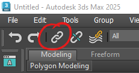

2. Select the object (child) and drag it to any other object (parent)

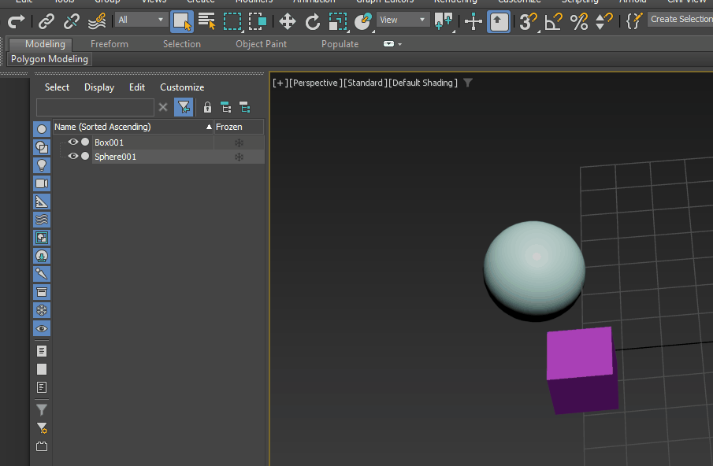

**To unlink objects ⤵**

1. Select the child

2. Click Unlink

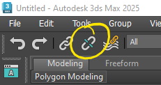

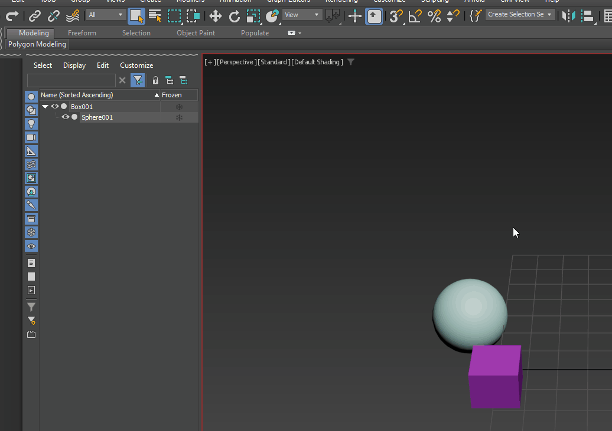

### **🔗Link Parent**

In 3ds Max, ***Link Parent is the equivalent of Maya’s parent constraint***

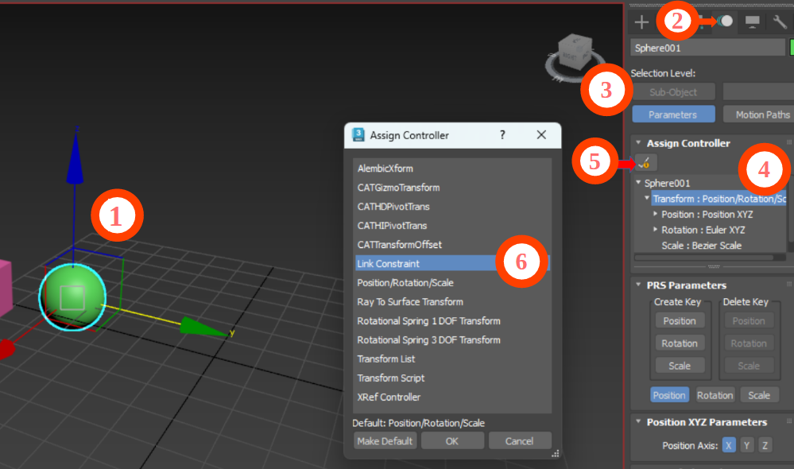

1. Select the child

2. Go to the motion panel

3. Select Parameters

4. Select “Transform : Position/Rotation/Scaling”

6. Select Link Constraint and click OK

7. Move the time frame to the frame that you want to start the constraint

8. Click Add Link

9. Select your parent object (the current frame you have selected is the active parent frame)

10. Click “Link to World” to return back to the default

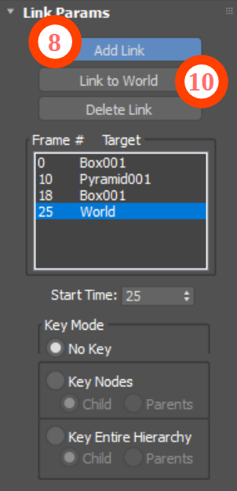

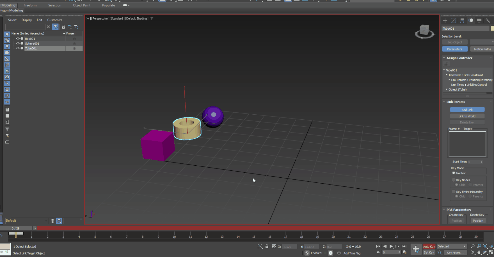

**❗❗ Make sure to click Add Link again to deactivate it at the end ❗❗**
