# **💡Assembly Documentation**

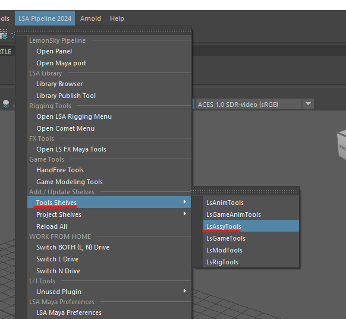
 
 

## 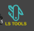 **Ls Tools Maya**

- Production tool

- Project pipeline toolsets for Maya

- For more information about LsTools please click on below link. 
 

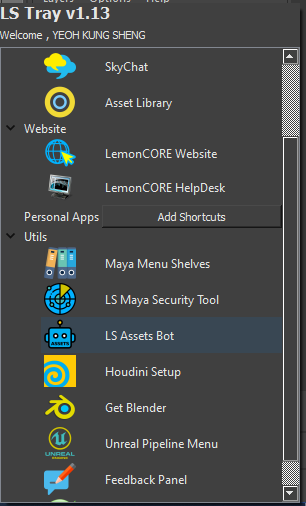

## **Lemonsky AssetBot Client**

- image to 3d ai submission tool , tasked submit the generation task to ai machine thru deadline. 
 

## 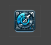 **LS tx Manager**

- Wrapper tool built over Arnold native fx generation tool with a patch to fix fail tx generation that sometimes occurs when the texture files in server. 
 

##  **Shader Transfer**

- Transfer the shaders of one asset to another version of the same asset , based on object name. 
 

## 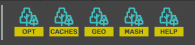 **Foliage Tool**

- Foliage management toolset, that helps transfer, modify, replace foliages in shot for Maya. 
 

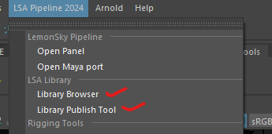 
 

## **LSA Library**

- Library browser tools to access assets from out LS library.

- Library Publish tools to publish into our LS library.

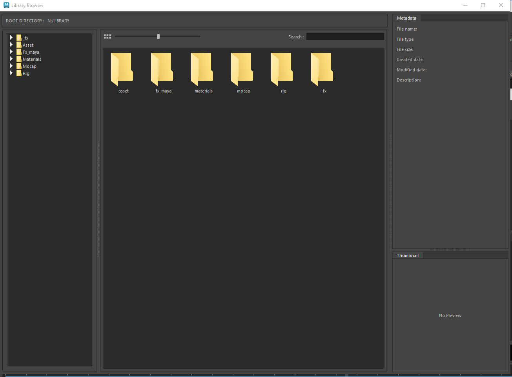 
 

##  **MF Interactive Lighting**

- Help to do interactive lighting linking.

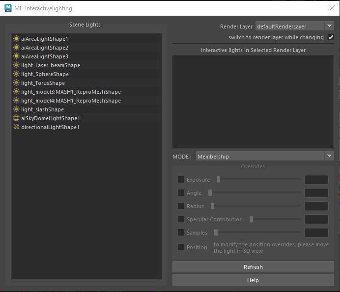

## 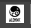 **LS Alembic Workflow**

- Help to create the cache to certain files.

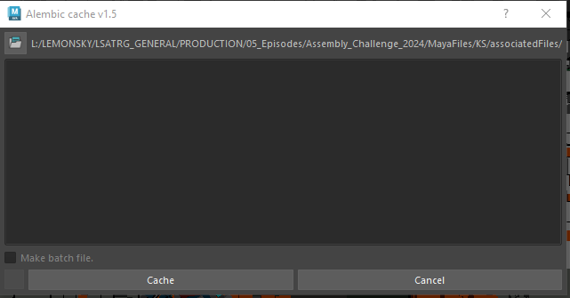

##  **Follicles2vtx**

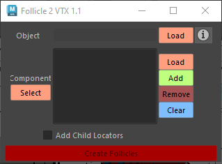

##  **MF UVTransfer**

- Help to do UV transfer if you want copy the same UV to other similar model.

##  **Repath**

- Help to repath all the texture location path.

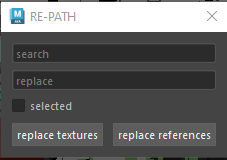

## 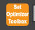 **Set Optimizer Toolbox**

- Help to fixing all the textures color management, color space and deleted not related plugin attributes.

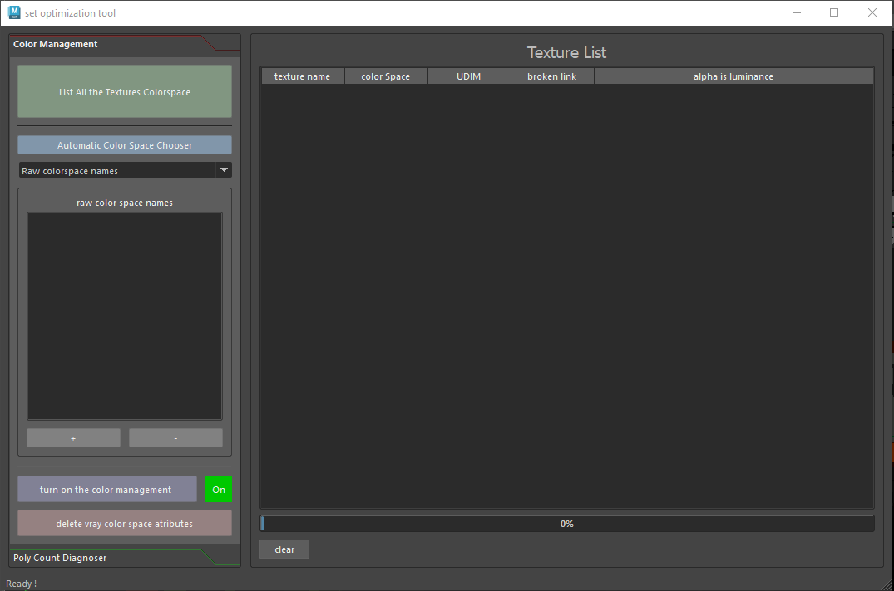

## 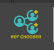 **REF Chooser**

##  **Advanced Rename**

- Help to rename our textures naming. 
 

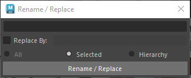

## **🎭 LSToolsNuke**

- Production tool
- Project pipeline toolsets for Nuke
- Read more **[Ls Tools Nuke](LsToolsNuke_Doc.md)** 
 

## **💨 Nuke pack tool**

- Pack tools for Nuke. 
 

## **💫 Deadline For Unreal Svn**

- Custom tool

- Deadline submission tools for unreal 
 

## **💥 Standalone FBX Exporter**

- Command tool

- Link for exporting maya assets/animation in fbx format (For unreal and other game projects)

- WTP tools

    ​AWS Thinkbox Deadline is a powerful render management and compute orchestration toolkit designed for managing render farms across Windows, Linux, and macOS platforms. It\'s widely used in the media and entertainment industry to streamline rendering workflows for visual effects, animation, and other compute-intensive tasks.

    This is the Deadline Monitor. It shows how it works and how it\'s related to some of our LS tools as well.

    
    

## **Deadline Launcher**
- Read more **[Deadline Launcher](Deadline_Renderfarm_UserGuideline_Doc.md)** 

