# Blender Documentation 

## Introductions

**❗❗ Please be aware that this document is based on making Blender similar to Maya so that you can pick up the software in a short amount of time ❗❗**

## **⌨ Interface & Keymaps**

1. Understanding the interface

1. Basic interface overview

2. Customise your own interface

2. Setting up keymaps

3. Basic Navigations

4. Basic Shortcuts

5. Cool features

## **🍹 Animating in Blender**

1. Animating Objects

2. Armature & Parenting Objects

3. Pose Mode

4. Keyframes

5. Constraints

6. Exporting Animation

7. Animation Techniques & Tricks

## **➕ Addons**

1. What are addons?

2. Where can I find them?

3. How to install?

4. Essential addons that ease your life

# ⌨ Interface & Keymaps

1. **Understanding the interface**

**❗❗ The image below is from ver 3.5 and the interface will change from time to time ❗❗**

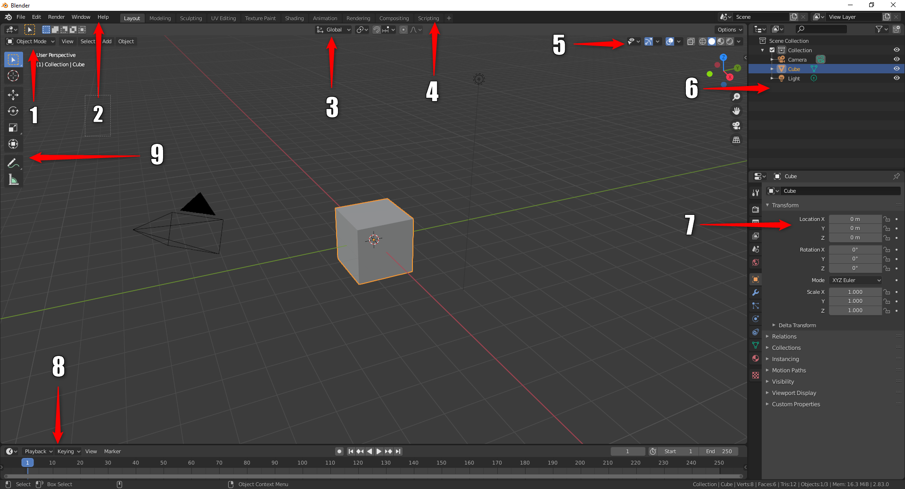

1. Mode Selection + mode menu

2. Blender General Menu

3. Manipulator space switch + snapping tools

4. Workspaces

5. Viewport options

6. Outliner

7. Scene setting and properties

8. Timeline

9. Tools

1. **Basic interface overview**

1. Mode Selection + Mode Menu

Under the mode selection menu you can change your current working mode and the related menu just like maya menu selection.

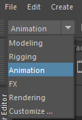

The big difference is, in Blender, each mode is designed to work separately and only certain things can be done under certain modes. For example, when you are in pose mode, you can only make changes on joints or controllers on the rig but you can't make changes on the model etc. We will go into the details of each mode in just a short while.

Unlike Maya, Blender will actually detect what kind of objects that you are selecting and only give you the list of options that applies to that object.

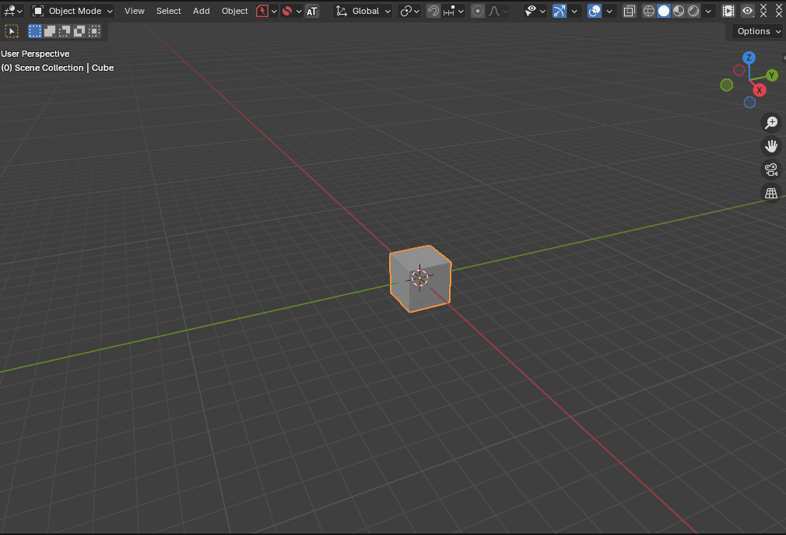

As we can see in the example above, each mode will give you a set of tools and also a menu so that you can also have what you need under that mode. This will make your workspace very clean but it might be quite a hassle if you need to jump back and forth.

1. Blender General Menu

Blender doesn't have a very big list of general menus as most of the menu will be under mode menu instead. So what you get here are mostly files and setting related lists.

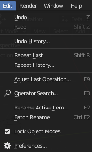

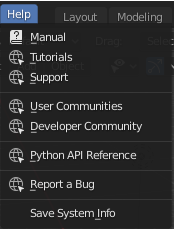

Above ⤴ are all the lists of items under the general menus

1. Manipulator space switch + snapping tools

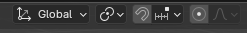

Over here you can select your default gizmo orientations and also how the pivot works. You can also change your pivot point in the second drop down menu as well. As to how Blender works, these menus will differ between the modes you are currently on, so you might notice there are some other drop down menus after the snapping tools.

1. Workspaces

Workspaces are some preset layout that applies to whatever you are working on now, it is the same as the maya workspaces except in Blender they just make it like your browser tab instead!

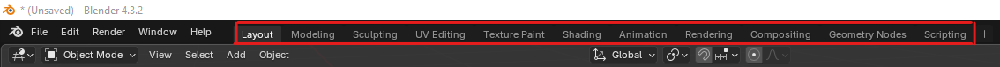

The default workspace is [Layout], [Modeling], [Sculpting], [UV Editing], [Texture Paint], [Shading], [Animation], [Rendering], [Compositing] and [Scripting]. And you can always create your own workspace by clicking the “+” sign at the end or simply duplicate your current layout as a new workspace.

1. Viewport options

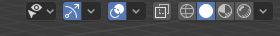

These are basically the same as we have in Maya, viewport options about how and what we like to show in the viewport, controllers, joints, shading etc.

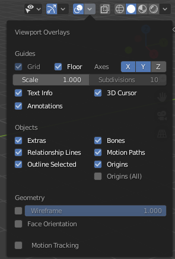

2. Outliner

The outliner in Blender basically functions the same as Maya, only that in Blender, we are being introduced to a new hierarchy system called “Collections”.

Collections are just like groups in Maya, and it is also the main function that is going to be used when we are referencing assets into the scene. One thing that is very different from Maya about Blender’s outliner is, in Blender, the outliner has the option to view your data in the scene based on categories, as shown in the image below.

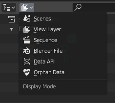

The default is View Layer, and this should be enough for your general usage. Eventually you might need to go to Blender File or Orphan Data for finding the other data that is stored inside the Blender scene, something like the Non-DAG data in Maya.

3. Scene setting and properties

Over here is where we set up our scene and also other properties. From rendering settings, shaders, joints and constraints, etc.

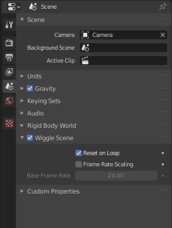

The amount of side tabs will be different based on the object that you have selected.

4. Timeline

Blender timeline can be a bit confusing at the beginning, since there are basically more than 3 timelines that look similar, work similar, and sometimes there are actually the same thing!

By default, if you are using the animation workspace, Blender timeline is set to Dope Sheet.

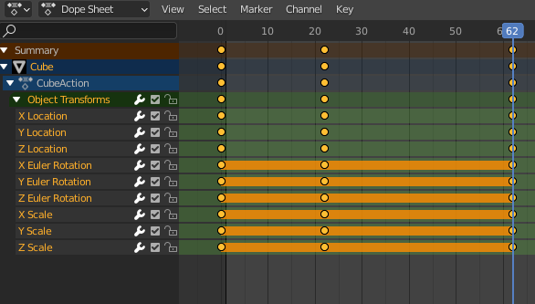
*Dope Sheet in Blender 2.8++*

If you are familiar with Maya’s Dope Sheet, this shouldn’t be a problem for you. But most of the animators are more used to using the default timeline when they are animating, so this will be a challenge for those who have never touched Dope Sheet before.

**Dope Sheet** is basically what we called an Exposure Sheet or X-Sheet back in traditional 2D animations. After animation is moved to 3D software, the dope sheet becomes a sheet that summarises all the channels that we have keys on and shows it on the timeline. For easy understanding, it is a graph editor plus timeline for animators.

However, if you check the timeline in Blender, you shouldn't notice any big difference as in Blender, both Dope Sheet and Timeline contain the information of all the channels that you have keys and also show you what type of keys they have on the timeline.

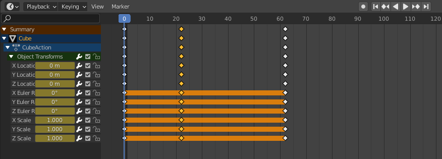
*Timeline in Blender 2.8++*

For those that use Graph Editor heavily on their animations, Blender’s Graph Editor is not much of a difference on the layout, but some functions are not the same as Maya. We will go deeper on that in the later chapter of this guide.

5. Tools

All the general tools on the left side of the screen, like all the interfaces in Blender, this list of tools will be changed based on your selected mode.

Below is a sample of the tools box will look like if you select the Pose Mode and Edit Mode

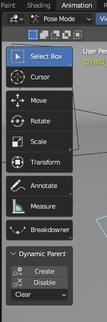

# Customise your own interface

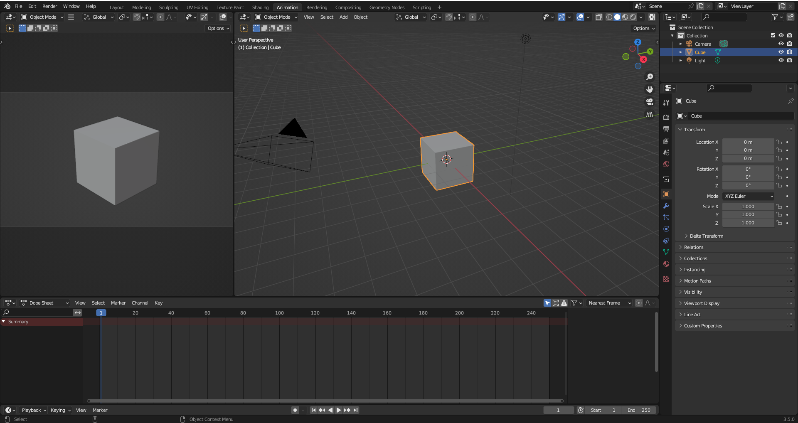

Blender is very customizable and you can set your window into any option under the editor type, below is all the editor types that you can choose from.

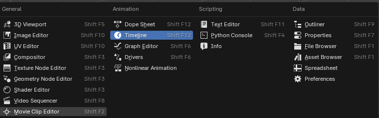

1. Arranging your UI

Above is the default layout of the UI of the animation workspace. But Blender is almost fully customizable based on your workstyle.

You can follow the step by step guide to customize your workspace.

1. Move your cursor to the corner of each panel and you should see your cursor turned into a crosshair.

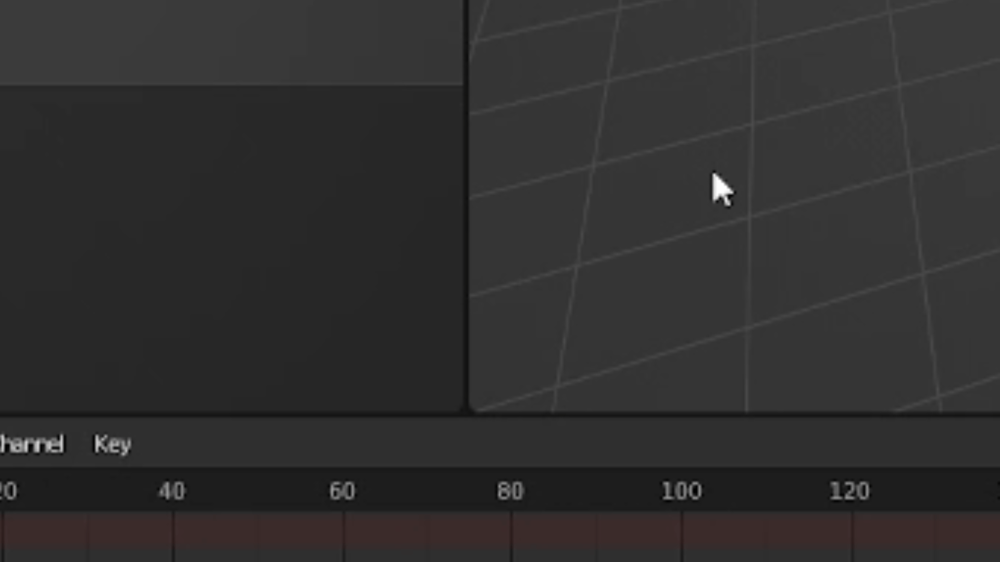

2. From here, you can decide to combine the 2 panels or add another panel by dragging the cursor inward or outward. Dragging the cursor inward will split the area into 2 and dragging outward will combine 2 areas.

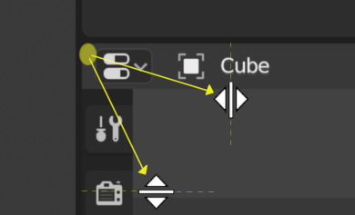

*Dragging inward to split the panel*

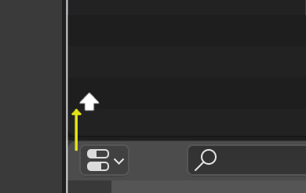

*Dragging outward to combine the panel.*

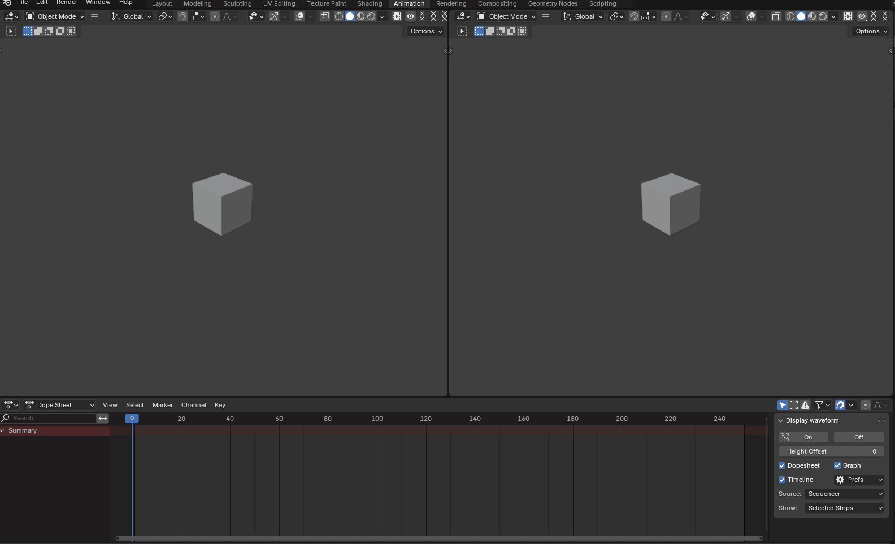

**NOTE** 

To remove a duplicated/additional panel, at the edge of the chosen panel (you should see the crosshair), left click and drag the mouse either left/right/up/down to overlap with the panel that you want to remove

Referring to the above gif, you can clearly see that the crosshair is selected from the edge of the screen left's bottom and then dragged across to the next panel

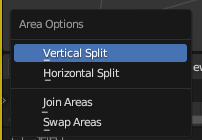

1. Duplicate a panel to new window (Tear Off Copy)

In the situation when you want to copy an area to a new window like maya tear off copy function, Blender can do that as well.

Here are the step by step guides.

Go to the panel that you would like to copy.

Go to View > Area > Duplicate Area into New Window

⭐ Voila, you will have the area copied to a new window. ⭐

# Setting up Keymap

Blender keymap and shortcuts are very different from Maya, even though from 2.93 onward there is an industries compatible option to choose, which will set the keymap to be similar with Maya but also you will lose quite a few good features original from Blender as well.

Therefore, here are some tips for you to set up your keymap which is easier to navigate and still retain the good features from Blender.

1. Basic Navigation

In the default Blender setup, most of the controls are inverted compared to Maya and also there is a lot of navigation that we are using day to day that are set to MMB as well. So that’s what we need to set before moving to other stuff.

You can just use the ready **Keymap_joseph.py** file which can be found over here 

**L:\LEMONSKY\LSATRG_GENERAL\TOOLS\BlenderAddOns**

if you want to skip this entire part and continue to the shortcuts if you are not planning to go through this process.

1. Go to Edit > Preference > Navigation.

	Then Set the **Orbit Method** to “**Turntable**”.

	Checked the “**Auto Perspective**” box.

	Change the **Zoom Method** to “**Dolly**”, and the **Zoom Axis** to “**Horizontal**”.

	Checked the “**Zoom to Mouse Position**” box.

2. Now, go to the **Keymap** tab and we will be changing all the essential keys.
2. 
3. You can use the search box to look up the function that you need to change and set the new shortcuts as you want, you can search by function name or assigned keys.

4. Below is the list of stuff that needed to change at the very beginning to make Blender as close as Maya but retained its features.

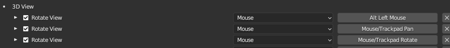

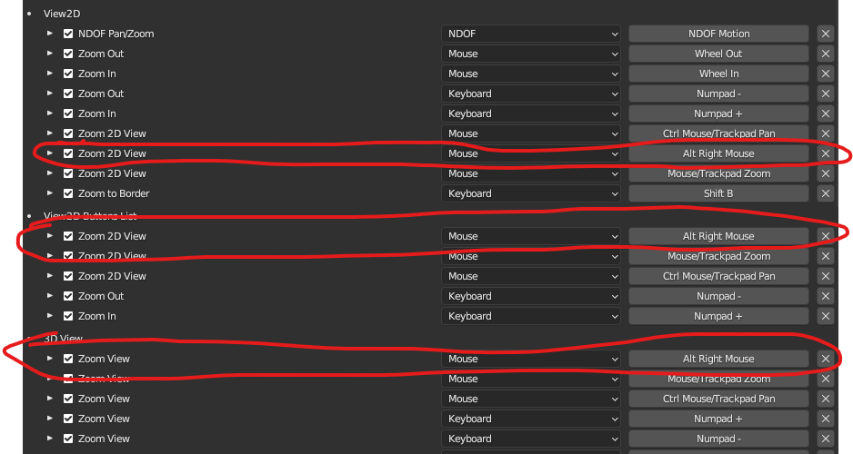

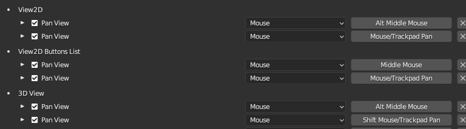

4. Switch to the Key-Binding tab from now on as there will be multiple places we need to change on the keymap in order to make the key work in all panels since in Blender, each panel can have a unique key to navigate.

5. Search “**g**” and now it should show all the panels that use the G key to move/translate the object. Change all the “**Move**” functions to “**W**”. And look for “**Clear Location**” or “**Clear Pose Location**” and change it to “**Alt W**”.

6. Search “**r**” and change all the “**Rotate**” functions to “**E**”.  And look for “**Clear Rotation** ” or “**Clear Pose Rotation**” and change it to “**Alt E**”.

7. Search “**s**” and change all the “**Scale / Resize**” functions to “**R**”.  And look for “**Clear Scale**” or “**Clear Pose Scale**” and change it to “**Alt R**”.

8. Search “**i**” and change all the “**Insert Keyframe**” functions to “**S**”, depends on your personal preferences, you can change the “**Insert Keyframe (Menu)**” functions to “**Shift S**” and the “**Delete Keyframe**” functions to “**Alt D**”

(Optionals)

1. Search for “**Frame Selected**” and change all the views to “**F**” if you don't like the default “**Numpad .**”

2. Basic Shortcuts

Blender also comes with some cool shortcuts in the box which you can use and does not conflict with the Maya usage.

| Functions | Keyboard Shortcuts |
|---|---|
| Isolate selected | Numpad / |
| Quick search | F3 |
| Add menu | Shift+A |
| Undo history | Ctrl+Alt+Z |
| Quick Favorites | Q |
| Orbit Left | Numpad 4 |
| Orbit Right | Numpad 6 |
| Orbit Up | Numpad 8 |
| Orbit Down | Numpad 2 |
| Roll Right | Shift + Numpad 6 |
| Roll Left | Shift + Numpad 4 |
| 3D View | Shift+F1 |
| Node Editor | Shift+F2 |
| Image View | Shift+F3 |
| Outliner | Shift+F4 |
| Graph Editor | Shift+F5 |
| Dope Sheet | Shift+F6 |
| NLA Editor | Shift+F7 |
| Sequence Editor | Shift+F8 |
| Text Editor | Shift+F9 |
| Clip Editor | Shift+F10 |
| File Browser | Shift+F11 |
| Python Console | Shift+F12 |

### Context Menu

You can always right click anywhere in the panel and it will pop up a **Context Menu** for you to pick which action you want to do.

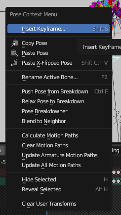
***Example context menu in Pose mode.***

### Assign Shortcuts for anything

When you find something useful from the menu, you can always right click and select the assign shortcuts button to anything.

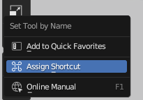
***Example of Assign Shortcut Menu.***

3. Cool Features

Blender also builds in some cool features that we can use from the beginning, without installing any plugins in advance.

### Breakdowner

Blender Breakdowner is a built- in feature similar to tween machines or A tools in Maya. It can be created in betweens frames based on your needs.

**Breakdowner can only be found in pose mode**. So please make sure you are in the correct mode before using it.

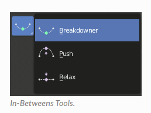

It comes with 3 different modes for different uses.

***Breakdowner : Usually used for adding in betweens or ease poses.***

***Push : Adding a pose as an overshoot based on the rest pose.***

***Relax: Adding a pose as an ease pose on the rest pose.***

To use it, simply follow the steps below.

1. Select the controllers that you want to add poses, can be a single or multiple controllers.

2. Click the Breakdowner tools, you can hold LMB to show the options if you want to use Push or Relax.

3. Go back to your viewport and click and drag LMB on any place, a slider will show on the top of your viewport and now you can choose the percentage of your in-betweens.

4. Click LMB again to decide the pose you want.

5. Press insert keyframe to lock down the pose.

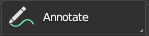

Same like Maya Grease Pencil, Blender’s annotate tools are easier to use if you need to add some markers on the screen or drawing for guidelines. Simply click on the tools and start drawing on the screen.

### Keying Set

Keying set is a new concept in Blender which Maya does not have. Basically you can create a custom set of controllers that you want to set keys and only insert keyframes on those controllers. By default this is set to **Available** which will insert keyframes to all the default channels.

You can set your custom Keying Set from the scene menu. Simply select all the controllers you want and press the + button.

### Pose Library

Pose Library is a library tool similar to Studio Library, however, it does not work for animation. Animation data is stored differently in Blender. This feature is implemented as an add-on which is supposed to be enabled by default, however if you can't find it, you can check if this add-on has been disabled.

For a detailed guide on how to use the pose library can find it on the Blender manual here.

[https://docs.Blender.org/manual/en/latest/animation/armatures/posing/editing/pose_library.html#pose-creation-via-action-editor](https://docs.blender.org/manual/en/latest/animation/armatures/posing/editing/pose_library.html#pose-creation-via-action-editor)

### Action Editor

Action Editor is a way to store animation in Blender, it can act as an animation library since it will contain all the keys of an animation which can later be imported back to the scene. Using this with an NLA editor can achieve something similar to the Animation Layer in Maya.

Detailed guide on the Blender manual.

[https://docs.Blender.org/manual/en/latest/editors/dope_sheet/action.html](https://docs.blender.org/manual/en/latest/editors/dope_sheet/action.html)

### NonLinear Animation Editor

NLA editor takes each action in the action editor as a strip of data. Layering each strip on top of others can be a way to change the animation like how the animation layer does in MAYA. Also can be used as a blending system like in Unreal Engine.

Detailed guide on the Blender manual.

[https://docs.Blender.org/manual/en/latest/editors/nla/introduction.html](https://docs.blender.org/manual/en/latest/editors/nla/introduction.html)

# Animating in Blender

# Animating Objects

Animating objects in blender is similar to how we did in MAYA but still due to the unique flow in blender, it can be confusing. To start animating in blender, we first need to understand a few basic things in blender.

#### **Object Mode / Pose Mode**

Although we can animate anything in object mode as well but since blender divide the actual rigging animation mode and the mesh into two different mode, which is Object Mode and Pose Mode, and some tools or plugins is only available on certain mode, is always good to check which mode you are in before your started your animation.

#### **Keying Set**

Keying sets are a collection of animated properties that are used to animate and keyframe multiple properties at the same time. For example, using keying sets you can press I in the 3D Viewport, Blender will add keyframes for all the properties in the active keying set. There are some built-in keying sets and also custom keying sets called Absolute Keying Sets. To select and use a keying set, set the Active Keying Set in the Keying popover in the Timeline header, or the Keying Set panel, or press Shift-Ctrl-Alt-I in the 3D Viewport.

#### **Timeline**

Blender has not just one but multiple timelines that you can use for managing your keyframes, depending on which one you are comfortable with, is always good to explore the possibilities before you settle in.

After you get a quick understanding of the interface and the basic navigation of blender we can start making some simple animation. Let’s make some animation using the basic cube.

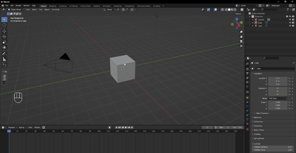

# Armature & Parenting Objects

#### **Armature & Bone**

Blender has a different rigging system than Maya. The rigging system is separated into **Armature** and **Bone**.

An armature in Blender can be thought of as similar to the armature of a real skeleton, and just like a real skeleton an armature can consist of many bones. These bones can be moved around and anything that they are attached to or associated with will move and deform in a similar way.

An “armature” is a type of object used for rigging. A rig is the controls and strings that move a marionette (puppet). Armature objects borrow many ideas from real-world skeletons.

**Bones** are the base elements of armatures. The visualization of bones can be set in the Armatures [Viewport Display](https://docs.blender.org/manual/en/latest/animation/armatures/properties/display.html).

Bones in an Armature can be generally classified into two different types:

##### **Deforming Bones**

Are bones which when transformed will result in vertices associated with them also transforming in a similar way. Deforming Bones are directly involved in altering the positions of vertices associated with their bones.

##### **Control Bones**

Are Bones which act in a similar way to switches, in that, they control how other bones or objects react when they are transformed. A Control Bone could for example act as a sliding switch control when the bone is in one position to the left, it could indicate to other bones that they react in a particular way when transformed, and when the Control Bone is positioned to the right, transforming other bones or objects could do something completely different. Control Bones are not directly used to alter the positions of vertices; in fact, Control Bones often have no vertices directly associated with themselves.

#### **Parenting Objects**

Blender's Object Parenting and Maya's Grouping serve similar functions by establishing hierarchical relationships between objects. In Blender, Object Parenting is more straightforward and accessible, while Maya's Grouping system offers additional features such as instancing and better control over object hierarchy.

However, different from Maya, there is a very specific way of parenting objects or armature in Blender, each object will need to be parent in their specified mode.

##### **Make Parent**

To parent objects, select at least two objects (select the child objects first, and select the parent object last), and press **Ctrl-P**. The Set Parent To menu will pop up allowing you to select from one of several possible different parenting types. Selecting one of the entries in Set Parent To confirms, and the child/children to parent relationship is created. The selected objects will have their ‘parent’ set to the active object, and as a result will be ‘siblings’.

The Set Parent To pop-up menu is context-sensitive, which means the number of entries it displays can change depending on what objects are selected when the Ctrl-P shortcut is used.

Moving, rotating or scaling the parent will also usually transform the child/children. Yet transforming the child/children of the parent will not affect the parent. In other words, the direction of influence is from parent to child and not child to parent.

##### **Type Of Parenting**

Blender supports many different types of parenting, listed below. Besides parenting the selected objects, some types add a Modifier or Constraint to the child objects, with the parent as the target object or activates a parent property i.e. Follow Path.

- Object

- Armature Deform

- Bone

- Curve Deform

- Follow Path

- Path Constraint

- Lattice Deform

- Vertex

- Vertex (Triangle)

##### **Keep Transform**

The object’s current world transform (so its absolute location, rotation and scale in the world) is computed. The new parent is set, and then the Parent Inverse matrix is computed such that after setting the new parent the object is still at its previous world transform.

##### **Object Parent**

Object Parent is the most general form of parenting that Blender supports. It will take selected objects and make the active object the parent object of all the selected objects. Each child object will inherit the transformations of the parent. The parent object can be of any type.

If the object has a preexisting parent, that is cleared first. This moves the object to its own location, rotation and scale, without its parent’s influence.

There are three operators that allow you to set an object parent. They differ in the way they compute the Parent Inverse matrix and the local Transform of the object.

##### **Bone Parent**

Bone parenting allows you to make a certain bone in an armature the parent object of another object. This means that when transforming an armature the child object will only move if the specific bone is the child object of moves.

To use bone parenting, you must first select all the child objects you wish to parent to a specific armature bone, then Shift-LMB select the armature object and switch it into Pose Mode and then select the specific bone you wish to be the parent bone by LMB selecting it. Once done press Ctrl-P and select bone from the Set Parent To pop-up menu.

Now transforming that bone in Pose Mode will result in the child objects also transforming.

##### **Clear Parent**

You can remove a parent-child relationship via Alt-P.

If the parent in the group is selected, nothing is done. If a child or children are selected, they are disassociated from the parent, or freed, and they return to their original location, rotation, and size.

##### **Clear and Keep Transformation**

Frees the children from the parent, and keeps the location, rotation, and size given to them by the parent.

# Pose Mode

Pose mode is an editing mode for animating bones in blender. As most of the time we are animating a character rig, we will be operating in this mode the most compared to other editing modes. One thing to keep in mind is that any other things which are not a bone or armature, we will need to switch back to Object Mode in order to animate them.

In Pose Mode, bones behave like objects. So the transform actions (move, rotate, scale, etc.) are very similar to the same ones in Object Mode (all available ones are regrouped in the Pose ‣ Transform submenu). However, there are some important specifics:

Bones’ relationships are crucial (see Bone Parenting).

The “transform center” of a given bone (i.e. its default pivot point, when it is the only selected one) is its root. Note by the way that some pivot point options seem to not work properly. In fact, except for the 3D Cursor one, all others appear to always use the median point of the selection (and not e.g. the active bone’s root when Active Object is selected, etc.).

##### **Basic Posing**

As previously noted, bones’ transformations are performed based on the Rest Position of the armature, which is its state as defined in Edit Mode. This means that in rest position, in Pose Mode, each bone has a scale of 1.0, and null rotation and position (as you can see it in the Transform panel, in the 3D Viewport’s Sidebar).

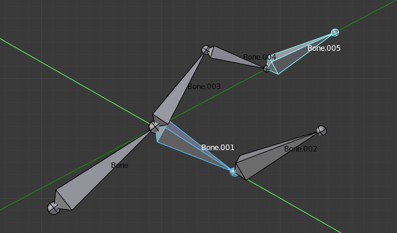

*An example of a rotation locked to the local Y axis, with two bones selected.*

An example of a rotation locked to the local Y axis, with two bones selected.

Note that the two green lines materializing the axes are centered on the armature’s center, and not each bone’s root…

Moreover, the local space for these actions is the bone’s own one (visible when you enable the Axes option of the Armature panel). This is especially important when using axis locking, for example, there is no specific “bone roll” tool in Pose Mode, as you can rotate around the bone’s main axis just by locking on the local Y axis** R>Y>Y**. This also works with several bones selected; each one is locked to its own local axis!

When you pose your armature, you are supposed to have one or more objects skinned on it! And obviously, when you transform a bone in Pose Mode, its related objects or object’s shape is moved/deformed accordingly, in real-time. Unfortunately, if you have a complex rig set-up and/or a heavy skin object, this might produce lag during interactive editing. If you experience such troubles, try enabling the Delay Deform button in the Armature panel; the skin objects will only be updated once you confirm the transform operation.

# Keyframes

Setting keyframes in Blender is not too much different than Maya, however there are a few core features in Blender that make this part of the process a bit more complicated.

##### **Visualization**

There are some important visualization features in the 3D Viewport that can help animation.

When the current frame is a keyframe for the current active object, the name of this object (shown in the upper left corner of the 3D Viewport) turns yellow.

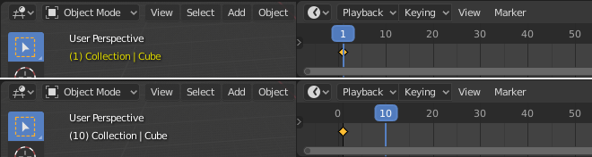

*Top: Current frame is a keyframe for Cube. Bottom: Current frame isn’t a keyframe.*

##### 
##### **Keyframe Types**

For visually distinguishing regular keyframes from different animation events or states (extremes, breakdowns, or other in-betweens) there is the possibility of applying different colors on them for visualization.

**Keyframe (white / yellow diamond)**

Normal keyframe.

**Breakdown (small cyan diamond)**

Breakdown state. e.g. for transitions between key poses.

**Moving Hold (dark ****gray**** / orange diamond)**

A keyframe that adds a small amount of motion around a holding pose. In the Dope Sheet it will also display a bar between them.

**Extreme (big pink diamond)**

An ‘extreme’ state, or some other purpose as needed.

**Jitter (tiny green diamond)**

A filler or baked keyframe for keying on ones, or some other purpose as needed.

##### **Handles & Interpolation Mode Display**

Dope Sheet can display the Bézier handle type associated with the keyframe, and mark segments with non-Bézier interpolation. This facilitates basic editing of interpolation without the use of the Graph Editor.

The icon shape represents the type of the Bézier Handles belonging to the keyframe.

| Circle | Auto Clamped (default) |
|---|---|
| Circle With Dot | Automatic |
| Square | Vector |
| Clipped Diamond | Aligned |
| Diamond | Free |

If the handles of a keyframe have different types, or in case of summary rows representing multiple curves, out of the available choices the icon that is furthest down the list is used. This means that if a grouped row uses a circle icon, it is guaranteed that none of the grouped channels have a non-auto key.

Horizontal green lines mark the use of non-Bézier Interpolation. The line is dimmed in summary rows if not all grouped channels have the same interpolation.

# Constraints

Same as Maya, the concept of constraints is to connect and control an object’s value using another object. Which is often mentioned as **“parent”** and **“child”**. In blender, the parent is called **“target”** and you only need to select one object which is the **“child”** to add the constraint. Also, it is separated into two categories, **“Bone”** and **“Object”**. Multiple constraints on the same objects are also workable in blender in a combination with each other to form a Constraint Stack, however, the animation that you are looking at might get a little too complex to adjust and will lead to software crashes at the end due to there is too many calculation need to be done each time you move the object.

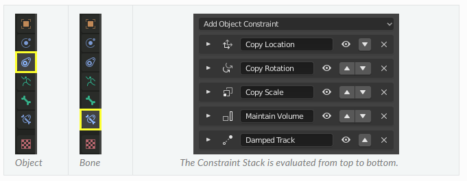

##### **Object and Bone Constraints**

Both types of constraints work under the same logic but the only difference is that if you are animating with a character rig, you might want to go for bone constraint so that you don't need to keep switching working mode.

##### **Adding/Removing a Constraint**

To add a constraint click on the **Add Object Constraint** menu in the Constraints tab.

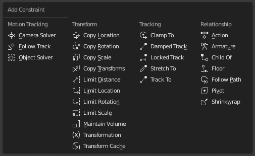

To remove a constraint click on the** “X”** button in the header.

# Exporting Animation

## **Exporting To Another Blender File**

Exporting Animation is very easy by using Action Editor if you are just transferring between blender files.

##### **Action Editor**

Blender saves your animation as a data block in Action Editor, so there is no need for you to “Export” your animation again. You can just append your action from a different .blend file into your new blender file and you will have your animation in a few clicks.

1. Go to File > Append

2. Find the blender file that content the animation you need

3. Select the Action folder

4. Find the Action that content your animation

5. Voila, the animation will be imported into your current file.

## **Exporting To Other Software**

To export your animation to other software, we can use FBX or GLTF. This part is basically the same as maya but when you are doing that, you have to be sure that you are exporting the right object based on the scene.

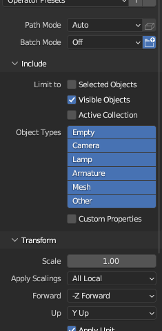

The animation that will be exported is the currently selected action within the Action editor. To reduce the file size, turn off the exporting of any parts you do not want and disable All Actions. For armature animations typically you just leave the armature enabled which is necessary for that type of animation. Reducing what is output makes the export and future import much faster. Normally each action will have its own name but the current or only take can be forced to be named “Default Take”. Typically, this option can remain off.

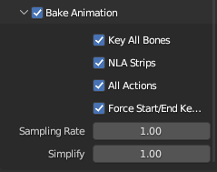

# Addons

# What are addons?

Addons are just like plugins or scripts in MAYA, they provide some features that are not originally in Blender or make the features more user friendly to us animators. There are some addons that have been loved by so many Blender users and have been integrated into newer versions of Blender as default addons. Such as the pose library that we talked about in the previous chapter. These addons can be found online in several websites mainly on gumroad, Github, Blender Studio and also Blender Community Forum. And since Blender is an open source and basically everyone can make and post addons online, please be aware of what you are getting into and make sure all the links are legit before you proceed. We will talk about some must have addons later and you should be good to go from there.

# How to install?

To install addons you will need to first have your addons ready. It can be a compressed file such as .zip or just a simple .py python script.

But, before you head to the web and download a ton of addons and put it into your Blender machines, Blender does come with many addons by default. So first thing first, if you have any addons that you fancy of, check in the default list if that is already installed by Blender.

You can check your installed addons by going to Edit > Preferences > Add-ons.

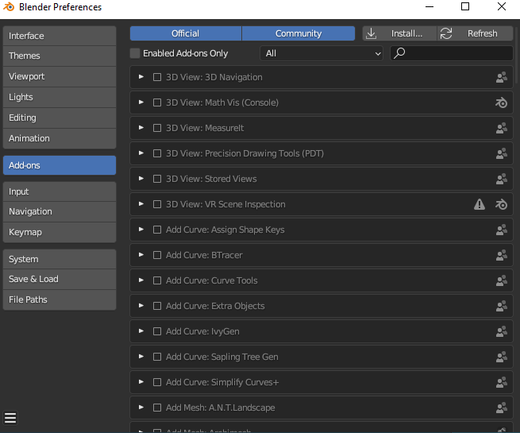

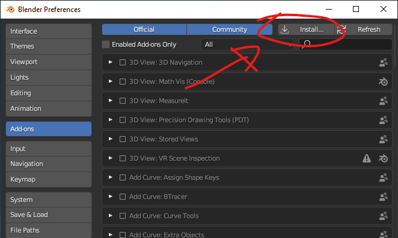

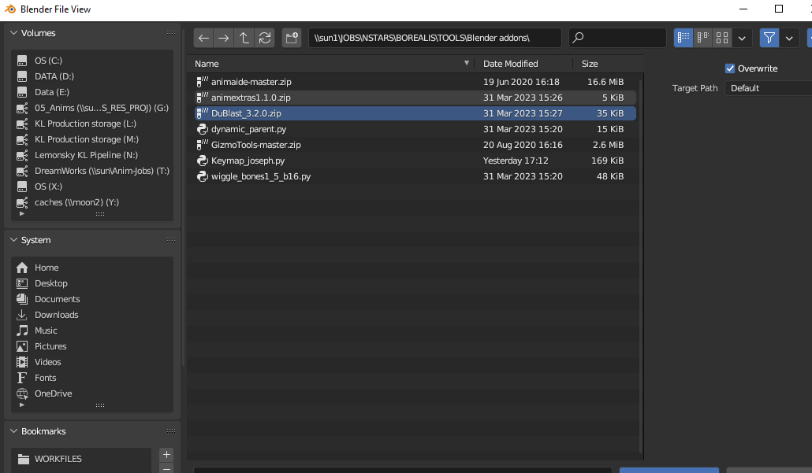

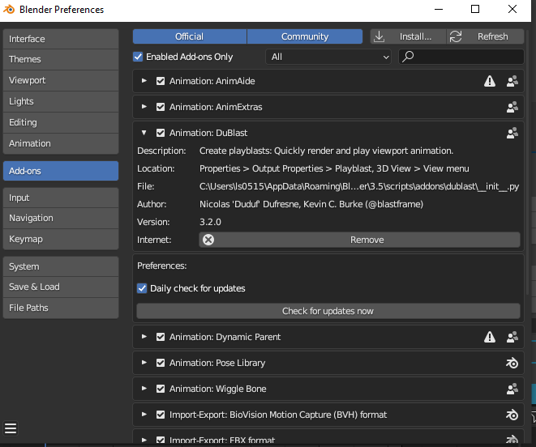

# 

# Essential addons that ease your life

Here are some of the essential Addons that would help on your journey switching from MAYA to Blender.

### Animaide (Not working anymore with 4.0 and above)

Animaide is an addon that helps animators to manipulate the graph editor and manage your keys in a much more efficient way. It also has functions like a tween machine or A-tools that can ease your keys.

More detailed functions can be found on their online manual.

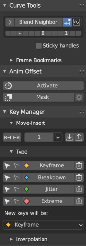

[https://aresdevo.github.io/animaide/](https://aresdevo.github.io/animaide/)

### 
### AnimExtras

AnimExtras is an addon for Blender that adds ease-of-use for animators using onion skinning. It will allow animators to preview and have 3d onion skinning in the 3D View using different preview modes. Colours are fully customizable, together with the opacity. Added options allow for a convenient preview when viewing the onion skinning.

Demo and detailed manual can be found here.

[https://Blendermarket.com/products/animation-extras](https://blendermarket.com/products/animation-extras)

### DuBlast

DuBlast is an add-on for Blender which makes it easy to create and play animation playblasts, without having to change any render or output setting.

The setting can be found under the Output tab in Blender after install.

You will need to set the output path from the default Blender and set the quality and file type in the bottom of the same tab.

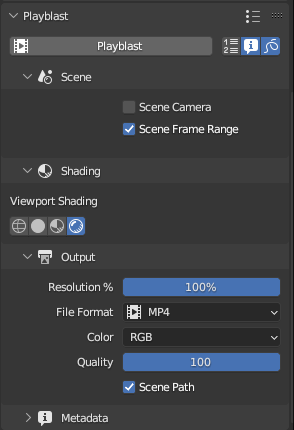

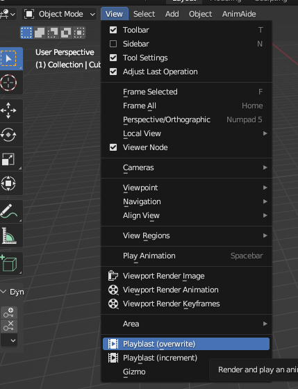

### Dynamic Parent

Dynamic Parent is an add-on for Blender.

The add-on allows you to quickly enable/disable parent-child relationships between objects. This is done through the animated Child Of constraint. When disabled the child's position relative to the parent is preserved. \
 \
Select two objects, and the child should be selected last.

Click `Create` to create constants and animation keys. Move to another frame. Click `Disable` to disable the constraints for the selected objects.

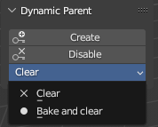

### Gizmo Tools

Gizmo Tools is an addon that lets you change the size of your manipulator like this MAYA since Blender doesn't have an option to do so. This is purely esthetic and you don't have to install this if you don't think you need it.

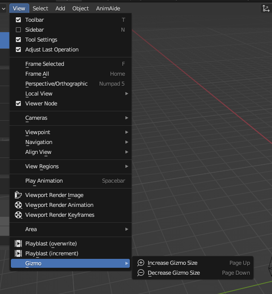

### Spring Bones

Blender addon to add spring/bouncy dynamic effect to bones.

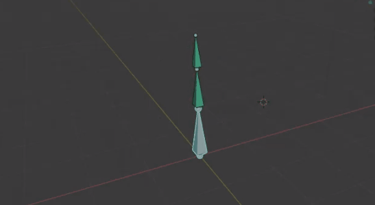

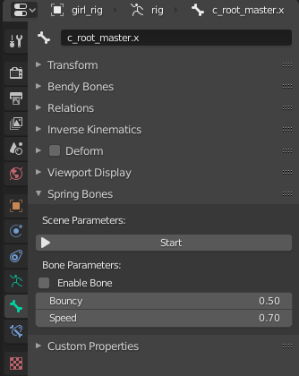

- Click "Enable Bone" to enable spring on a bone (must be a child bone)

- You can adjust the "Bouncy", "Speed" and other parameters parameters such as collision

- Click "Start" to enable the effect interactively, or "Start - Animation Mode" to enable it on frame change only (support baking)

- When moving the parent bone, the child will move dynamically with bouncy motion

- To bake, use the Blender baking tool: press F3 > type "bake" > NLA Bake

### FCurve Helper

It is a Blender addon designed to help animators to deal with FCurves, and specifically F-Modifiers.

It consists of:

- 2 Main operators for Adding and Removing F-Modifiers on all selected FCurves with some specific settings (Add or Modify behaviours to only modified existing F-Modifiers…)

- An inspector showing you the selected FCurves and their F-Modifiers. From here you can copy/paste a single Modifier, enable/disable it, or remove it

Demo link:

### Convert Rotation Mode

Convert Rotation Mode (CRM) is an add-on for Blender that allows you to change the rotation mode of the selected bones and preserve the animation or poses you have already made.

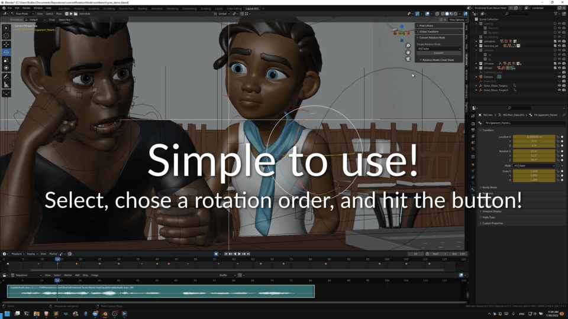

Select one or more bones in Pose mode, select the rotation mode you want them to use, hit the Convert! button.

It will automatically scan through all the keyframes of the selected bones in the timeline.

Please note these are merely suggestions, what you will actually need may vary from one rig to another or even from one animation to another.

Note that there are two main coordinate systems for bones. Blender uses Y down, so this is most likely the one you will use. But you might need to look at the X down in some cases like exporting to softwares that can only read X down.

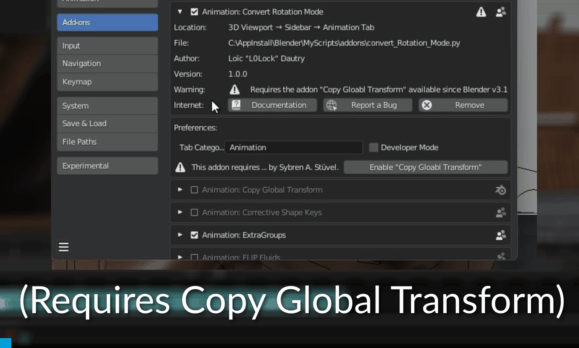

Demo and Manual Link: [https://github.com/L0Lock/convertRotationMode](https://github.com/L0Lock/convertRotationMode)

### BoneDynamic Lite

BoneDynamics Lite is a free blender addon that allows you to add physics to bones, which is similar to BroDynamic on Maya.

**  ↑**  A simple up and down animation is keyed into the “**ROOT**” bone

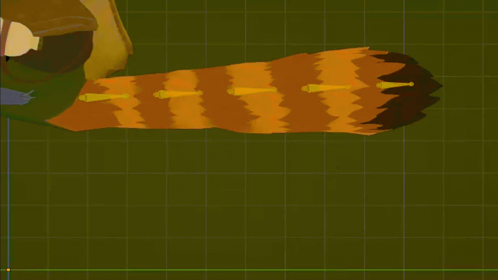
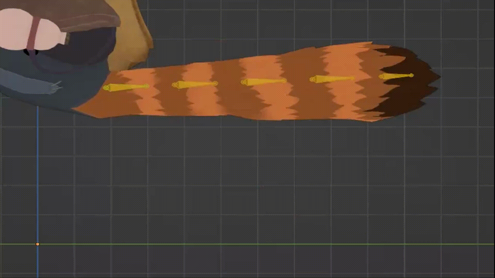

Tail Physics created with ”**Default**” setting        Tail Physics created with ”**Slow**” setting  

#### **Limitations**

- You’ll have to** BAKE** the animation.

- Only works when you select** at least 3 bones** to add the sim on.

- Limited adjustment to make for fine details.

#### **How to use**

1. Select the bones you would like to add physics on, then select the ROOT (BoneDynamic will use this ROOT bone as base for the movement) **LAST****.**

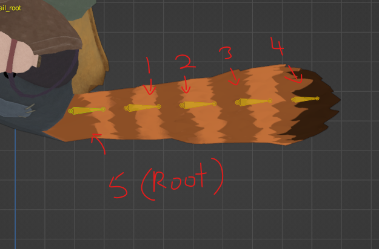

↑ The orders of selecting the bones to add BoneDynamic on

2. Check the settings ①  and press "Add Bone Dynamic"  ②.

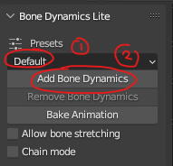

- I personally like the results of “Default”, sometimes using “Slow” if I want it to have a “weighter” feel to it. But do experiment around to see what’s best suited!

3. Play the animation on your timeline for a few times to see the physic kicks in.

4. If you're satisfied with the results, select the bones that have the physics, and select "Bake Animation ''.

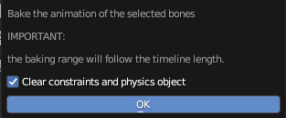

-  Make sure "Clear constraints and physic object" is **ON**

- **Bonedynamic will not add physics sims/constraints into the ROOT bone**, so you don't have to bake the ROOT afterwards, just the bones you have the physics/constraints on.

5. **Remember to double check if there’s any pop frames** after it’s done baking, the addon’s baking sometimes doesn’t bake properly.

#### **Troubleshooting the problem**

If you’re thinking, “Oh no, it doesn’t work for me  : ( “. Have no fret! Here’s some solutions that I’ve found for some common problems you might have!

1. ***It’s not simulating properly, the mesh is twitching crazy!***

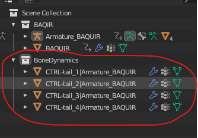

- This will happen when we try to undo after we pressed the “Add BoneDynamic” button. If you undo like that, sometimes it doesn’t fully remove the extra things created from BoneDynamic. Hence residues like the picture remains in your outliner that will mess up your simulation.

- ***No matter how much I bake, there’s still a pop frame that’s not baked properly.***

- If this happens, you’ll need to bake normally using blender’s baking and not the Addon’s baking.

- ***My rig’s hair only has 1 controller, how should I sim it : (***

- The work around way I found is that I will find a bone that doesn’t do anything, etc the very end extra bone for fingers. Then I would select the 1 hair controller first, the finger bone, and lastly the ROOT bone. After that I will delete the keys on the fingerbone in case of future complications. That way it still sims properly and cut down work load : D

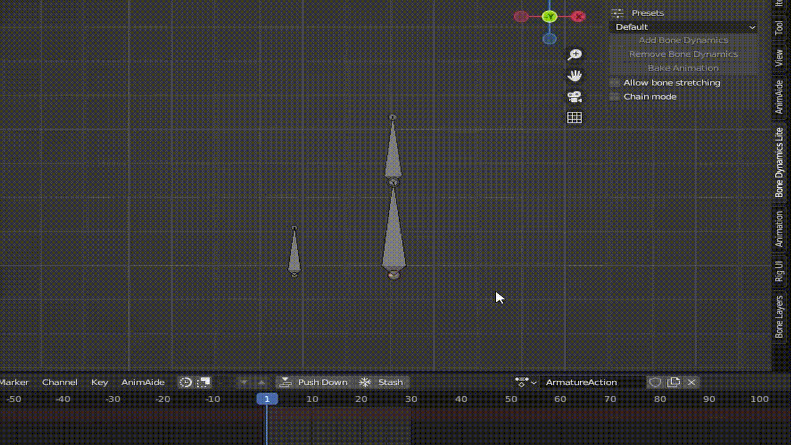

Example of how to solve it by selecting an extra bone to sim it.** ↑** 

### 
### **JT _Bakery**

JT Bakery is a tool that mimics the wj_bakery from maya. Due to the special nature of blender, we will need to separate the function into object mode and pose mode. Please bare in mind that this tool will only work on bone.

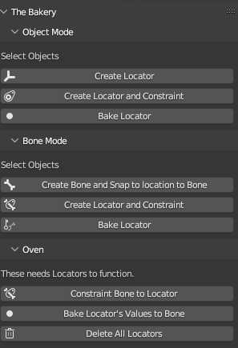

Both object mode and bone mode are having the same function on each button

1. **Create a locator and snap to the selection**

This will create a locator in the scene with the controller name and a suffix _Loc then snap the locator to the selected controller.

2. **Create a locator and constraint to the selection**

This button does everything that the previous one does, but will add a constraint to the selection.

3. **Create a locator and bake selection animation to it.**

This button does everything the previous two does, but after that it will bake the animation to the locator.

The Oven is for us to transfer the animation back to the bone and this section will only be available when there is a locator in the scene.

1. **Constraint the bone to the locator**

After the locator animation has been transferred, this button will constrain the bone back to the locator.

2. **Bake Locator’s Value to Bone**

This button will constraint the bone back to the locator, then bake the locator animation to the bone.

3. **Delete All Locators**

This button will delete all the locators created by this tool, please make sure you have done what you need to do before deleting the locators.

# Notes and Reference:

##### Blender Reference Manual:

[https://docs.blender.org/manual/en/latest/index.html](https://docs.blender.org/manual/en/latest/index.html)

##### Awesome Blender:

[https://github.com/agmmnn/awesome-blender](https://github.com/agmmnn/awesome-blender)
