# **Deadline Renderfarm User Guideline**
<br>
**LAST UPDATED**
Author - Yeoh Kung Sheng<br>
Collaborators - <br>
<br>
Communication is what makes a team strong.<br>
Google is your best friend.<br>

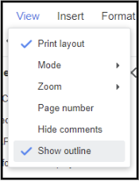

*For content page:*\
*Go to **View \> Show outline** to see outline navigation on the left side*

## 🚀 **Deadline Launcher**

How to start Deadline Launcher

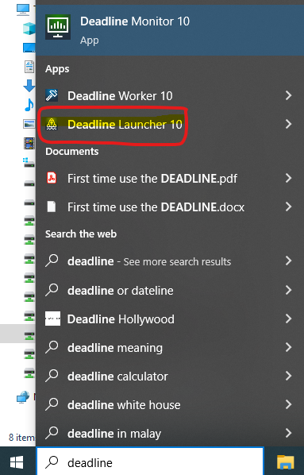

1. You can go to search bar type " Deadline\" to start up the deadline launcher. (Black Rocket icon), this Deadline launcher will auto start when you start on Window.


2. Keep the deadline launcher turned on at all times as Assembly team will utilise artists pc to render over night.

3. As best practice before leaving work and during lunch breaks, manually turn on the Deadline Worker (Blue Rocket). Deadline launcher is set to launch Deadline Working is  no keyboard or mouse activity is detected for 1 hour.<br>
<br>
<br>
    A. Right-click on the Deadline Launcher icon (usually in the system tray).

    B. Click on "Launch Worker"

    C. A message from the Blue Rocket software will pop up, confirming it has started.

Step A and B 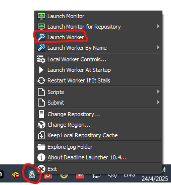<br>
<br>

## 🚨 **Deadline Worker**

- Deadline Worker is a software tool that utilizes multiple machines to render animation sequences or cinematic shots in parallel.

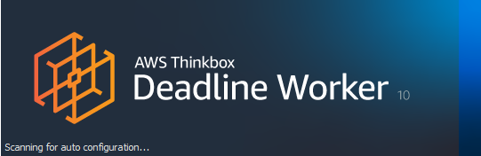

- After starting Deadline Worker, you will see the following tag appear on your desktop, as shown in the image below.

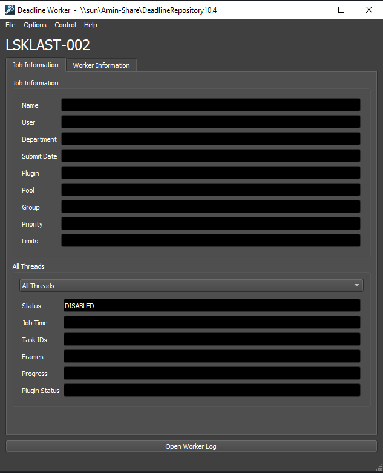

- This tag shows which scene and frame the machine is currently rendering. If the rendering progress is between 95--99%, please allow it to finish before clicking the \'Close\' button. However, if you urgently need to start your work, it\'s fine to press \'Close\' right away.

- After overnight rendering, you might notice your PC running slower even after closing Deadline Worker. If that happens, feel free to restart your machine to restore performance. You need to refer **🎫LS-render account** after you restart your pc.<br>
<br>

## 💻 **Deadline Monitor**

- Deadline Monitor is the platform used to monitor or submit jobs to the render farm for rendering.

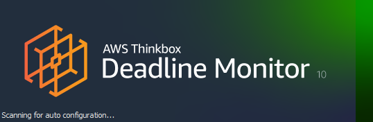

- This is the interface how is deadline monitor look like.

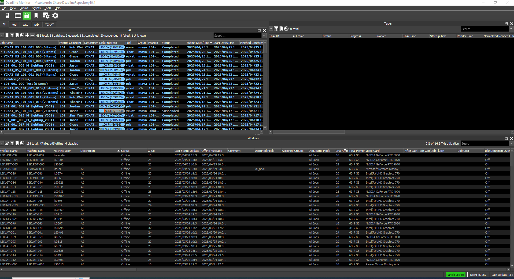

- To launch the deadline, go to desktop taskbar right click the black rocket \> Launch deadline monitor.

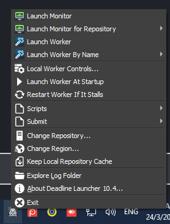
<br>
<br>

### **📜 User interface**

1.  **Job tab - To monitor the job under which project, click on the project tag. If you need any additional project feel free check with Kung Sheng.**

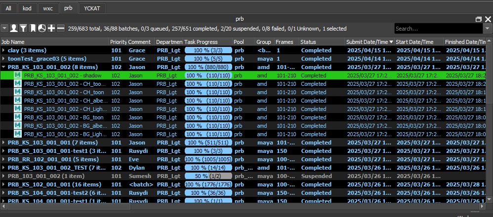

2.  **Tasks tab - When you click on a render job, this tab shows which frames are being rendered. You can use it to review render results or requeue any frames that encountered errors.**

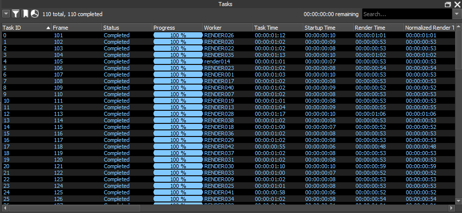

3.  **Workers tab - This column for you to referring how many render machines currently are on duty, any workers are offline or stalled.**

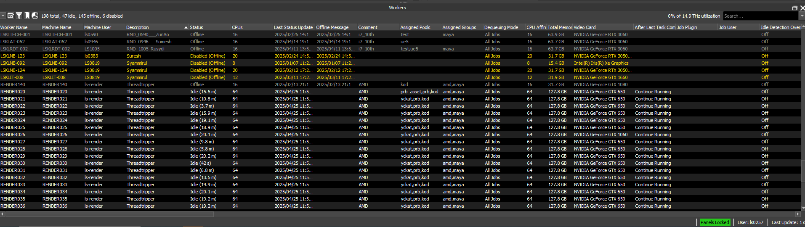<br>
<br>


####  **Important features**

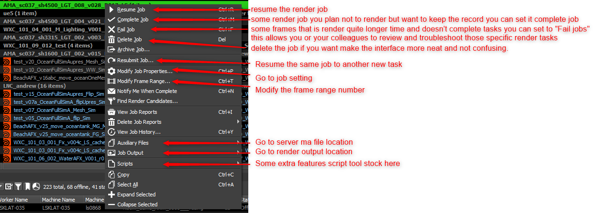<br>
<br>


#### **📕 Stalled jobs**

When machines are stalled, they will be highlighting in red. If you urgently need those jobs rendered, please contact Kung Sheng immediately to help resolved those machines.

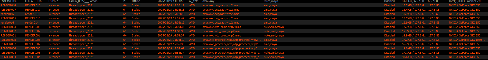

If you seen your job is under failed feel free to resume it.

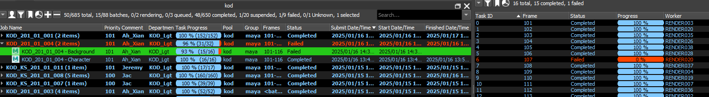

### **How to do resume the failed job**<br>
<br>

**Option 01**<br>
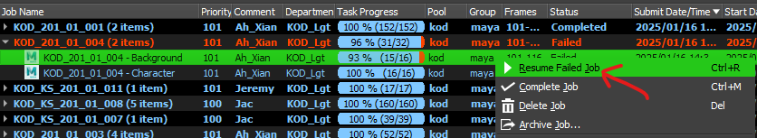

**Option 02**<br>
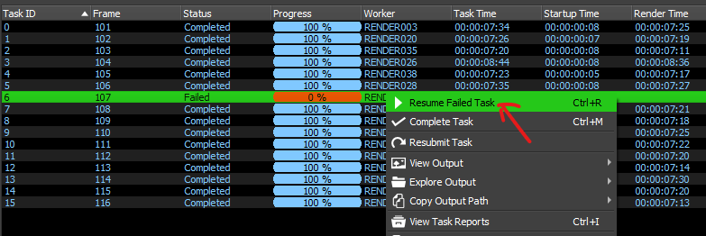

**Option 03**<br>
- Select those failed frames and shortcut key Ctrl + R <br>
<br>

#### **🔄 Resume Stalled Job**
<br>
1.  When you are resume your failed jobs and found out that is keep on failed after couple of minutes or second. Please check the log report first to identify the issue. Just double click the failed frame and you will have this page pop out to check on the log report.

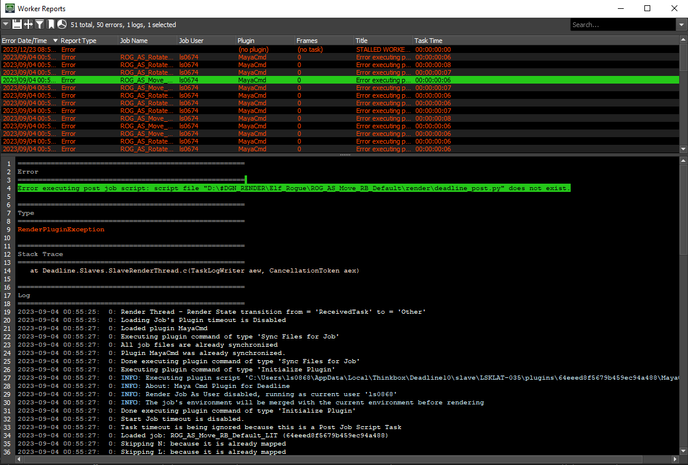

- Resubmit job will help sometime that is just deadline bugs error follow the below image just select those fail frames and right click \> resubmit job

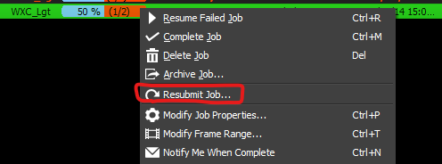

- Next, you need to re-enter the failed frame numbers; otherwise, the new job will re-render all the frames again. exp: 2,5,20,34,35,36-38<br>
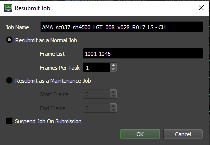


- If you're feeling too lazy to reopen your original project ma file to enhance the render layers and just want to open the farm submission .ma file instead, you can do it like this and open the ma file in the server and overwrite save it.

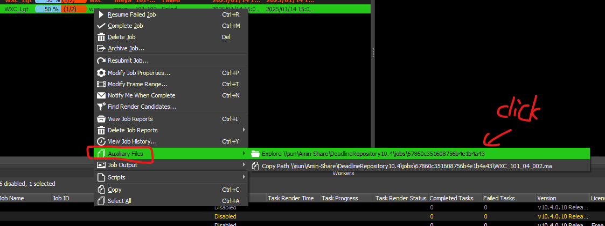

- After modifying your farm submission .ma file, please do this step before resuming the job. Tick on **Re-synchronize Auxiliary Files Between Tasks \> OK.**

- This ensures the render task reads the latest modified .ma file instead of the original version even you are overwrite the farm ma file.

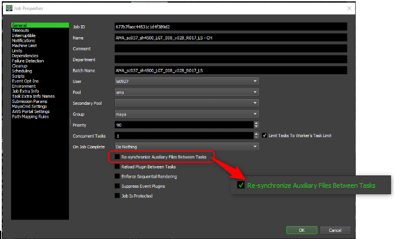

2.  After you check on the log reports that is nothing error, you can simply right click \> click on **resume failed task** only try and see without resubmit or modify your file. Tips: error code 1818 and 1819 they are files too heavy or some assets history need to clean up again.

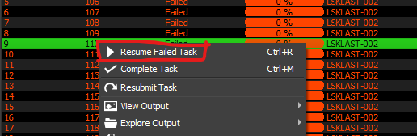

3.  We recommend regularly **cleaning the render reports** to ensure there are **no hidden errors or bugs** in the job.

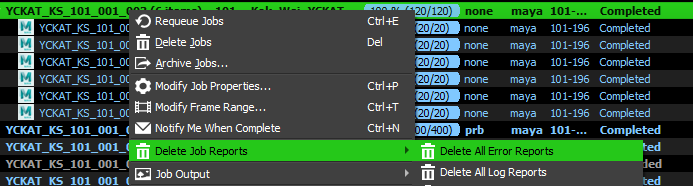


#### **⛔ Disable worker**

- Disable the machine that is under yellow highlight in the worker tab. This is assigned to Kung Sheng to better manage daily software license usage and determine how many machines are needed for job rendering.

- Sometimes, issues like **blank frames** or **flickering** may appear in rendered footage. In such cases, please contact Kung Sheng to help disable the problematic machines. It's provide the **domain names** that produced the errors, so they can be disable worker for troubleshooting.

- A common issue we encounter is that a user\'s Maya XML file gets modified. Usually due to switching projects, installing a new plugin, or updating to a new version of Maya. This can affect render consistency or cause compatibility problems during rendering.

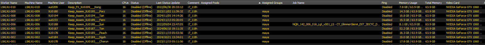

#### **⏱ Time out**

- For every project, we'll set a timeout 3 hours to optimize the usage of our render machines. This feature helps us manage our daily render quota more efficiently. If a machine hangs or becomes unresponsive during rendering for more than 3 hours, the job will be automatically terminated, allowing other jobs to proceed.

- You can also modify the settings here, for example, if the project requires longer rendering time, you can adjust to overtime rendering accordingly.

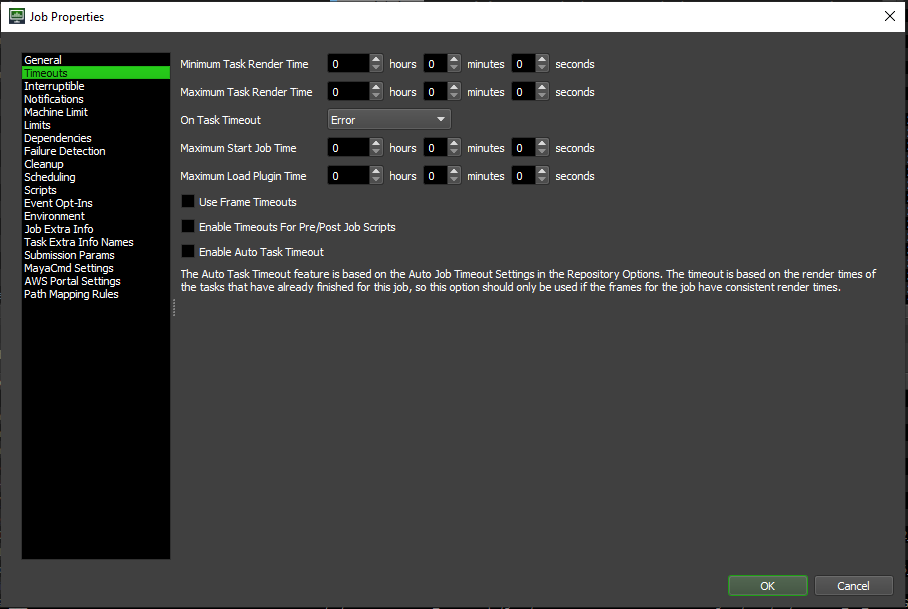

#### **🎫LS-render account**

1.  This is an additional account deployed to all user PCs to improve remote management of rendering tasks. Especially useful during weekends or unexpected power shutdowns. After IT restores power, there\'s no need to log into each user account individually. The **LS-render** account can bypass the regular user login and automatically launch the Deadline software to resume rendering tasks.

2.  LS-render account login password are not allowed to sharing.

3.  Artists are requested to **restart their PC once when returning to work**, then **log out of the LS-render account** and **log back into their own account**. This ensures that the Deadline Worker is not running in the backstage in the LS-render account, preventing unintended background rendering and allowing the system to be used normally for production work.


### **🥏 Submit job**

How to do submit job to deadline, there are 2 ways; within LS_tools or manually submit a job.

##### **1.** **Manual way**

A.  This is how to do manual submit the render jobs, go to tool bar \> Submit \> Maya

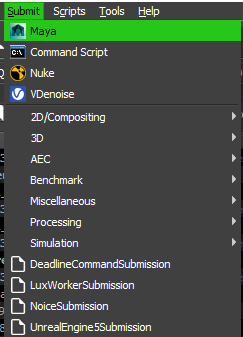

B.  Follow the provided description and make sure to input **all relevant information according to your project's scene file**. This helps maintain consistency, allows easier tracking, and ensures smooth coordination between rendering, asset management, and job distribution.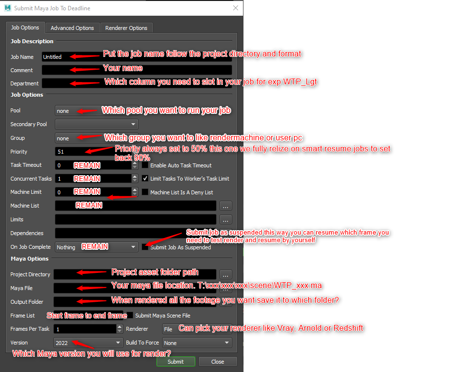

C.  Go to Advanced options page and tick on this 3 options.

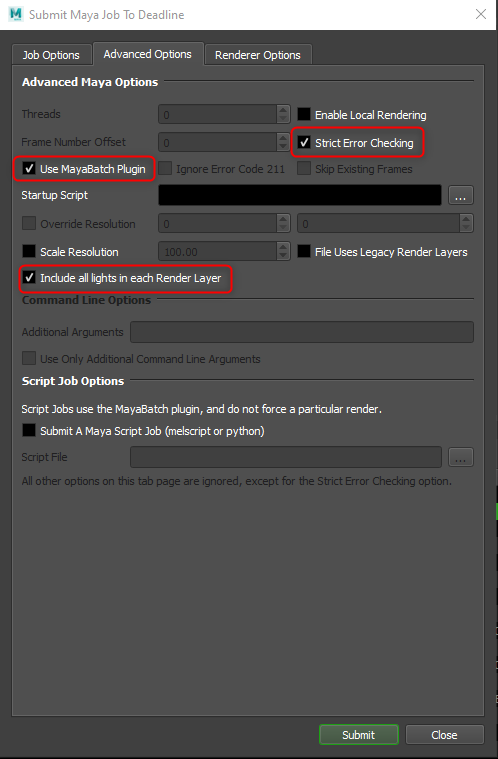

##### **2. LS_tools** 

- LSTools is your one stop shot setup script which we will be using for almost all production projects to help shorten the setup time for each shot.


- Go to \<LSA Pipeline 2025\> - \<Tool Shelves\> - \<LsAssyTools\>

- For more information about LsTool, click here **[LsTool](LSTool_Doc.md)**.<br>
<br>


### **🧶 Job directory**

Here is double check all the setting is it correct.

**Right click the jobs \> Modify jobs properties**

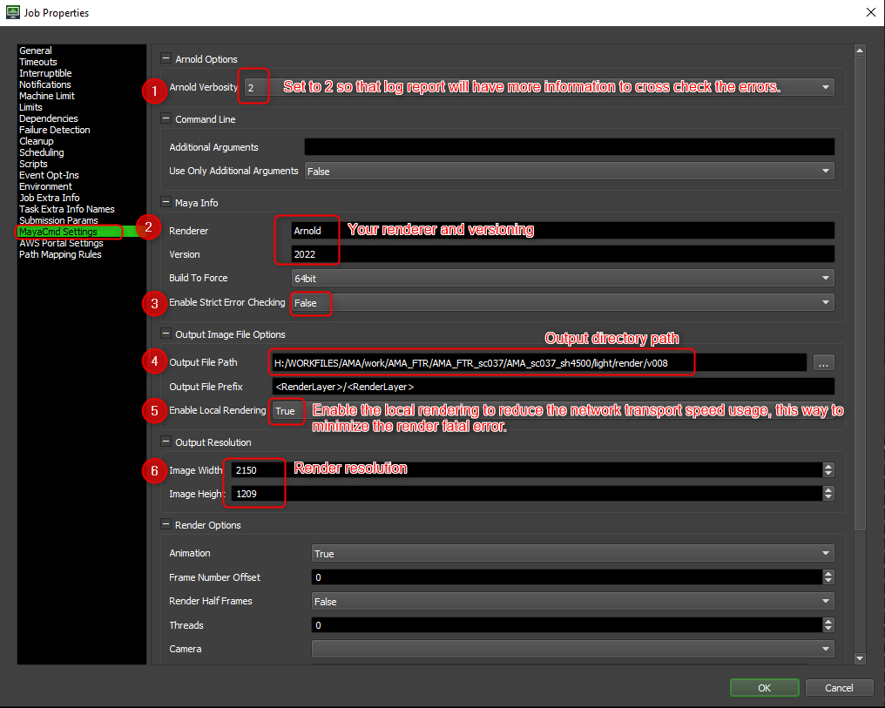


### 🚫 **Machine limit**

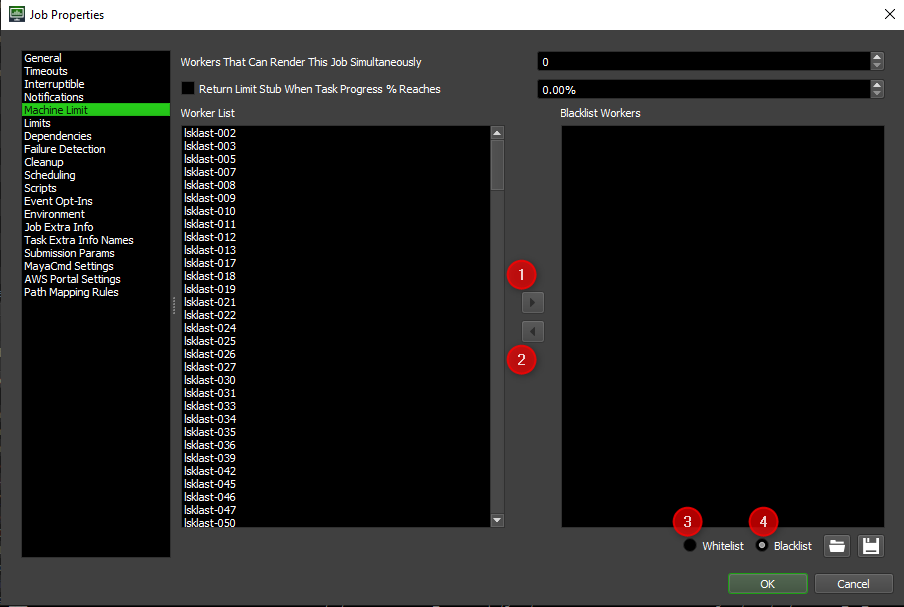

1.  Select which pc you wish to add to blacklist workers bar and press ➡

2.  Which pc you wish to remove it from the blacklist workers bar press the ⬅

3. is set those machines under the **Blacklist Workers** bar as **Whitelist**, so that only the specified render machines will be used for the job.

4. is set those machines under the **Blacklist Workers** bar as **Blacklist**, so that only the specified render machines will be excluded from render job.<br>
<br>

### **🎬 Frame range**

1.  When you submit a job, you still have the option to modify the frame range afterward. There are two ways to do this:

2. **Select the group of jobs**, then **right-click** and choose **\"Modify Frame Range\"** to adjust the frame range for all selected jobs.

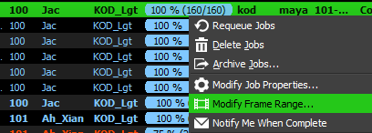

3. Second, select the specify layer that you want to change the frame range for rendering. **Right click \> Modify Frame Range.**

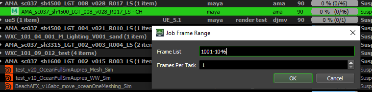

4. Both you can use shortcut too, **Ctrl + T**<br>
<br>

### **📂 Output directory**

How to get the output directory, you can use shortcut key **Ctrl + O** or **right click \> Job output \> Explore Output \> click on the link.**

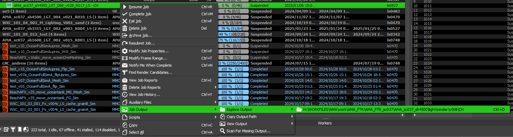<br>
<br>

### **💥 Smart resume job**

You can select those jobs and then right click **\> Scripts \> SmartResumeJob** or **Ctrl+Alt+R.**

- The farm will automatically help **break down the job** and **assign it to the appropriate render machines** based on the updated frame range. This ensures efficient load distribution and optimal use of rendering resources.


Here is the script location for future motification when Deadline versions upgrade.

```//sun/Amin-Share/DeadlineRepository10.4/custom/scripts/Jobs/GroupCheck.py```

<br>
### **🏳 Modify job tasks**

This shortcut feature allows you to **change or add to the job task name.** For example, tagging it as ***Keyshot*, *Re-render*, or *Feedback*** which is especially useful when using the **ls_tool**, where direct name editing isn't possible. By entering the desired label here, the script will **automatically append it to the job name**.

This feature is useful because it helps prevent accidentally adding labels like **KS (Keyshot)**, **FB (Feedback)**, or **RR (Re-render)** directly into the **render output file names**. Instead, these tags are appended to the **job name only** for identification purposes, ensuring that the **final output sequence files remain clean and correctly named**.

Exp:

WTP_101_01_001**\_FB**\_LGT

WTP_101_01_001**\_RR**\_LGT

WTP_101_01_001**\_KS**\_LGT


This feature is designed for **super users** to quickly identify which jobs have **higher priority** beyond the standard episodic shot renders.

Here is the script location for future motification when Deadline versions upgrade.
```//sun/Amin-Share/DeadlineRepository10.4/custom/scripts/Jobs/GroupCheck.py```

### **🏴Resume / Requeue frame range**

This shortcut feature allows you to **re-sequence specific frames** you want to test render across **multiple layers**, saving time and effort. Instead of manually re-sequencing frames one by one for each job and frame, this tool lets you **batch-select and reassign frame ranges**, making the test rendering process much more efficient and streamlined.

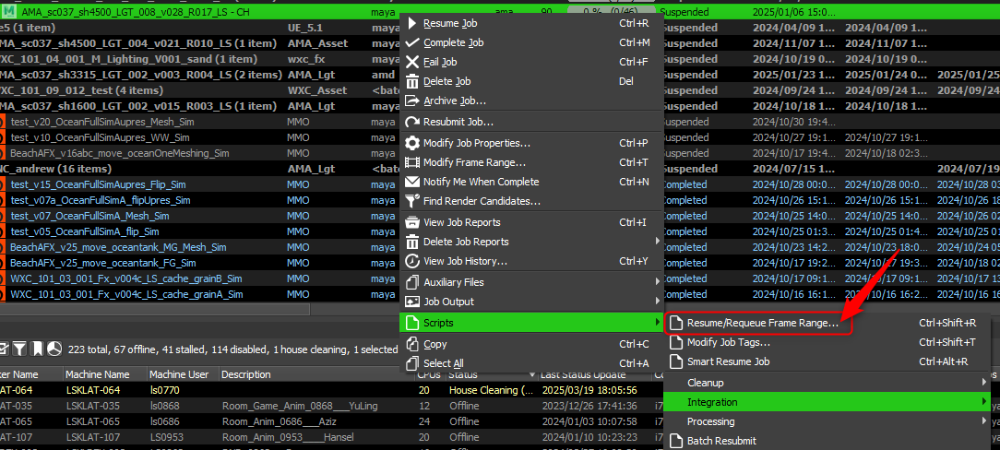

<br>

## 💎Super user

### Ⓜ User guideline

1.  Instructions for accessing the super user account to configure advanced farm settings.

Go to **Tools \> Super User Mode \> Enter the password.**

- This only apply for who is the person managing the deadline farm.

### 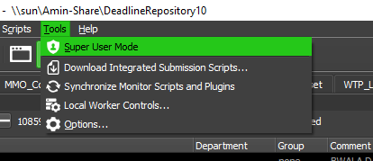

- Enter password

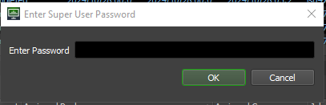

2\. Allow artist to modified other artist's render job.

**Tools \> manage User Group \> Can Modify Other User's Jobs \> OK**

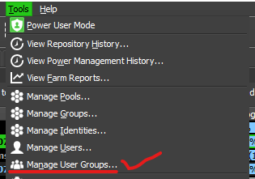

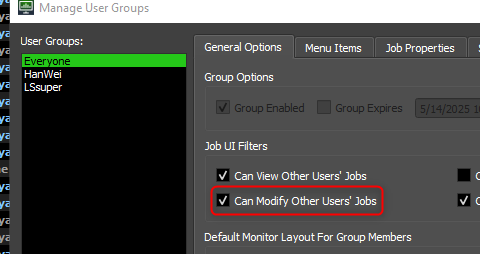<br>
<br>

### 📫 Mapped drives

1.  To map drives into Deadline when starting a new project for rendering, here are the **3 key steps you need to follow**:

    1.1.  **Get the Project Path**\
        Locate the project path from the shared drive---for example:\
        \\\\sun\\Anim_Jobs\\DISNEY\\BCG\
        (This is map to the **J: drive**.)

    1.2.  **Raise a Ticket to IT**\
        Request IT to **map the new project drive** to the **LS-render account** on all relevant render machines. This ensures the render nodes can access the new drives.

    1.3.  **Check Software Compatibility**\
        Verify the **Maya version** and the **renderer (e.g., Arnold, Redshift, V-Ray)** version used in the project match the versions installed on the Deadline render machines.\
        If they do not match, **raise a ticket** to request an upgrade or installation to ensure compatibility.

2.  After completing the drive mapping, please **restart all the render machines** to ensure the **LS-render account activates and gains access to the mapped drive**.<br>
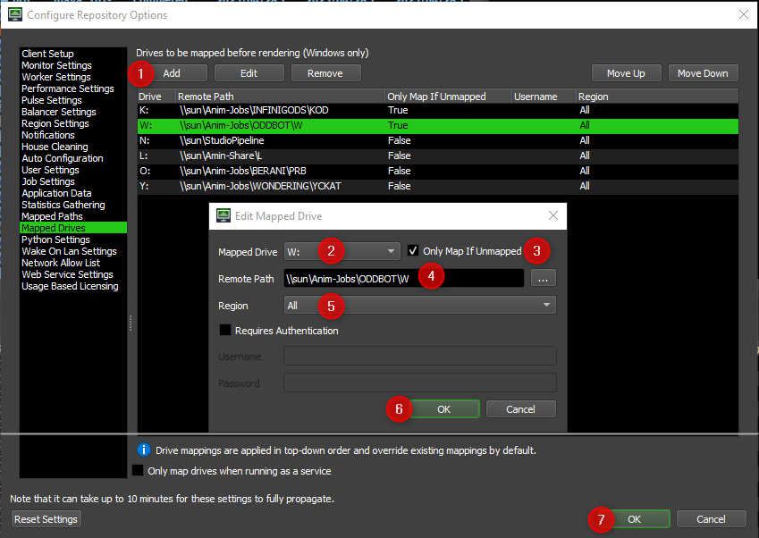<br>
    <br>2.1. press **Add**

    2.2.  Choose the drive

    2.3.  Tick the map will map the drive when it's unmap the drive. If untick meaning every time will map it before render.

    2.4.  Paste the \\\\**sun drive path** here.

    2.5.  Region choose the **All**

    2.6.  and 2.7. press **OK** to saved.<br>
    <br> 


### 📬 **Mapped paths**

Always check with the Technical Supervisor (Zun-Ao) as only some situation requires to map the path, e.g the progress need to free out more network bandwidth and create a fake path to stock our cache files. 90% that is non requested, best practice is to double check with the Tech Supervisor before proceeding.

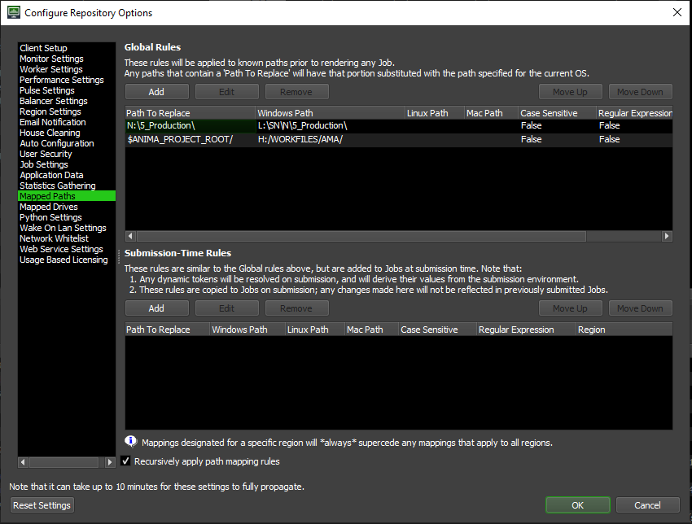<br>
<br>


### **📰Clone tab**

1. To easily filter your jobs base on project, clone the project tab to more efficiently without searching one by one.
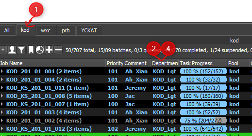<br>
<br>
    1.1.  In the Filter Name: \< Put your project name \>, will display the name as below image.

    1.2.  This column is used to select the Department for filtering purposes. In our case, we utilize the Department column within our project for easier tracking and organization.

    1.3.  Equals is the best choose

    1.4.  Use the same name as provided by the **Ls_tool** from the Tech team. This allows Deadline to automatically identify and categorize your jobs into the appropriate project tabs.<br>
    <br>
    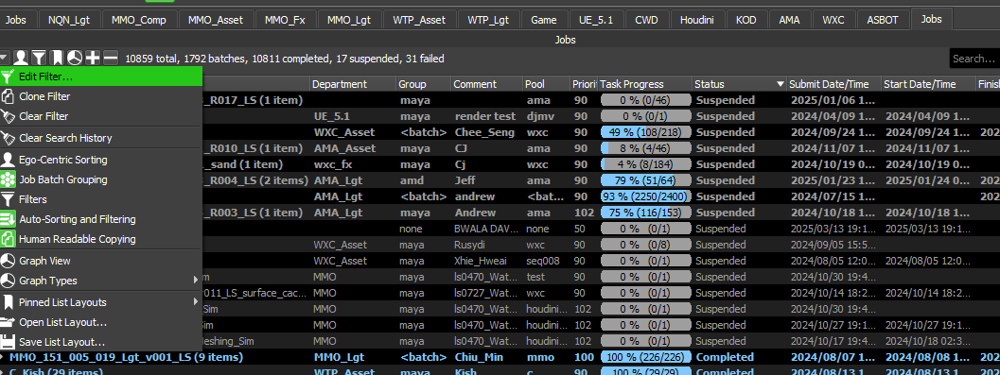 
    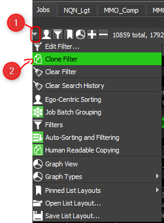 
    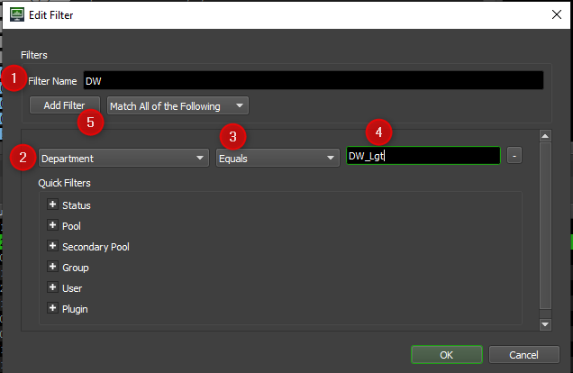
    <br>
    1.5.  You can add multiply filters to included different department into one tab.<br>
<br>

2. After setup the new project tag how to save and share with other users.

    2.1.  Go to **Configure Repository Option**

    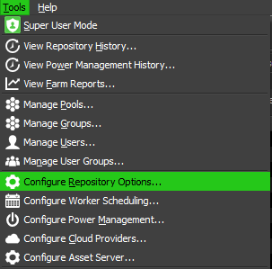

    2.2. Go to **Monitor Settings.**

    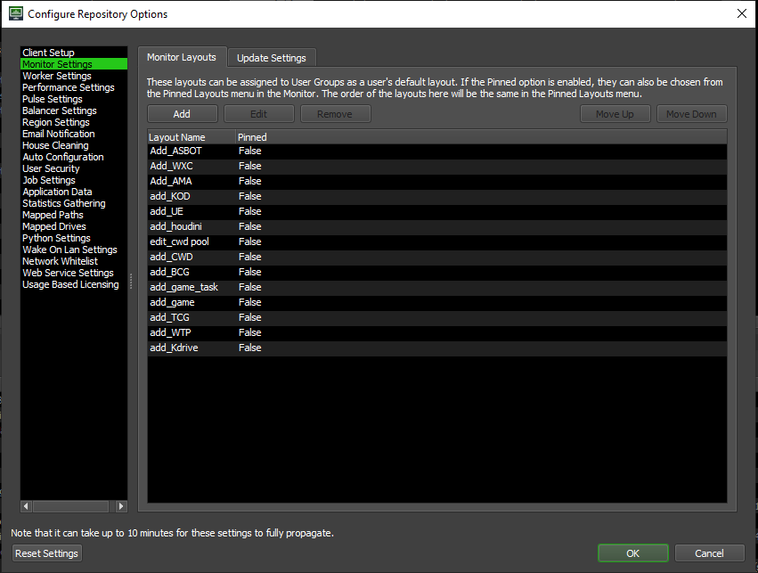

    2.3. Press on **Add** button and select the **Select Layout File,** put the description for your remaining and also can

    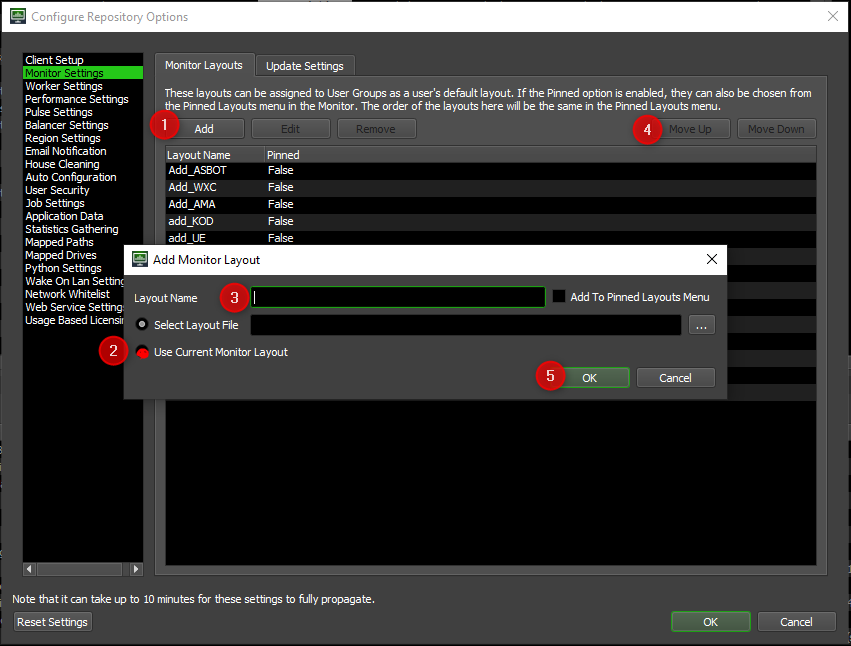

    2.4.  Press the **Add**

    2.5.  Choose **Use Current Monitor Layout**

    2.6.  Rename the job or task with a **clear and descriptive name** to identify which feature or section has been updated. this helps with both tracking changes for record-keeping and for managing tasks within Deadline.

    2.7.  You can move the job name to the top of the list and inform the PIC that the **top name always represents the latest setup**. This helps everyone quickly identify the most recent updates, ensuring the correct version is used for rendering and tracking.

    2.8.  Press **OK** to saved.<br>
    <br>

3. After completed the **Configure Repository Options** setup, the final step is to **apply and deploy the configuration through Deadline**, making the settings available for everyone across the studio.

    3.1.  Go to Tools \> Manage User Groups

    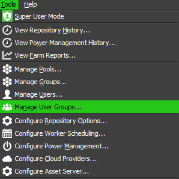

    3.2. Select **Everyone,**


    a.  In the Layout: choose the latest **configure monitor layout.**

    b.  press **OK** to save again.

    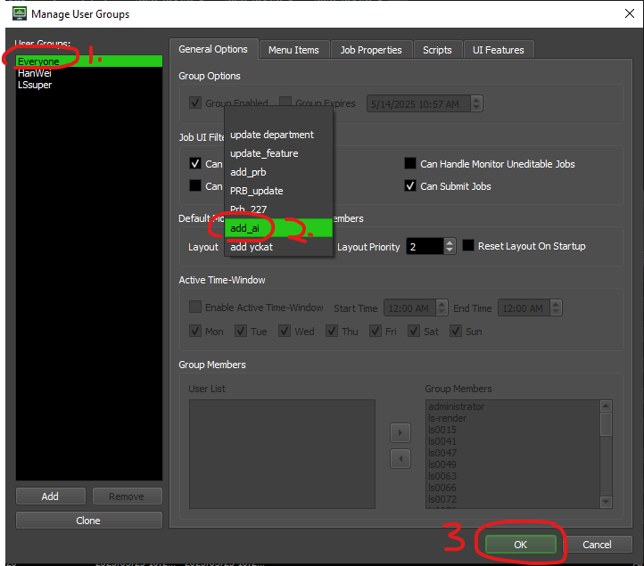

    3.3. And then super user (PIC) need to announce it to everyone to reset layout and update the deadline monitor interface.

    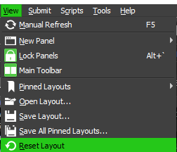<br>
<br>


### 💻**Manage domain pc**

To better manage all render machines it\'s best to organize them by department, LSID, and artist name in the **Woker Description**. Additionally, include the PC spec in the **Worker Comment** section for reference. This is especially helpful when certain jobs require higher-spec machines for rendering.

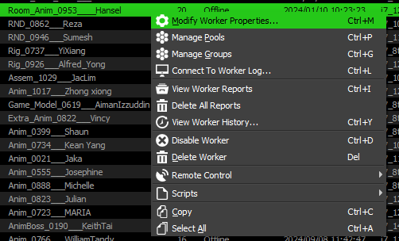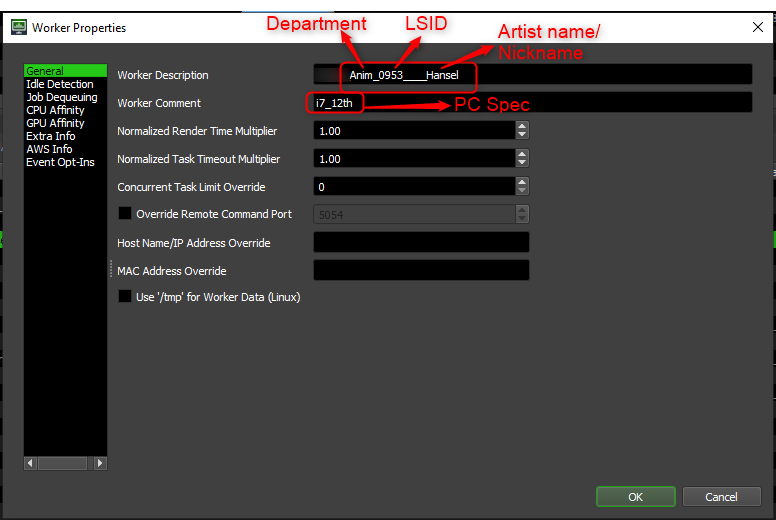

For each domain PC, we can set up an individual idle detector to enable automatic startup for that specific machine. However, we also have a general idle detection setting configured under the super user account. This serves as a fallback in case certain PCs require a customized. 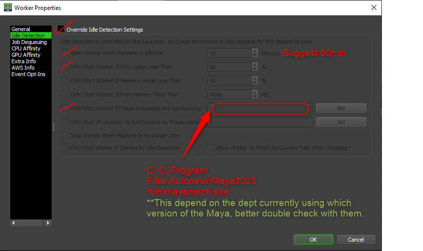<br>
<br>


### 🧭 **Worker schedule**

Besides managing the schedule for individual domain PCs, you can also configure a **Worker Schedule** that can be **deployed to all machines added into Deadline**.

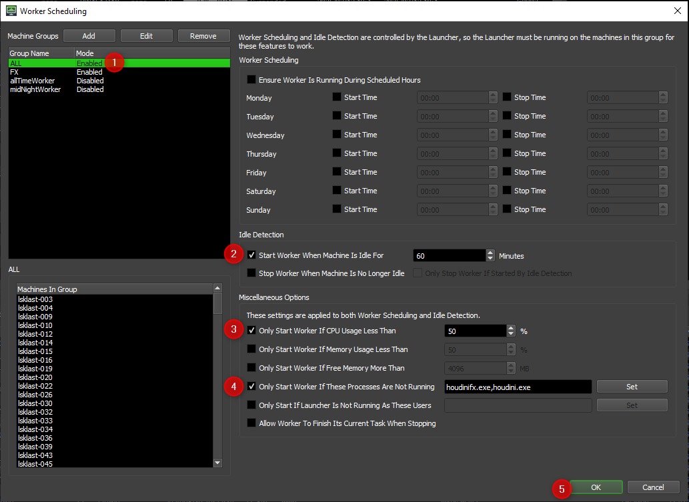

1.  Select **ALL**

2.  Tick on start worker idle for **60 minutes**

3.  Tick on start worker **CPU usage** below 50%

4.  Tick on start worker if **not running software** like Houdini, Maya and etc for 60 minutes.

5.  Press **OK** to saved<br>
<br>


### 🎨**Assign Pool**

How to allow the pc auto detect the project and start the rendering jobs. We need to setup 2 setting within "**Pools and Group**"
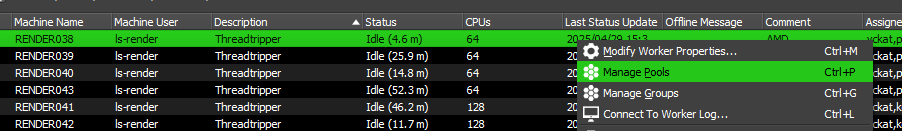
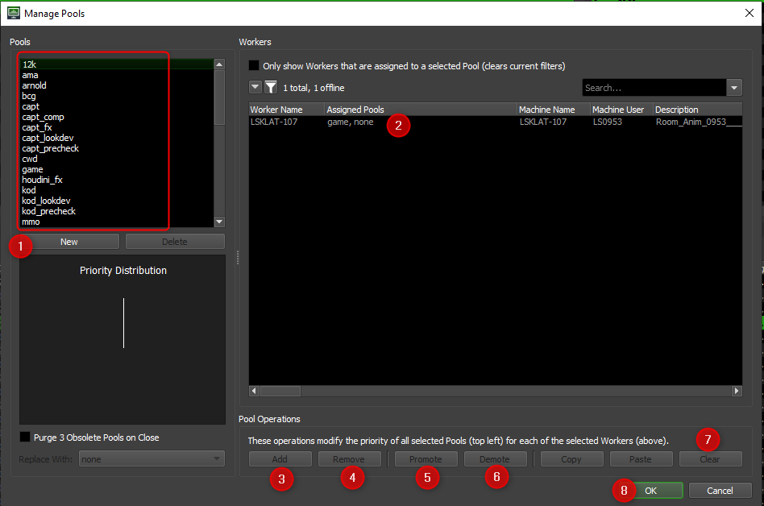

On the red circle that pools column you can find out any pools name you wish to add into the worker name.

1.  Press **\"New\"** to add a new project name.

2.  Select the **pool name** from the **Pools section**. \> Select the **worker** you want to assign to that pool.

3.  Press **\"Add\"** to assign the selected pool to the worker.

4.  Press **\"Remove\"** to unassigned a pool from the worker if it was assigned incorrectly or needs to be changed.

5.  Press **\"Promote\"** to set a pool as the first priority in the first choice. The worker will check this pool first for jobs; if there are no jobs, it will move on to the second priority pool, and so on.

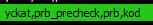

Example: This worker will prioritize rendering jobs from the **yckat** project first. When there are no more **yckat** jobs in the queue, it will automatically move on to render jobs from the **prb_precheck** project, which is set as the second priority.

6.  Pressing **\"Demote\"** means you want to lower the priority of a pool. This allows another pool name to take priority for rendering. You can demote a pool to make it the second or even the last in the priority order, depending on your workflow needs.

7.  Sometimes a worker may have too many pool names assigned. In that case, you can press **\"Clean\"** to clear the existing assignments and reassign pool names based on the current needs of your render farm.

8.  Press **"Ok"** then everything will be saved.<br>
<br>


### 🎨 **Assign Group**

Assign the **"Group"** this is for you manage the high spec and lower spec pc render the different render time jobs.

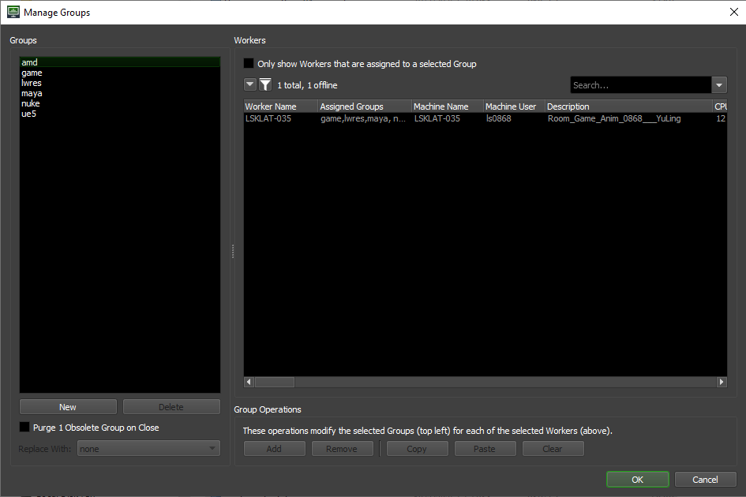

We currently have **43 machines equipped with AMD Threadripper processors** and around **100--110 user PCs** in the studio. This setup allows us to efficiently separate heavy and light rendering tasks by assigning them to the appropriate machines.\
For example, a single frame that takes **40 minutes** to render on an artist's PC can be completed in just **8 minutes** on an AMD Threadripper machine, this significantly improving render times and resource allocation.

Therefore, our weekday daily render quota is estimated to be around **8,000--10,000 frames per night**, while the weekend quota increases to approximately **34,000--36,000 frames**. These figures are based on typical requirements from the **Capt**, **NQN**, and **MMO** projects. Additionally, episodic storytelling and asset complexity can significantly impact the daily render quota, especially when rendering heavy assets like large cities or multiple combined sets within a single episode, which require more resources and time.

Therefore, we classify rendering tasks by separating **heavy jobs** to the **AMD group** and **light jobs** to the **lwres group**. This classification ensures optimal use of resources, faster turnaround times, and balanced workload distribution across the render farm.

Below that is how we understanding on render time to separate out using which group.

All render times must be calculated using the **AMD Threadripper machines** during the **precheck render** stage. This allows Deadline to accurately determine render duration and assign jobs to the appropriate machines based on render times, ensuring efficient distribution across the render farm.

**Less than 9 min = Maya pool\
More than 10 min and more than 16 min = Maya pool but split job into 1\
More than 17 min = AMD and split job into 1
More than 17 min = AMD and split job \***remain 2 frame per task.**

Here is some of the formula we can do referring and acknowledge how is deadline break down the render jobs. All this can used our additional tools call " **Smart resume job**" can refer back on 💥 **Smart resume job**

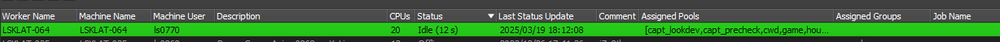

Once you **change the pool assignment** on a domain PC, please **wait until the \"Assigned Pools\" update is fully completed**. Alternatively, you can **Cancel current tasks** on that machine to immediately apply the new pool settings.<br>
<br>


### 🛑 **Stalled machine**

Stalled machines often occur when rendering borderline heavy jobs or when a PC overheats and hangs. In such cases, the super user needs to set the stalled machine to **Mark Worker as Offline** in Deadline Monitor and notify IT or the artist to restart the PC. If the stalled machine is not marked offline, it will remain visible under \"Stalled\" status, which can cause confusion and disrupt efficient job distribution.

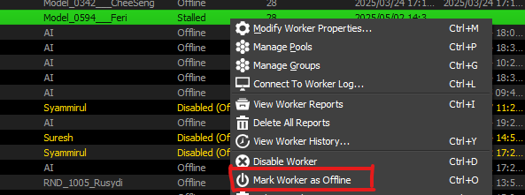

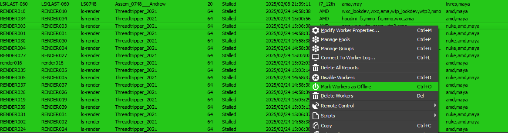<br>
<br>


### **💲 Render report**

When the **PM or SPM** asks for the **Deadline render quota** for project estimation purposes, you can **generate the render report** from here.

To check the **daily total rendered frames** or **total render tasks**, you can follow these steps in **Deadline Monitor** too**.**

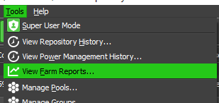

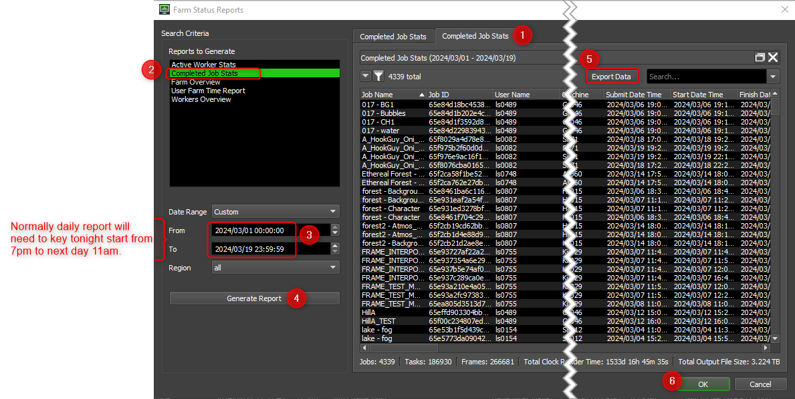

1.  This is the bar to view all the render jobs base on the from and to date.

2.  Select the Complete Job Stats

3.  Set the **From** and **To** date including the times, From set 19:00:00 and To set to 11:00:00

4.  Press **Generate Report** then No.1 there will create a new tab for you.

5.  Press **Export Data** to save the csv.file

6.  Press **OK** to close the report.<br>
<br>


### 🔄 **Restart PC or worker of PC.**

Some machines may need to be **restarted** to refresh their performance or resolve issues like **slow rendering, memory leaks, or unresponsiveness**.

Select the domain pc, you can select multiple machines please press and hold the Shift key and select the domain pc. **Right click \> Remote Control \> Worker Commands \> Start Worker.**

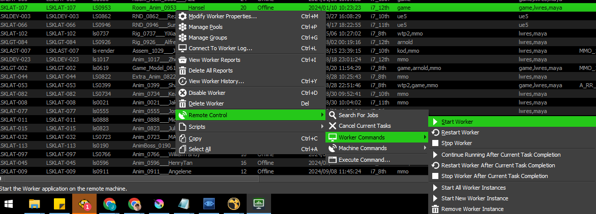

If you notice that some artists have requested a PC restart from IT but haven\'t received a quick response, you can try to remotely restart the PC through Deadline Monitor.<br>
<br>


### 📜 **View worker reports**

When a **machine stalls** or there are **render errors**, you can go to the **View Worker Reports** in the domain pc to check the **log reports**. This helps you identify the root cause of the issue.

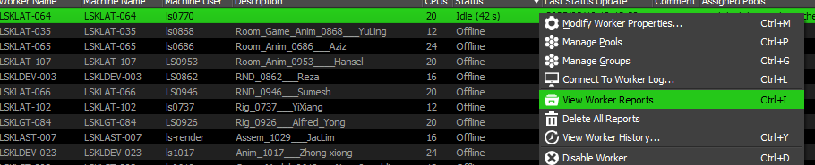

