# **✨ Tips & Tricks**

## **👩🏻‍🎤 Just Act It Out** 

- The most simplest way to understand body mechanics, just stand up and act

- **Lemon Sky has props,** please ask your lead 👈🏻

## **🏃🏻‍♀️ Get to the Antic A.S.A.P** 

- Game animation is all about fast response, get to the antic very early!!

- Players do not need to see that slow transition from idle to antic, what they need to see is that once a button is clicked, it would immediately register that the action is performed

## **😖 Wasted Frames**

- Game animation is all about maximizing the usage of frames

- If you go frame by frame and notice that the change in pose is not that big of a difference, that means you are not utilizing your frames well

## **🔁 360 degrees**

- Normally games would allow a player to look at the character in 360 degree angle (\...not unless the game is already set with a specific angle)

- **Do not CHEAT the angle !! Make sure the pose looks correct and believable from all angles !!**

- Check your motion from all angles

## **🥧 Fast Bake**

- If you need baking at lightspeed (joking), please utilize the Fast Bake tool. Basically it bakes in the background hence, speeding up the process

> 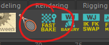

## **⚖ Key Scale**

- For loop motions, play around with the Key Scaler script. As the name says, it is able to scale up or down the curves or inverse if necessary

> 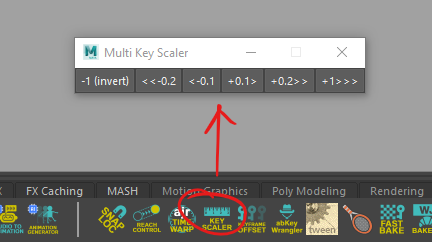

- This works a bit differently from the regular Scale in the Graph Editor but there is a huge difference in the result. The regular one scales all graphs by the same pivot but this tool will scale all graphs by each of their own pivots.

## **🕐 Time Warp**

- When you need to do a quick adjustment to the overall timing, try playing around with time warp, just select the curves that you want to adjust the timing and hit the ajr TIMEWARP tool

> 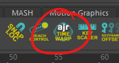
>
> It is recommended that all curves are selected when you are choosing the "selected objects" option or by changing this to "entire scene"
>
> 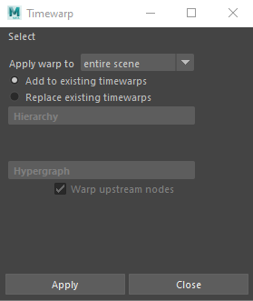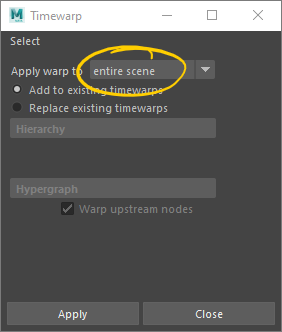
>
> Once you have time warp working, you'll notice that it cannot be found in the outliner and has to be selected by name. To do this, change "Absolute transform" to "Select by name" and type in "timeWarp"
>
> 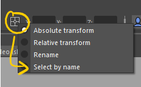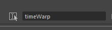
>
> By default, 2 keys are set at 1 and 100 and that the curve is on, so, depending on your motion, you'll need to change those 2 keys to your first and last frame value. Make sure the curve is also changed from auto to spline. **Both the x and y columns must have the same value**
>
> 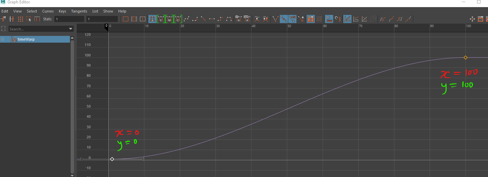
>
> ***Example :***
>
> ***x and y columns on your first frame have a value of 0 and on the last frame, both x and y columns are 10. The curve is also changed from auto to spline***
>
> 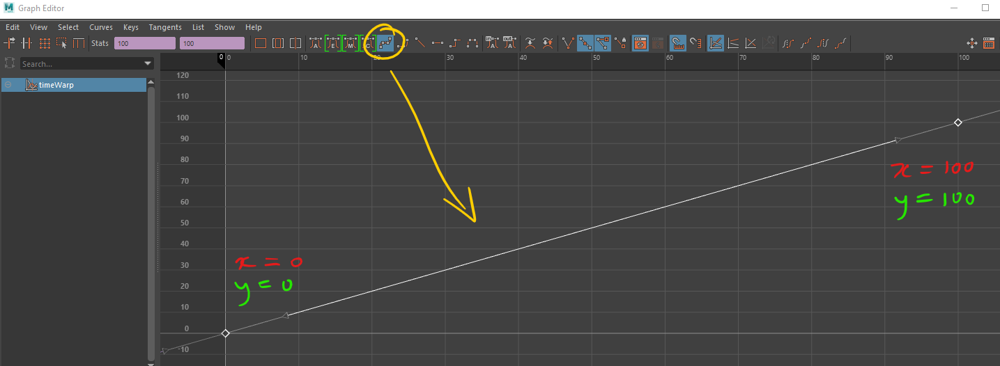
>
> Key whichever frame you think is important and from the curve drag it left or right depending on whether you want the motion to be faster or slower. Once you are more or less settled with what you want, the next step is to bake it. Baking will automatically remove the time warp curve and in the event it does not remove it, just find the name of the time warp and manually remove it. Since the animation is baked, it should not be an issue for you to manually delete the time warp

## **🦾 Reach Tool** 

> 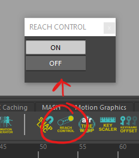

- This tool works well for IK only

- Originally designed to fix overstretched arms/legs and jitters in mocap data but the same principle can be applied to hand key motions

- Usually it is applied to the arms and legs but can also be applied to the COG depending on the situation

<!-- -->

- **If the arm/leg is in contact with the ground, please avoid using this script (IMPORTANT)**

<!-- -->

- The general idea is that the end control of a limb hierarchy is selected first followed by the start control of the same limb's hierarchy, after that just hit the "ON" button

## **🔑 Keyframe Offset**

> 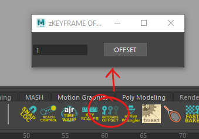

- This tool is good to use when you are doing loop motions such as locomotion

- It offsets each controllers' keys that you selected by the amount that you input in the box by the order of selection.

- So, make sure you select the controllers by the correct order first

> *Example :*
>
> *Using the FK arm* *(shoulder ctrl, upper arm ctrl, forearm ctrl and wrist*
>
> *ctrl)*

- Select in order from the shoulder until the wrist

- Input 2 (for example) in the box and click OFFSET

- All ctrls' keys except the first selected one will be delayed by 2 frames each

- **The end result would look something like this**

<!-- -->

- **shoulder ctrl (remain the same frame)**

- **upper arm ctrl (delayed by 2 frames)**

- **forearm ctrl (delayed by 2 frames FROM upper arm ctrl OR 4 frames FROM shoulder ctrl)**

- **wrist ctrl (delayed by 2 frames FROM forearm arm ctrl OR 6 frames FROM shoulder ctrl)**

## **🎹 Keyframe Wrangler**

> 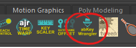
>
> 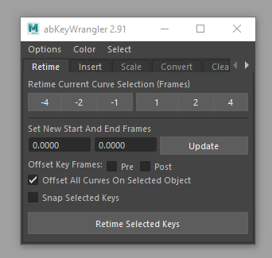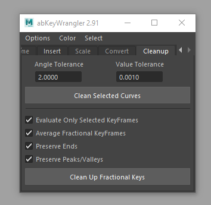

- **Retime** and **Cleanup** are mainly used

<!-- -->

- Retime

<!-- -->

- For the retime tool, you can retime your animation without having the graphs to be broken, it will automatically adjust to match with the original graph

<!-- -->

- The number buttons are either to shorten or lengthen the selected frames

- Turning on the "Snap Selected Keys" is **OPTIONAL** if you do not want to see decimals in your keys but it might deform the graph a bit

<!-- -->

- Cleanup

<!-- -->

- A really good tool to use when you are handling a bunch of keys such as mocap data.

- For "Clean Selected Curves", it will clean all of the selected ctrls' graphs by removing constant keys

- For "Clean Up Fractional Keys", it will transfer your fractal keys (if any) into a whole number keyframe instead without affecting the graph.

<!-- -->

- For the time being, Insert, Scale and Convert are hardly used but feel free to explore them

## **🧮 Mathematical Equation**

- Using mathematical equations under the x and y column in the graph editor to make your life easier

> 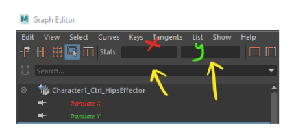
>
> Select the curves that you want to adjust and if you input the equation under the x column, the graph will change either by moving left or right and if under the y column, the graph will move up or down
>
> \[+\]\[=\]**\[insert value\]**
>
> **➡ normally used to shift your keys in positive value base on the x**
>
> **curve or y curve**
>
> \[-\]\[=\]**\[insert value\]**
>
> **➡ normally used to shift your keys in negative value base on the x**
>
> **curve or y curve**
>
> \[\*\]\[=\]**\[insert value\]**
>
> **➡ normally used to inverse or multiply a curve base from from the**
>
> **origin point of x=0 and y=0 depending on whether the value**
>
> **inputted is a positive or negative value**
>
> \[/\]\[=\]**\[insert value\]**
>
> **➡ rarely used but it basically divides the value base on whether you**
>
> **have inputted a positive or negative value**

## **⏩ Speed**

- In actual projects, you may be given an average speed by the client, for example 2cm per frame

- First thing to check is whether you are actually using centimeter (cm) as a working unit, this is because some clients do request for meter (m) as the working unit

> 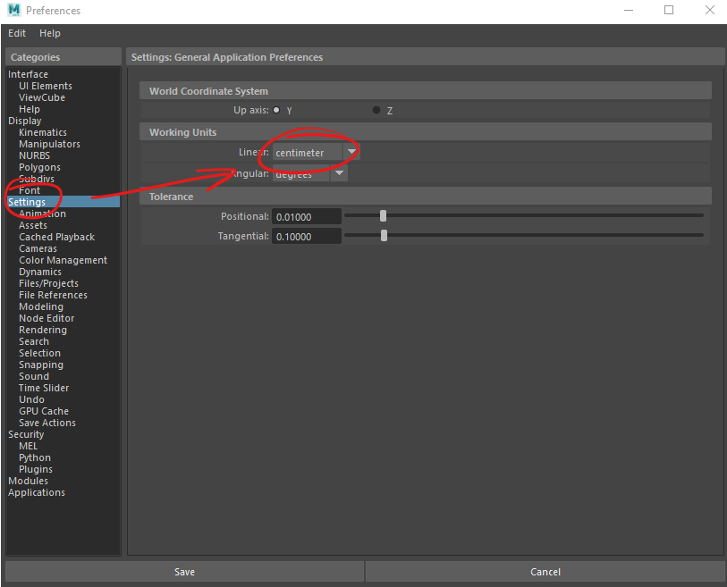
>
> From that point, since your character is moving at 2cm per frame, what you should do is to key the world control's translate z at the first frame as 0 and the next frame as 2. After that, turn on the infinity cycles which can be found in the graph editor or either through the Curve tab in the graph editor
>
> 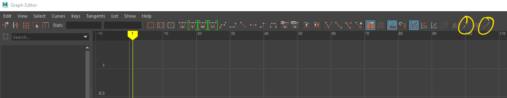
>
> 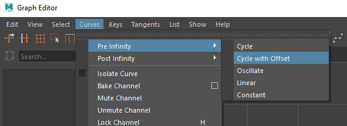

## **➰ Buffer Curves**

- Turning on buffer curves helps you see your current and previous curves adjustments

> 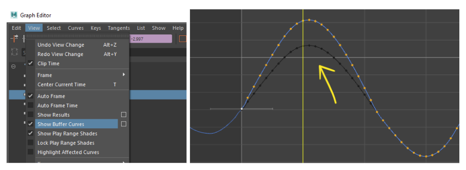

## **💻 Copy + Paste**

- You can literally copy and paste curves from one control to another!

## 

## **🚩 Layering Technique**

- This technique is useful especially when doing loop motions and/or secondaries such as flag, hair, droopy clothes, accessories, capes etc.

- We shall use a simple flag as a demo for this. The flag has 4 sections to be animated.

- Roughly animate all 4 sections in Rotate Y (make sure to turn on Infinity and Cycle).

> 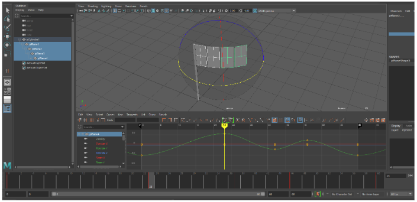

- Then either manually offset each section or use Keyframe Offset tool to offset *x* amount of frames (the higher the offset, the softer it will be and make sure to select in order from the base/root until the tip). In this case, it is offset with 3 frames each sections.

> 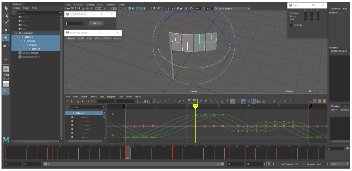

- Now the graphs are the same for each section. To make it look more natural, the graph should be gradually increasing from the base/root until the tip. This is where Key Scaler comes in handy.

> 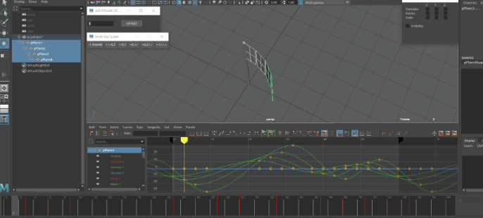

- All controllers are supposed to have a key at the start and end frame but currently there are no keys on certain graphs. Now, to clean up the keys instead of baking every frame, simply select the graphs after the end frame then hold the "i" button and middle mouse click to insert key at the end frame.

> 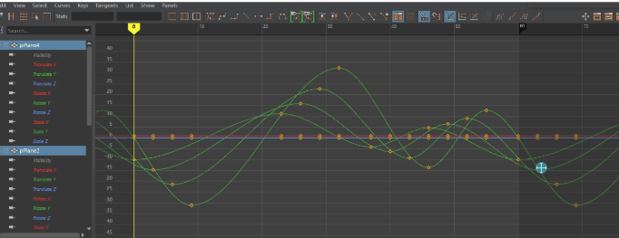

- Inserted keys will look like this below. Copy the graphs for all controllers from the end frame until the available end keys beyond the end frame. In this case, it is f60-69.

> 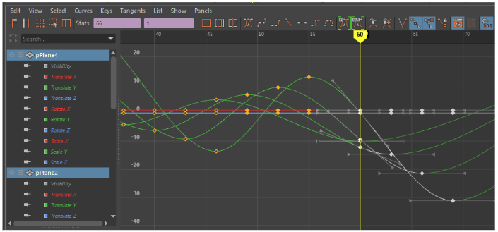

- Paste the keys at f0 and then you may delete any keys beyond f60.

> 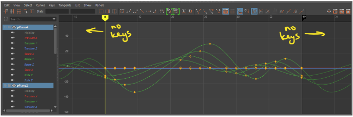

- You may do the same for all axis to make it even more natural but might need to offset them manually instead of using the Offset tool.\
  Tips: You may use Show \> Select Attributes... to only show a certain or multiple axis so that you can offset them as a whole.

> 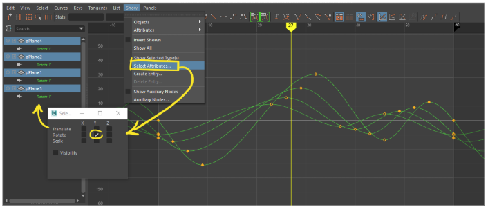

## **➕ Locators**

###  **➿ Motion Trail for Weapons**

- Always attach a locator to the tip of your weapon to see the trail

###  **🌎 Swapping between World & Local Spaces** 

- Sometimes we might need to switch the controllers to World space / Scene space in order to make sure the animation trail is easier to be refined and also the usual procedure when you are swapping the cycle from progressive to on the spot, vice versa

- First of all, you need to identify which controller is needed, most of the time you will need at least these controllers:

  - COG

  - Both IK Arms

  - Both IK Legs

  - All pole vectors

- To perform this swapping process, we will be using this WJ_Bakery tool which you can find in the LSGameAnimTools shelf

> 

- The bakery UI is quite self explanatory, you can choose which button to click based on your needs

> 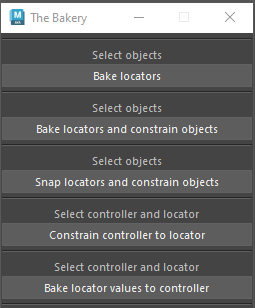

- Unless the rig comes with world space features, most of the animation on a rig is usually controlled by the world / root controller. If we want it to be in world space, we will need to use a locator

- Select your controller and click "Bake locators", this will transfer your controller's animation to a locator at the same position your controller is, we can use this value to do a lot of stuff later

  - If you are switching rigs to transferring animation to another rig, you can move on to your new rig from now on using the animation we just baked

> 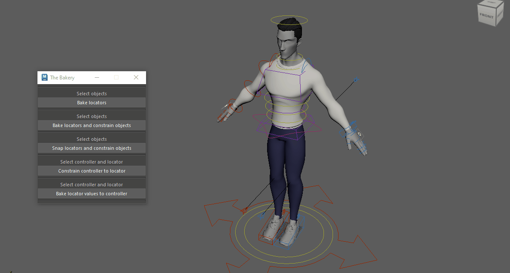

- Since our goal is to switch the animation to World / Scene space, we will click "Bake locators and constrain objects" instead. This will bake your current animation to a locator and constrain your controller to the locator, now we have the same animation we had before but is controlled by the locator, this animation is now free from the world / root controllers on the rig and switched to World / Scene space

> 

- After switching to World / Scene space, you can proceed to do whatever you need to do or fix in world space without the noise from the rig

- Once you are done with your animation in World / Scene space, we can use the same tools to transfer back your animation to local space

- Simply select the controllers and bake down the animation and voila, your adjustments will be transferred back to local space

  - In the case of transferring animation to another rig, select the new rig's controller and the locator, click "Bake locator values to controller", you will have the animation transferred to the new rig now

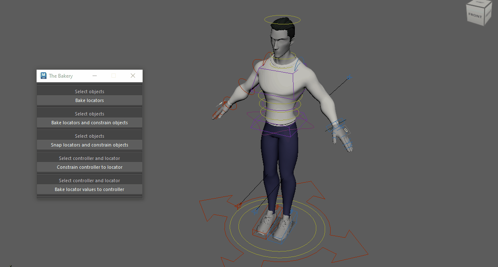

## **👩🏻‍🏭 Independent Euler Curve**

- As a precaution, please set the Rotation Interpolation to Independent Euler Curve (let's avoid Maya crashes 😂)

> 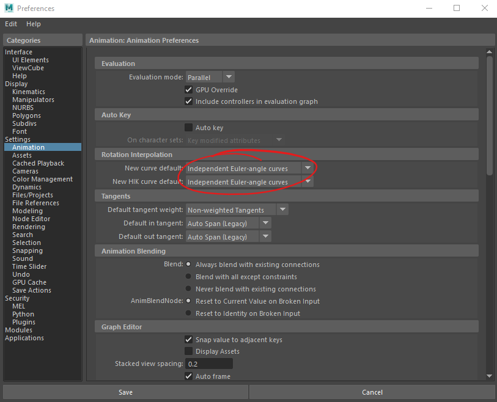
