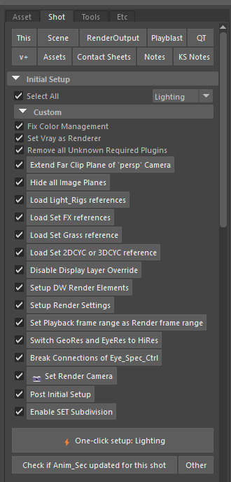
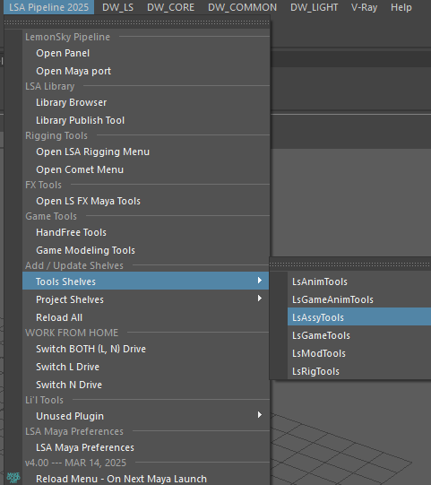
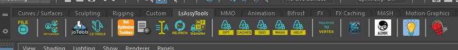
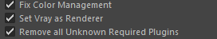
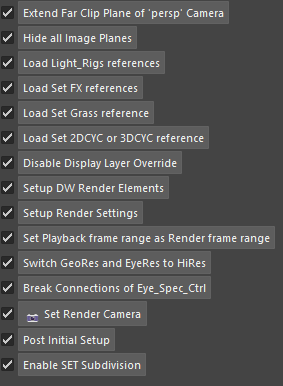
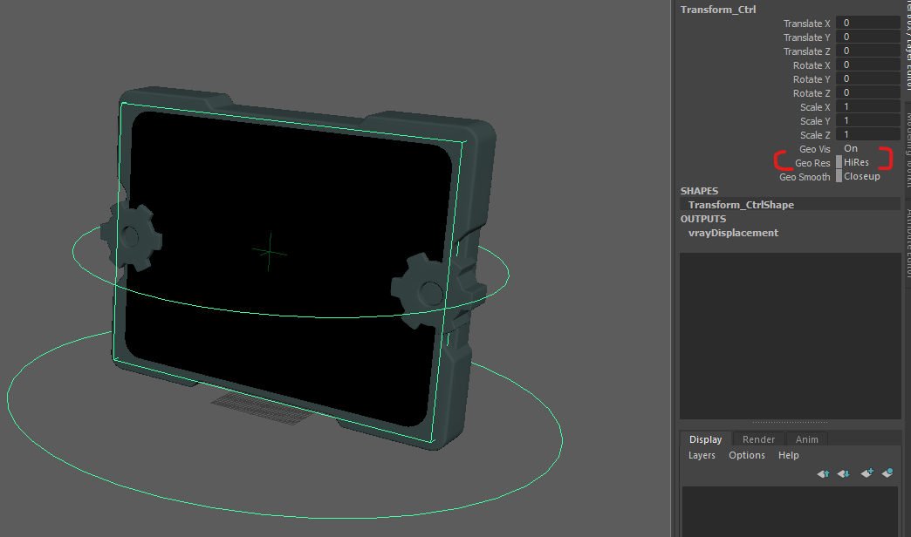

# **LS Tool Documentation**

## **Introduction** 

- LSTool is Lemonsky's homegrown one stop shot setup script which we will be using for almost all production projects to help artist shorten the setup time for each shot.

- **Remarks: Note that tools on other tabs may change based on the project you are working in. This doc will go through the general tools in the tool set.**

- The toolbar will be set up for each individual project and will generally look like this at it's very base.

## **Where to Find LS Tool**

- Go to <LSA Pipeline 2025\> - <Tool Shelves\> - <LsAssyTools\> .

- You should see the Toolbar appear on your MAYA toolbar

. 
 

## **Main Functions Explained** 

### **1. Fix Color Management**

- Adjusts your color management to the required settings based on the project you are on. 
 

### **2. Set Vray as Renderer**

- Automatically help u set the correct renderer based on project. In this case here it is VRay but it may vary based on your project. 
 

### **3. Remove all Unknown Required Plugins**

- Deletes all un-required plugins that may be still embedded into any files.

 

### **4. Extend Far Clip Plane**

- Increases the cameras far clip so there is no cutting in the viewport 
 

### **5. Hide All Image Planes**

- Hides all image planes inside the camera. 
 

### **6. Load Light Rig References**

- Loads all related light rigs into the shot .e.g. CH, Set, Props light rigs. 
 

### **7. Load Set FX References**

- Loads any built in Set FX such as water fx etc. If the FX is not needed in the shot you will need to go to the reference editor and turn them off. 
 

### **8. Load Set Grass References**

- Loads all Grass References of the set. 
 

### **9. Load Set 2DCYC or 3DCYC Reference**

- Loads any 2D/3D CYC referenced in the set. 
 

### **10. Disable Display Layer Override**

- Disables any overrides which may have been set in the display layer. Most of the time there won't be any overrides here. 
 

### **11. Setup Render Elements**

- Sets up the preset render render elements for your Vray project. For Arnold projects this most likely will be altered to setup the needed AOVs instead. 
 

### **12. Setup Render Settings**

- Sets up the basic render settings for your project. 
 

### **13. Set Playback Frame Range as Render Frame Range**

- Takes the frame range on the anim slider and sets it as your current shots frame range. 
 

### **14. Switch GeoRes and EyeRes to HiRes**

- Switches GeoRes of your assets from Proxy to HiRes versions.

### **15. Break Connections of Eye_Spec_CTRL**

- We can ignore this function as we do not have any Eye_Spec_Ctrl nodes in our assets. 
 

### **16. Set Render Camera**

- Helps to set the render camera in your render settings to the shot camera. 
 

### **17. Post Initial Setup**

- This tool is mostly not needed at the current time 
 

### **18. Enable SET Subdivision**

- This tool is mostly not needed at the current time 
 

### **19. One Click Setup**

- Runs all the above processes in one click, this will mostly be what you will be using for all your shots.
