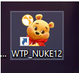
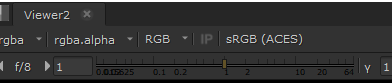
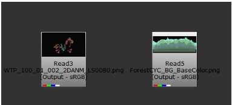
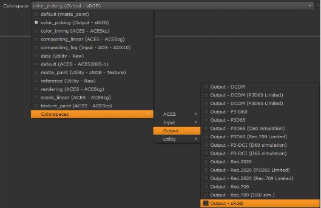
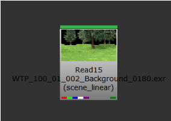
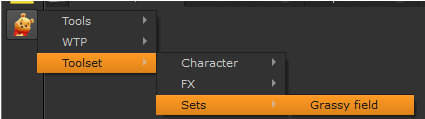
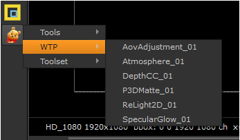
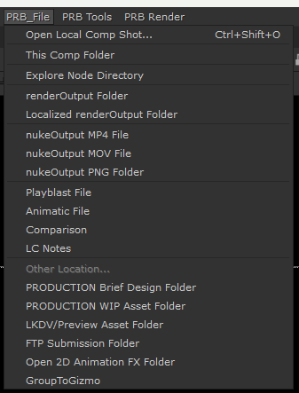
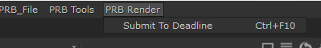
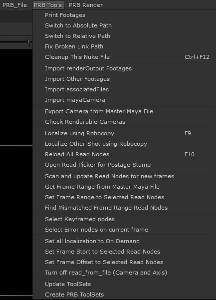

# **LsToolsNuke Documentation**

- Make sure you are opening Nuke from PROJECT nuke provide by Tech team (ZunAo)

    

- Always check on your viewport color lookup, its needs to be sRGB (ACES)

    

- All png and mattepaint / cyc footage require changing colorspace to ( Output - sRGB )

    

    

- EXR footage from maya render require changing colorspace to ( scene_Linear )

    

- Remember to always localized your shot to reduce lag

- Base comp can be found inside PROJECT\>tool\>example

    

- We have custom make tool for comp, try use these tools only

    

- AovAdjustment is for light adjust, select the aov light to adjust

- Atmosphere is fog

- DepthCC is creating a mask using zdepth data

- P3DMatte is same with matte3D

- SpecularGlow need to change input specular setting to ( specular_key )

- Tools for comp, found on top of each PROJECT nuke file, each option will open up the folder location 
 

## **Project Related Tabs**

- **Open Local Comp** Shot - key in the shot number and it will auto open up the comp file that you check out from Lemoncore

- **This Comp Folder** - this will open up this shot comp folder in your local drive

- **RenderOutput Folder** - this will open up the maya rendered imagine inside server folder

    

- Use this to send nuke file to farm for output ( not all project works )

- Not all the tools here is use, only use it when needed

    

- Print Footages - use this to clean nuke file path for clean up files, usually do this after the shot is approve by client

- Cleanup This Nuke File - this usually can fix all your dirty nuke file path, path no relative, not linked to server etc etc

- Localize using Robocopy - a fast localize plug in to use rather then the default nuke way

- Update ToolSets - this will help you get the new ToolSets created by key artist thats in server
