# Motion Builder Documentation

## **❗❗ DISCLAIMER ❗❗**

**“Motion Builder is pretty unstable and buggy which results in lags and things not going according to plan…”**

## **💻 Getting Started**

Before doing anything, it is advisable to do the necessary setting changes to make your user experience better and to further understand the Do’s and Don’ts of using this software

### **💬 Different Terminology**

	**Maya terms		➡		Motion Builder terms**

Bake 			**➡** 			Plot

Graph Editor 		**➡**			FCurve

Motion/Shot 		**➡**			Take

Hypergraph 		**➡** 			Schematic

Outliner 		**➡** 			Navigator

Playblast 		**➡** 			Render

### **🎮 Interaction Mode**

** \
	**If you are coming from Maya, then Motion Builder’s key bindings would be 

a complete 180 degrees change, fret not for you are able change your mouse and keyboard’s key bindings to follow the other software of your choice

**Settings ➡ Interaction Mode**

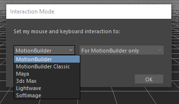

**⭐⭐⭐ It is recommended to familiarize / get used to Motion Builder’s default key binding ⭐⭐⭐**

### **🐀 Default Navigation Key Binding**

*Ctrl + Left Click 		*➡  	Zoom In/Out

Shift + Left Click 		➡  	Pan Left/Right

Ctrl & Shift + Left Click 	➡ 	Rotate

Ctrl + Spacebar 		➡ 	Play button

Ctrl + Left CLick /		➡ 	Selection Add-On

Spacebar + Left Click

### **🩺 To Save or not to Save…**

**There is no Autosave in Motion Builder**, and because it's unstable, 

crashes will occur…so, please make sure to make it a habit to save

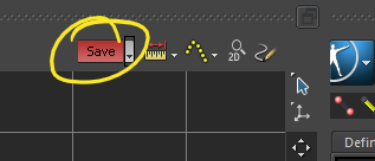

#### **💥 Crash Files**

- If your file does crash, you can still retrieve the crashed file from over here

***Documents ➡ MB ➡ [Motion Builder Version]***

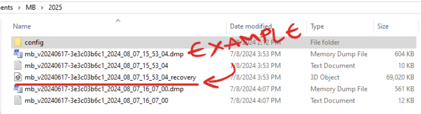

### **🔐 Shortcut Keys**

|  | MOTION BUILDER | MAYA |
|---|---|---|
| Select Hierarchy | Space + Right Click |  |
| Selection | O | Q |
| Deselect | Shift + D |  |
| Translation | T | W |
| Rotation | R | E |
| Scale | S | R |
| Set Key (only works in F Curve & Story | K | S |
| Add Zero Keyframe | Shift + K | Shift + S |
| Add Flat Keyframe | Ctrl + K |  |
| Next Keyframe | ➡ | > |
| Previous Keyframe | ⬅ | < |
| Save | Ctrl + S |  |
| Save as | Shift + Ctrl + S |  |
| Open scene | Ctrl + O |  |
| New scene | Ctrl + N |  |
| Undo | Ctrl + Z |  |
| Redo | Ctrl + Y |  |
| Drag selection to navigator (for parenting) | Alt + Right Click | X + Right Click |
| Play / Stop | Ctrl + Space / Ctrl + ⬆ |  |
| Play Reverse | Ctrl + ⬇ |  |
| Next frame | Ctrl + ➡ |  |
| Previous frame  | Ctrl + ⬅ |  |
| Front / Back view | Ctrl + F |  |
| Side view | Ctrl + R |  |
| Perspective view | Ctrl + E |  |
| Top / Bottom view | Ctrl + T |  |
| Schematic  | Ctrl + W |  |
| Hide selection | Shift + S |  |
| Unhide selection | Shift + U |  |
| Zoom | Ctrl + Left Click Drag | Alt + Right Click Drag |
| Rotate camera | Ctrl + Shift + Right Click Drag | Alt + Left Click
Drag |
| Pan camera | Shift + Left Click | Alt + Middle Click |
| Rotate camera with zoom | Shift + Right Click |  |
| Pan camera with zoom | Ctrl + Right Click |  |
| Change to next task | Shift + Up Arrow |  |
| Change to previous task | Shift + Down Arrow |  |
| Frame selected object | F |  |
| Frame all object | A |  |
| HIK pin rotation | E |  |
| HIK pin translation | W |  |
| HIK - FK to IK with key in IK blend  | > |  |
| HIK - IK to FK with key in IK blend | < |  |
| Normal, Xray or model only in display | Shift A |  |
| Wireframe | 1 | 4 |
| Flat | 2 | 2 |
| Lighted | 3 | 3 |
| Texture | 4 | 5 |
| Shaded | 5 | 6 |
| Texture + Shaded | 6 |  |
| Add selection to constraint box | Alt + Left Click Drag |  |
| Remove selection from constraint box | Alt + Left Click Drag |  |

### **📌 Custom Key Mapping ⭐⭐⭐**

There is a fair chance that you will most likely (let’s be honest, 99.99%) want to use Maya’s key binding, therefore, proceed to…

**C:\Program Files\Autodesk\MotionBuilder 20XX\bin\config\Keyboard**

…and copy out the Maya text file (refer to the example image below)...

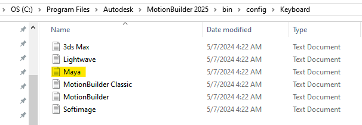

…paste that text file to…

**C:\Users\xxxx\Documents\MB\2025\config\Keyboard**

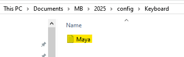

…from there, rename both the file and the text inside the file to your own preference

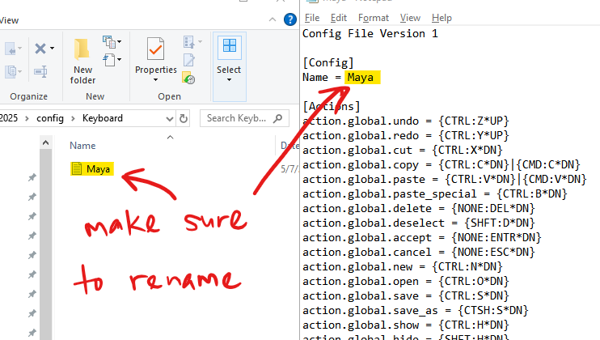

⬇

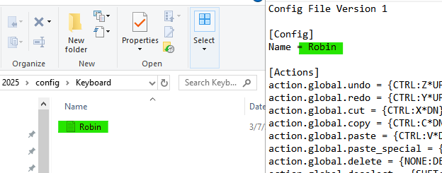

From this point, you can customize your key binding to your own preference using this formula

**{ HOLD BUTTON : BUTTON * DN or UP }**

HOLD BUTTON 	➡ 	usually CTRL / SHFT / ALT / a mix of the 3

BUTTON 		➡ 	eg. Q / W / E / R / T / etc…

DN or UP 		➡ 	the function will be executed upon the button being

pressed down or upon the button going up after being pressed (if that makes sense)

Example

**{ALT:Z*DN}** is the same as the play button in Maya

### **🔁 Undo**

**Settings 	➡ 	Preferences**

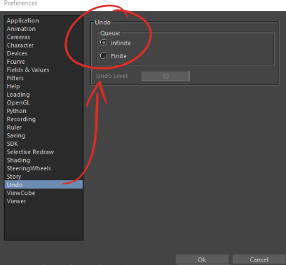

### **⬜ Grid Size**

**Settings ➡ Preferences ➡ Viewer ➡ Grid ➡ Size**

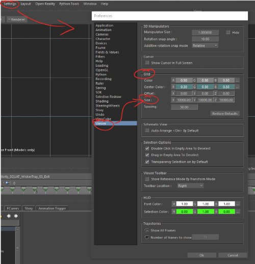

### **🔑 Auto Key**

**❗❗ ****NOT RECOMMEND TO USE AUTO KEY**** ❗❗**

### **🚅 Setting the FPS**

- Before starting, ensure you are on the right FPS base on the project requirement

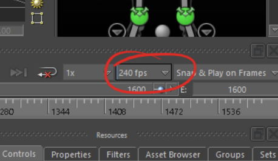

- Please ensure that you have plotted to the skeleton first (your HIK picker will just show a human character without any controls) followed by plotting to the Control Rig

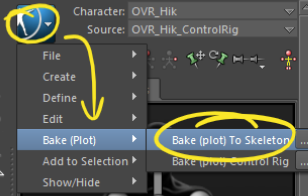
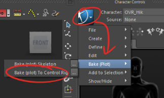

***By default, when plotting, it will be 30 FPS***

**⭐⭐ It is safer to Plot on every take one by one ⭐⭐**

### **💢 Camera Issue**

If the camera is not showing the correctly, just hit the reset button

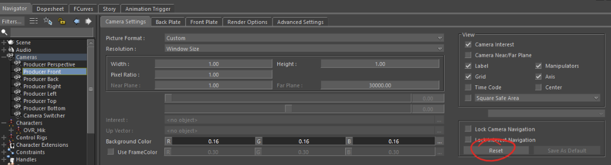

### **👁‍🗨 Hiding Manipulators**

- During playbacks, you might find it annoying to have the manipulator constantly moving while your take is being played

- Under the Viewer UI, at the Display drop down menu, turn on the “Hide Manipulators during Playback”

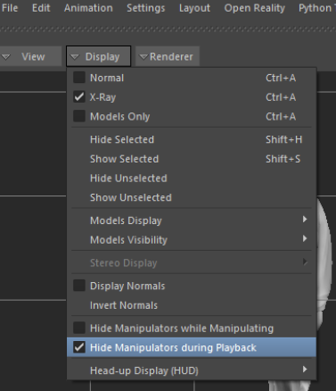

### **📝 Schematics**

- Schematic is like the “backstage area” to your scenes, where the object hierarchies in your scene are graphically displayed using nodes

- To access schematic view, select View and click on Schematic or just use the shortcut (Ctrl + W) to switch in and out

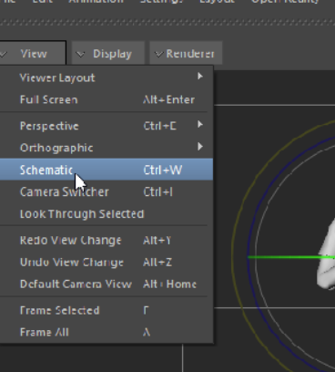

### **🔌 Nodes**

- In the Schematic view, every 3D object is represented by a rectangular node. For example, each bone in a character model’s skeleton is represented by a node

- Nodes are always arranged in a hierarchy that reflects how they are constructed. Each node has a label that indicates what it represents

- Nodes that represent models are light gray by default or they are the colour of their material, as shown in the following graphic. Nodes that represent markers, nulls, camera interests, and skeleton roots are red by default

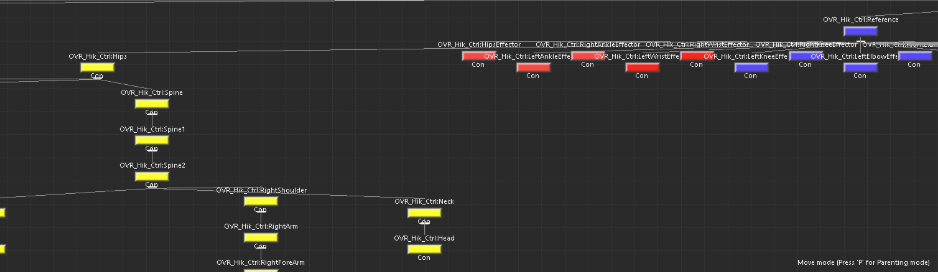

#### **🔍 Finding Specific Nodes**

- If the model / rig / skeleton is selectable from the normal viewport, select it first and press F in schematic

- If you can’t find what you are looking for, you can do a direct search (that is if you know the name…) in the Schematic itself, just right click and choose Find by name.

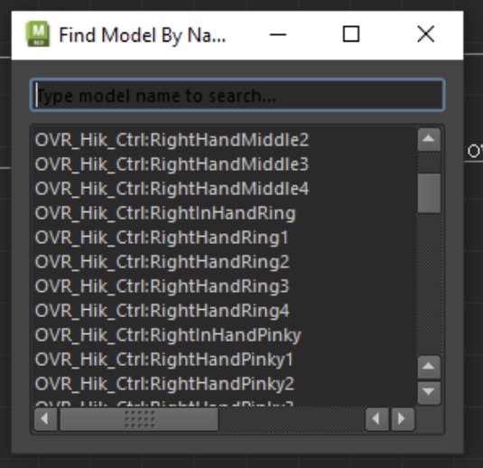

#### **🙈 Hide Model**

- Nodes that represent **hidden assets** are displayed as** dark gray**

- To hide geometry, select the nodes ➡ go to Schematic view ➡ press F ➡ press Shift + H

- To unhide, select the nodes and press Shift + S

# ❕❕❕❕ [INSERT CHAR INPUT GIF] ❕❕❕❕

#### **🧐 Find Hidden controller**

When cleaning Mocap, there will come a time when you realize after cleaning the curve, the motion is still unsmooth and uncleaned. One of the reasons might be due to a hidden controller. Here’s how you can find a hidden controller…

- Select all the controllers in HIK and go to to the Schematics view, in Ctrl:Reference group, if there are unselected nodes, most likely that’s the hidden controller

- **You’ll know its a hidden controller because when selected, the outer wall of the selection is not green**

# ❕❕❕❕ [INSERT CHAR INPUT GIF] ❕❕❕❕

#### **🌐 Selecting the Hierarchy**

1. Select Root/Master controller

2. Go to Schematic

3. Press F

4. Hold space and right click on the nodes (You will notice other nodes will be highlighted)

# ❕❕❕❕ [INSERT CHAR INPUT GIF]       f❕❕❕❕

### **📁 Asset Browser**

If you are working in a team, chances are that you may need to share some poses or takes with your teammates. In order to do so, you will need to create a favourite path in the asset browser

1. Right click on the screen left column and choose “Add favourite path”

2. Paste the shared path

3. You will now be able to access the shared folder for poses/animation

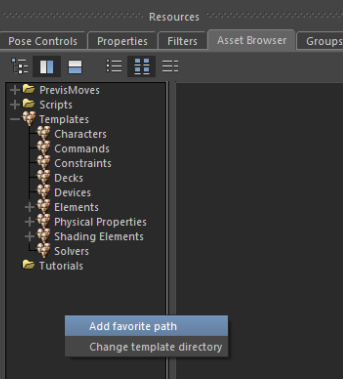

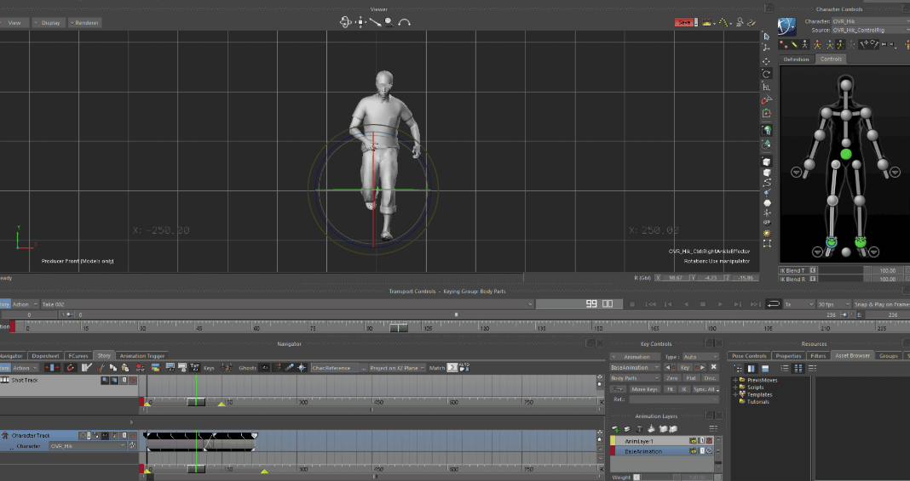

### **👣 Floor Contacts**

***❕❕ NOTE : Floor Contact will depend on the project requirement. Please seek advise from your lead before hand ❕❕***

*Turning on floor contact helps in the sense that the foot would not penetrate through the ground*

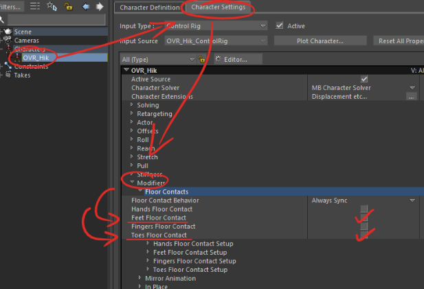

In order to see the floor contact, you need to show it by clicking over here...

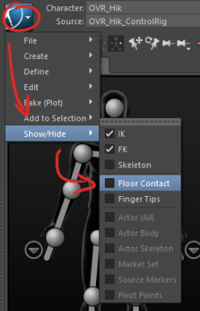

Once it is shown, you will notice small cubes appearing surrounding your character’s foot

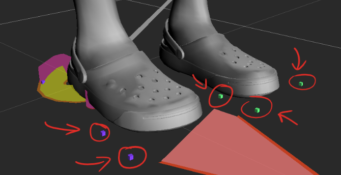

### **💻 Layout Mastery**

#### **💻 Single Screen**

It is **HIGHLY RECOMMENDED** to master / get accustomed to the default UI layout which may seem cramped

***❕❕ Zun Ao highly recommends to basically get use to the default UI layout ❕❕***

#### **💻💻 Dual Screen**

If the layout is too cramped for your style, this is the way forward for you

1. Turn off the “Auto-update Layout” function from the Layout drop menu. This is to prevent any updates to your layout if you do accidentally / unknowingly move your UI(s) around

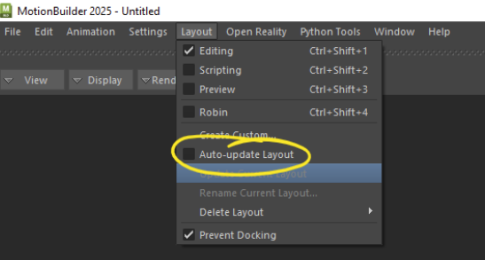

2. Turn off “Prevent Docking” to allow yourself to pull out, move about and dock the UI(s) in their new locations

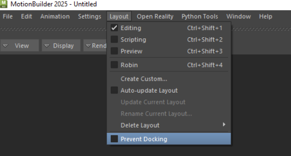

3. You will need to manually click the “Update Current Layout” whenever you make any changes to your layout

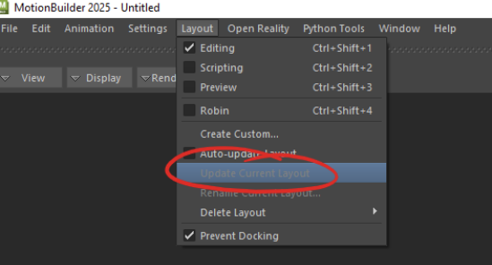

4. After updating the current layout, do make sure to turn on “Prevent Docking” so that you unable to move the UI(s) from the main monitor

***Example of a customized dual screen layout***

Monitor 1 (Main)

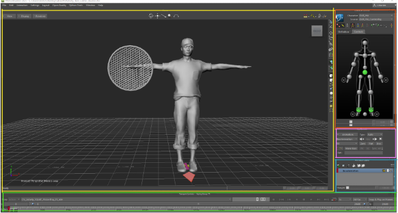

Monitor 2

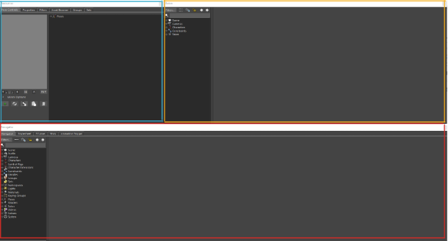

***❕❕ Customized layouts can be shared among ******                ******other people, you can find it over here ❕❕***

***Documents ➡ MB ➡ [Motion Builder Version] ➡ config ➡ Layouts***

***eg. C:\Users\ls0063\Documents\MB\2025\config\Layouts***

### **🔃 Alternating Reference Mode**

**LOCAL**

➡ F5 (known as Object mode in Maya)

**GLOBAL**

➡ F6 (known as World mode in Maya)

**ADDITIVE (F7) & PARENT (F8)**

➡ **PLEASE IGNORE & DO NOT USE THIS MODE**

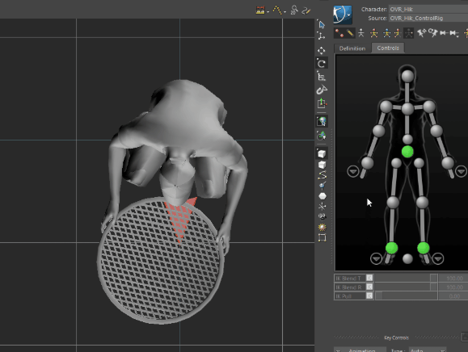

### **🎬 Takes**

- The term is widely used in Motion Builder and is similar in how we use the term “shot” or “motion” with Maya

- You can find the takes under the Navigator tab or above the Timeline

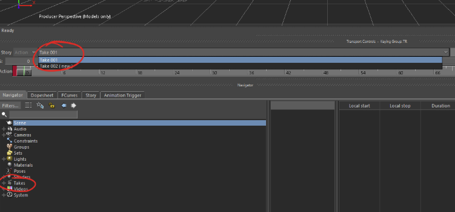

#### **🌱 Creating Takes**

- It is always advisable to create a new Take rather than working on the original Take

- It can go 2 ways; either you create a Take with or without the original data

#### **💿 With copying the data**

- This is to avoid deleting anything unnecessary from the original data and that the created new Take allows us to copy over the original data

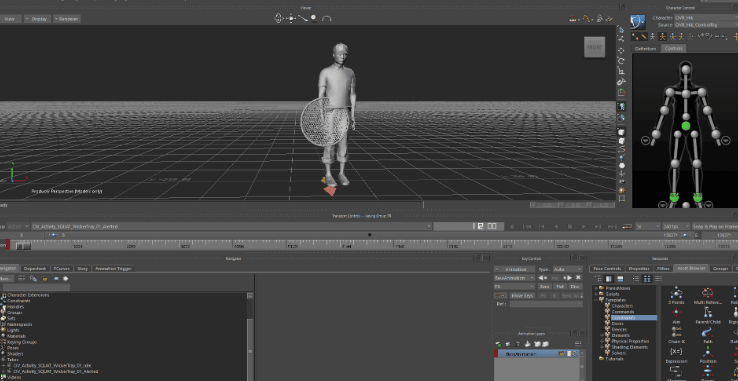

#### **🐚 Without copying any data**

- **This created take basically acts as an empty shell**

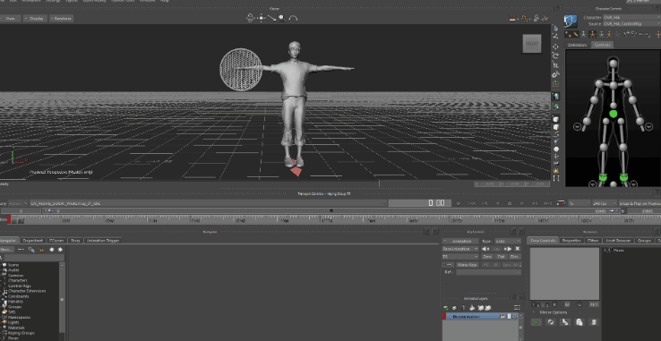

- In order for you to have some motion in the new empty take, you will need create a Character Track in Story mode and then plot the data (skeleton ➡ control rig) from your selected Take into it (you can also determine a new duration you would like to set for the new plotted take)

# 

- You can rename your take by double clicking the Takes from the Navigator tab and then manually changing the name when it appears…

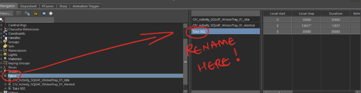

…or by right-clicking the actual Take of your choice and selecting Rename

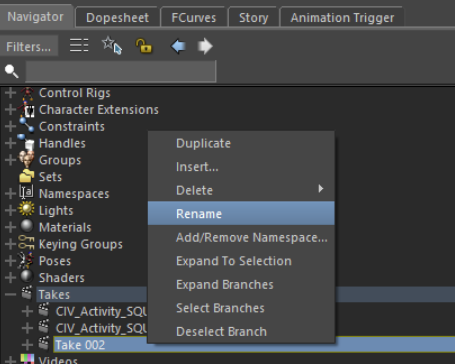

#### **🚮 Deleting Takes**

Deleting a take is permanent, so, be 100% sure because you **CANNOT UNDO IT**

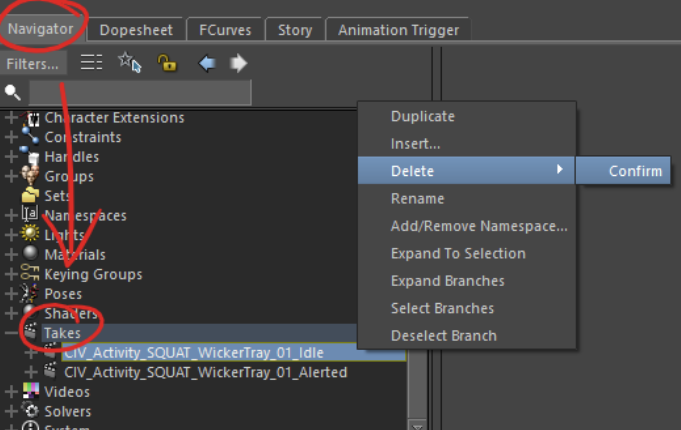

### **🔑 Keys**

#### **🌈 3 Key Colours**

- When you key something, there will be 3 distinct key colours that you should recognize which will depend on the type of selection that you are on

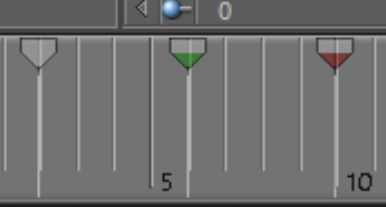

**Grey - Individual Key**

**Green - Body Part Key**

**Red - Full Body Key**

#### **🦾 Type of Selection**

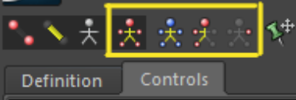

***Screen Left to Right***

***Full Body****** | ******Full Body with No Pull****** | ******Body Part****** | ******Individual****** ***

***Full Body***

- *the entire picker will glow in white and the selected control will glow blue*

- *it will select everything from what that can be seen from the picker*

- *it does not select hidden controls !!*

- *you can try and key it and head to the FCurve, you will find that there are no keys keyed for the hidden control*

***Body Part***

- *only a few controls which make up a single body part will glow in white and the selected control will glow blue (eg. the entire R arm excluding the R fingers)*

- *it does not select hidden controls !!*

***Individual***

- *only a single control will glow blue*

- *works best if you are cleaning the FK skeleton joints or if an effector is completely green*

***== IMPORTANT ==***

- ***Selecting your controls from the Schematic is the only way for hidden controls to be selected and keyed***

- ***If you want a one-click solution for selecting all controls including the hidden controls, you’ll need to create a Group***

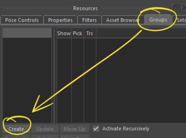

#### **🎹 Key Controls**

*The key controls in Motion Builder look quite intimidating with all the buttons to push but can be ****simplified to just a few which you would most likely use…***

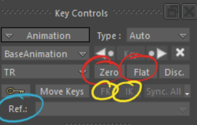

- *Chances are (90% of the time) you’ll be using the Zero & Flat when working on layers*

- *Ref would be if you are using a Multi Referential constraint*

- *FK and IK basically keys the IK Blend T & R instantly from a 0 to 100*

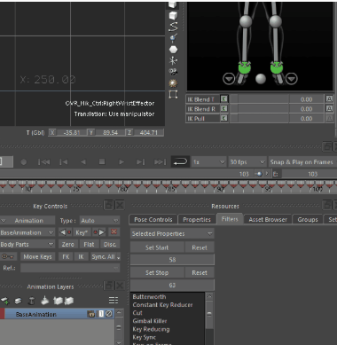

**⭐⭐ Fun Fact : If you right click on Key*, it brings up the “Key at time” window ⭐⭐**

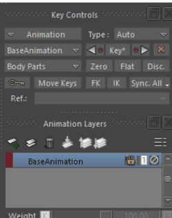

**📝📝 NOTE : To know how “Key at time” works, please refer**

**to Method 2 of  “Copying Poses & Mirrors” 📝📝**

#### **↩ Playback Options**

which can be found over here

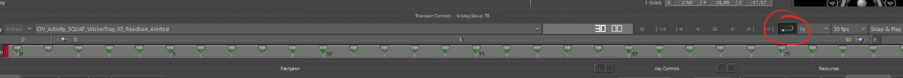

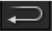

- Your animation will continue to cycle as long as the play button is pressed

- **Good for checking the 1st and last pose of an animation (press ⬅ or ➡ to snap from key to key)**

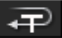

- Works if you have multiple takes in your file

- Your animation will cycle through the takes

- You won’t be able to check the 1st and last pose

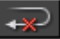

- Your animation won’t be able to loop

- You won’t be able to check the 1st and last pose

#### **🧲 Snap**

##### **📏 Object Alignment ⭐**

Select object ➡ Hold Alt + Left click drag to object / controller ➡

Select type of alignment

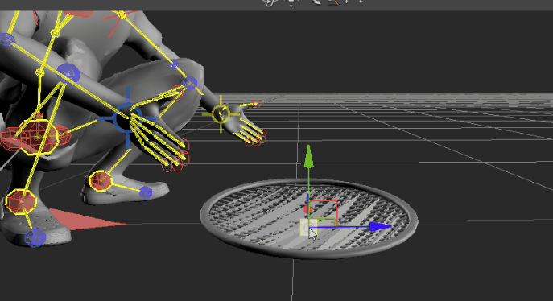

##### **🎡 Rotation ⭐**

You will be able to find the Viewer option under Preferences

**Windows ➡ Preferences ➡ Viewer**

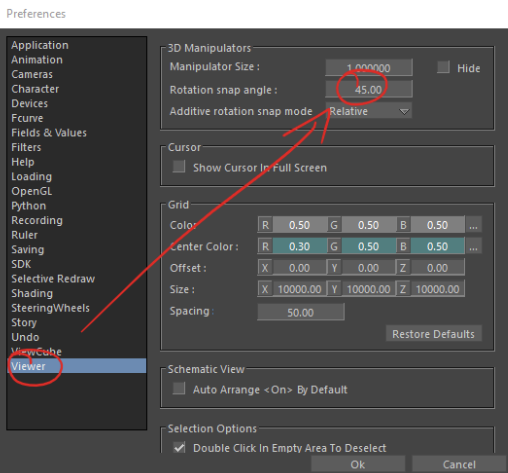

…or by right clicking this icon and selecting Preferences

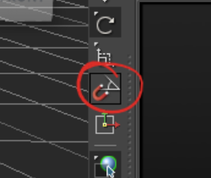

Once you have added a value into the Rotation snap angle box and clicked OK, it will stack on top of the default value of 10 and appear as a selection option

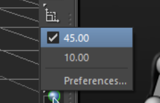

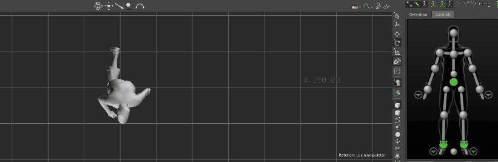

#### **🏀 Trajectories (Motion Trail)**

Under the Viewer UI, towards screen right, you will find an icon

showing an arc of yellow balls, click that to turn on the trajectories

(motion trail)

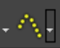

##### **⛹🏻‍♂️ Editing Trajectories**

1. Choose Set on Selection

1. Swap Object mode (Model) to Vertex mode (Vertex) by right clicking and selecting or by using its shortcut

1. With the trajectory still turned on, you will see it change into an editable option

1. **Don’t forget to change back to Object Mode**

#### **📈 FCurves**

- Similar like the Graph Editor from Maya but a more unfriendlier version of it

- Unlike Maya, when a control is selected, the curves will not automatically appear in the FCurve, you will need to manually select the individual axis or the group itself as shown in the gif below for the curves to appear

##### **🖐🏻 Add-On Selections**

- Shift + Left Click is a very common trait if you want to add on more selections, however in Motion Builder, instead of Shift, it is **CTRL + Left Click (Spacebar + Left Click)**

##### **⚠ Tangent Precaution**

- When changing tangents, do take note that the **SCREEN RIGHT PART OF THE TANGENT WILL ALWAYS HAVE MORE INFLUENCE** compared to the screen left part of the tangent

- Referring to the example gif below, if you select the linear tangent, only the screen right part of the tangent will actually go into a linear form.

- Therefore, if you want both screen left and right to be affected by the changes of the tangent, you will need to have the previous key in your selection for it to work

##### **🍃 Moving The Keys Around**

- To move around the keys in the FCurve, use the slider on both the X and Y axis

- It is recommended to not drag the key from inside the FCurve

##### **♎ Scaling**

You have 3 ways to scale, either you…

1. select the slider from their respective axis

2. select the any of the 4 white dots in the selection

3. hold ctrl + middle mouse drag

👆🏻 The video above shows the first 2 ways to scale 👆🏻

##### **♾ Infinity Curves**

Right click on the graph ➡ Select Pre/Post Extrapolation ➡ Set the drop menu for Pre and Post Extrapolation to Repetition ➡ Select Infinite for both ➡ Click OK!

##### **👻 Buffer Curve**

- Similar like Maya, you’ll be able to see the previous shape of the graph and what you have adjusted

Right click on graph ➡ Save Buffer

#### **⭐⭐⭐ Story Mode ⭐⭐⭐**

Story mode is actually quite a powerful tool that Maya does not have and chances are you’ll be using it a lot. It is able to…

- seamlessly connect your takes together

- trim your takes

- scale your takes

- copy animation into a new empty take

- import external FBX animation into your takes

- utilize the ghost tool

- adjust your constraint’s on/off timing

…and many more

**❕❕ Merge all AnimLayers before going into Story Mode ❕❕**

You will get a warning telling you that there are AnimLayers present in the take

If you do not merge the AnimLayers, while having Story mode enabled, it will automatically merge the animation of the AnimLayer with the BaseAnimation (even if you delete the AnimLayer, it will play out the merged animation)

However, if you disable Story mode, it will revert back to the original selected take in the Transport Controls

There are only 2 ways to turn on Story mode

- under the Transport Controls UI

- under the Navigator UI

By default, Story mode is turned off and can be seen as a dark grey colour. When it is turned on, it changes to a blue highlight

To know if your Story mode is actually turned on, you’ll notice the tracks highlighted in a light grey colour…

You are able to have multiple tracks added at one go…

**❕❕ IMPORTANT ❕❕**

**When working on your takes, please be extra careful when turning on and off Story mode, here is a scenario which might happen…**

***Scenario***

- **You have 2 takes; Take A and Take B**

- **Take A is shown to be the selected take in the Transport Control**

- **Take B is inserted as the Current Take under the Character Track**

- **If Story mode is activated, you will only see Take B’s motion being played even though Take A is the selected take**

- **If Story mode is deactivated, you will only see Take A’s motion being played**

- **When plotting in Story mode, always ensure you are doing it on an empty take**

- **You do not want to accidentally overwrite the original takes**

#### **👽 Character Animation Track**

When you insert a track, the 1st thing to do is to select a Character for it

1. Right click on the empty dark grey column

2. Select Insert ➡ Character Animation Track

3. Update the column **Character: <none>  **to selected character

**⭐ You can actually expand the Character Track by expanding it ⭐***** ***

With the Character Track selected, if you right click on the area with the vertical lines, a menu will appear with multiple options

Most of the time, you’ll be inserting either a Take or maybe an animation file

- **Insert Animation File**

- Exactly the same as dragging and dropping an individual Take into the scene

- **Insert Current Take**

- As the name suggest, it will insert the current opened take

- Just make sure when you are plotting, it is not on the original take but on a new take

Now that you have a clip/take in the Character Track, you are able to manipulate the clip/take according to the situations such as using the razor tool to split the clip/take into smaller parts or by scaling it

#### **🪒 Razor**

This tool will basically trim your clip/take into segments. Very similar to Adobe Premiere Pro’s razor tool. It’s pretty good if you want to alter the In and Out points without affecting the clip/take

##### **🔬 Scale Clips**

Scaling clips/takes lets you alter the length and speed of your motions. You can activate it by clicking on the loop button in the Story Controls

**❕❕ IMPORTANT ❕❕**

If you immediately scale the clip/take without activating the scale option, you are just scaling the duration but without any keys in it

When scaling, you have the option to have the keys snapped or not snapped, it's the same as how in Maya, you will get a whole number or numbers with decimals

**⭐⭐ Use No Snap when scaling ⭐⭐**

##### **🏁 Frame Start / End & Zoom Bar**

Before getting into this topic, you might have noticed these little triangles at the bottom of your clip…

The triangle splits into a green and yellow part

**Green ➡ Frame Start / End**

**Yellow ➡ Zoom Bar**

If you have multiple clips in a sequence, all you need to do is select all those clips/takes and click the Frame Start / End option

For example, referring to the gif below…

…the duration is from 0f to 6f based on the timeline. You can even see the triangle at bottom (yellow and green) hovering over 6f. However, based on the clips, it ends at 15f, so, once you have clicked on Frame Start / End, it will automatically set 15f as the end frame

The zoom bar is literally what it means, it will zoom in from the overall duration of your clip **without changing the Start / End frame**

#### **⛔ Delete**

#### **❕❕ DELETING IN MOTION BUILDER NEEDS EXTRA PRE-CAUTION ❕❕**

#### You can accidentally select anything in the Viewer and still be able to select any additional item from the navigator !! Please de-select everything first

#### **⭐⭐ SHIFT + D to deselect ⭐⭐**

#### **🎥 Playblast (Render)**

File ➡ Render

## **👷🏻‍♀️👷🏻‍♀️ GETTING TECHNICAL 👷🏻‍♂️👷🏻‍♂️**

### **🕴🏻 Referencing a Character**

The purpose of this is for the animator to compare with their original data

Your reference character should not have any animation and should be in its default pose (eg. T-pose)

#### **Method 1 ⭐⭐**

**⭐⭐ Works best when starting out on a fresh file ⭐⭐**

1. Before you start bringing in the reference character, you will need to Plot Selected (All Properties)onto your working character

1. Select the black area outside surrounding the controls of the HIK picker (all controls will be selected) and hit Plot Selected (All Properties) to allow it to bake everything related to the working character, this includes hidden nodes or joints that are not visible ⬅ this is just a setup precaution

2. File ➡ Merge ➡ Select your reference character (eg. CHAR.fbx)

3. A window will pop up, make sure to uncheck the Take 001 import and apply a new namespace

4. You will need to make the Reference Character mimic the Working Character

- Put your **Reference Character** under the **Character**

- Set the **Working Character** as the **Source**

- Create a Character Track and set the working character into the Character  selection

- Insert Current Take (trim if you need to)

- Create a new take (do not copy any data & make sure to set the Frame

Start/End)

- Turn on Story mode

- Under the new take, plot the skeleton & control rig to both the Working and Reference characters

- Turn off the Story mode and remove the Character Track

- Move your Reference to the side and that’s it !!!

#### **Method 2 ⭐**

**⭐ A slightly longer method but works fine while working half way through ⭐**

1. Similar steps as method 1’s step 1~4

2. Plot the Reference Character’s skeleton and control rig to your working take’s original data

3. Create 2 Character Tracks and set the Character selection to their respective characters

4. Insert your WIP current take under the Working Character and the original take under the Reference Character

5. Create a new take (do not copy any data & make sure to set the Frame Start/End)

6. Turn on Story mode

7. Under the new take, plot the skeleton & control rig to both the working and reference characters

8. Turn off the Story mode and remove the Character Track

9. Move your Reference to the side and that’s it !!!

### **🦘Bringing in External Animation**

This is if you have merged and brought in a second character that has no animation it

**Method 1 (via Load Character Animation)**

- Applicable only for HIK Character

1. Blue button (circled in red) ➡ File ➡ Load Character Animation

2. Choose whichever take you want to import

**Assign as Character Input**

1. Basically the animation you imported will create a take, a 2nd character and a new group called “Imported Character”

2. Your original character in the scene will have its “Source” set to follow the imported animation

3. You will need to plot to the skeleton and then to the control rig so that the animation stays in the new take

4. Select the “Imported Character” group and you’ll notice anything in that group will be highlighted in the Navigator

5. Right click on any of the highlighted selection from the Navigator and delete (choose Yes to All if there are any)

# ❕❕❕❕ [INSERT CHAR INPUT GIF] ❕❕❕❕

**Copy Animation**

1. Literally copies your animation in a new take (retains the same keys but the attributes in the keyframe will not be copied)

**Retarget**

1. Creates a new take with the animation that you have loaded in (but does not include the skeleton node’s animation)

#### **Method 2 (via Merge) ⭐**

- Uses Merge to import an external animation (FBX) into a new take without adding an additional new character

- Works on an empty scene or if you already have a character in the scene

- The Skeleton node will also be copied

- Applicable for props as well

➡ ✔️ the take you want to import ➡ Merge

**❕❕ If you want to import the character as well, please make sure you change Merge back to Append ❕❕**

#### **Method 3 (via Motion File Import)⭐**

- Please ensure you already have a character inside the scene beforehand

- Similar result as Method 2

- The Skeleton node will also be copied

- Applicable for props as well

File ➡ Motion File Import ➡ Select the FBX you want to import ➡ Change to “Merge” ➡ ✔️ all except “Ignore Model Type” ➡ ✔️ the take you want to import ➡ Import

#### **Method 4 (via Story Mode)**

Basically we will be utilising the Story mode to plot an external take into a character (preferably an empty character)

1. Bring in/Merge/Import an empty character into the scene ➡ Create a new take with no animation

2. Create a Character Track (set the Character of your choice) ➡ Drag an external FBX file into the track (the external FBX should have a single take only)

3. Click Frame Start/End so that the motion is within the frame range

4. Turn on Story mode

5. Plot the motion to skeleton and then to control rig

6. Under Animation ➡ Plot All (All Properties)

7. Turn off Story mode ➡ Remove the Character Track

# ❕❕❕❕ [INSERT CHAR INPUT GIF] ❕❕❕❕

### **🚴🏻‍♂️ Cycles**

#### **‍⭐⭐⭐ Cycle Creator ⭐⭐⭐**

This tool is super useful as it helps reduce the amount of time to trim and create loops for cycle motions.

**Window ➡ Cycle Creator**

When using this tool, you mainly want to look at this setting (yellow and green box)

**Pink Box**

- This will be auto selected when you select the upside down triangle on the timeline (refer to Step by Step)

**Yellow Box**

- when the alphabets are turned dark grey, it means it is active

- the alphabets means

- T for translation

- R for rotation

- G for gravity

- when you have a motion moving progressively forward, you will need the T[z] active

**Green Box**

- turning on “Move Start to Zero” will shift your selected cycle area to start at 0F after clicking “Create Cycle”

- if you ***turned off ***“Add zero key”, and clicked Create Cycle, you will find an animation layer is created with 2 keys only; at the start and end of the motion

- very similar to Maya in the sense that when you middle mouse and drag a key to copy the first frame to the last frame in an animation layer, the first key which is the original has a value of 0 and the last key has a value of 1

- if you ***turned on*** “Add zero key”, an animation layer is created but with 3 keys instead, the first and last keys are pretty much the same as mentioned in the above point, the middle key will have a value of 0 similar to the first key

**🦶 Step by Step**

1. Select a frame range that you think is suitable to perform a loop (ideally the 1st and last pose should look the same)

2. Select the 1st key of your selected frame range and right click it

3. Select Cycle Creator Time Marks ➡ Add Start Mark to Current Frame

4. Drag the timeslider to the last key of your selected frame range BUT DO NOT DO ANYTHING

5. Right click on the 1st key once more and select Cycle Creator Time Marks ➡ Add End Mark to Current Frame

6. You should now be able to see 2 red upside down triangles on your frame range

7. With the Cycle Creator window opened, select Create Cycle

8. Your new cycle will be created under a new take

**💡 Example (FCurve)**

Let’s say you turned on the “Add zero key”, you should be seeing something like this…

If the blending from the in between to the last key is either being too slow or too fast, you are still able to shift the key around (just make sure that you are under the Full Body selection as the key is red in colour). Plot the entire animation once you are satisfied with the changes

**💡 Example (Idle)**

# 

**💡 Example (Run cycle)**

# 

#### **⭐⭐⭐ In Place ⭐⭐⭐**

If your locomotion is progressive and you need it to be on the spot, here are 3 ways of doing so

##### **Method 1 (Something Maya-ish)**

The result is similar as Method 2

Basically this method is to transfer the trans Z of the HipsEffector (COG) to the Reference (World ctrl)

1. Create a new take (with the copied data)

2. Change your AnkleEffectors to FK (Grey) and maintain the HipsEffector as IK (Green). Do make sure there are no pins on the AnkleEffectors

3. Select all ctrls and put it into an animation layer. Set the HipsEffector’s trans Z value to 0 if that was not the default

4. Plot to the skeleton and then to the control rig. (the HipsEffector trans Z value should start at 0 now)

5. Copy the trans Z curve of the HipsEffector from the FCurve and paste it to the Reference

6. Mute the HipsEffector and the Reference should now be the one driving the trans Z movement

7. Plot to the skeleton and then to the control rig

8. The HipEffector should not have any progressive keys on the trans Z any more

9. Done

# ❕❕❕❕ [INSERT CHAR INPUT GIF] ❕❕❕❕

##### **Method 2 (Modifiers)**

1. Head over to the Modifiers and find the In Place option, **check the Lock Z only** and you will find that your character will just snap and play its cycle on the spot

*If you check the the Lock X and Y as well, the motion will look a very unnatural

1. Create a new take and a window will pop up asking if you want to copy the data from the current take to the new take, select Yes

2. The copied data should still show the character running on the spot because the Lock Z is still turned on

3. Plot to the skeleton, followed by plotting to the control rig

4. Done

# ❕❕❕❕ [INSERT CHAR INPUT GIF] ❕❕❕❕

##### **Method 3 (Skeleton)**

This method uses more towards the skeleton rather than the control rig and is **NOT RECOMMENDED \
 \
**** ****You are advised to proceed with caution**

With your progressive cycle, do not turn on the Modifier Lock XYZ

1. Create a new take (say Yes to copying the data) and then plot to the skeleton

2. Depending on your hierarchy, select the skeleton for the hips/pelvis/COG/Reference and head over to the FCurves tab to look for the forward motion in the Translation (it might be the Trans Y)

3. Drag and select every single key except for the first one to be deleted , you will notice the character will now be running on the spot

4. Plot to control rig

5. Done

# ❕❕❕❕ [INSERT CHAR INPUT GIF] ❕❕❕❕

### **⏲ Speed Adjustment**

There are a few ways to adjust the speed of your take

#### **Method 1 (Scale Take)**

Under Story tab, you can insert a Character Track with the current take and scale the take by dragging the edge either to the left or right

If you are elongating it as the image below, you will notice that there won’t be any keys at the elongated part

You will need to click this part (circled in red) and change it to the blue rectangle with 2 red arrows (green circle)

After that, turn on “No Snap”

Now you can try to elongate the current take

Plot the data once you are satisfied with the speed

#### **Method 2 (Scale Keys)**

Under Full Body selection, select any part of the body and then select all the keys in your frame range

Make sure you are on “No Snap”

Double click on the number that appears at the edge of the frame range and change it to whatever number you want

You can actually drag the last key after selecting all the keys to either increase or decrease the speed

Plot the data once you are satisfied with the speed

#### **Method 3 (TimeWarp)**

Head to the FCurve tab followed by selecting your character’s root (Character_Ctrl:Reference) from the picker

In the **schematic view**, press F and it will focus on Character_Ctrl:Reference

**Hold Space + Right Click to select the hierarchy**

Select all the Translation and Rotation and then turn on the “Enable TimeWarp Display”

After you turn on TimeWarp, do not be alarmed when everything in the FCurve disappears, just select Create and the TimeWarp curve will appear

Hit Apply and you will see your TimeWarp curve overlapping the initial hierarchy’s Translation and Rotation curves

Deselect the hierarchy to just show the TimeWarp alone

From this point, you can start editing the curve by adding keys (hit insert to add keys in the graph or just press K for key

**⭐⭐ If your motion is a cycle and you inverse the TimeWarp curve, your motion should be be going in reverse…might be good for walk cycles going to the back ⭐⭐**

Once you are satisfied with your adjustment, hit Merge and then delete the TimeWarp curve and turn off the “Enable TimeWarp Display”

### **👫 Constraints**

***❕❕ IF YOU HAVE MULTIPLE TAKES IN YOUR FILE, PLEASE BE EXTRA CAREFUL WHEN APPLYING CONSTRAINTS AS IT IS SHARED AMONG ALL OTHER TAKES…YOU WILL NEED TO FOCUS & PLOT ON A SINGLE TAKE AT A TIME ❕❕***

#### **➕➖ Adding & Removing**

There are 2 ways to add a constraint into a take; either you drag and drop the constraint into the object or drag and drop into the background

- If you had chosen to drag and drop onto the object, you would first see the object being highlighted when you are hovering the mouse over it. Once you let go of the drop, you will need to decide on whether the object is the child or the parent

# 

- If you had chosen to drag and drop onto the background, you will need to find the constraints under the Navigator. **To add the constraint to the box, you will need to hold Alt + Left Click (maya key binding would be X + Left Click) while dragging the object into the box to indicate whether its the child or parent**

# 

- **If you want to remove the constraint from the box, simply hold Alt + Left (maya key binding would be X + Left Click) and click and drag it out of the box**

- To activate the constraint, you either click Snap, Zero or just tick the Active box

- Snap is basically constraining with an offset

- Zero is basically constraining without an offset

- Ticking Active is basically just activating the constraint only

# 

#### **🔛 Turning ON & OFF**

Similar to Maya, we can still turn constraints on and off. Here are 2 methods that you can use and still have the same result

##### **Method 1 (Traditional Way)**

1. With the constraint still active, select it from the Navigator

2. Set a key on Weight with the value of 100 at the frame that you intend to have the constraint turned on and a value of 0 at where you intend to turn off (You are able to change the value from the FCurve too)

3. Plot your animation and remember to remove the constraint

# 

##### **Method 2 (via Story mode)**

1. With the constraint still active, select it from the Navigator and drag it into the Story (make sure Story mode is turned on)

2. Double click on the track (the one on the vertical lines)

3. Set the In and Out to where you want the constraint to be activated and deactivated

4. Plot the animation ➡ Turn off Story mode ➡ Delete the Constraint Track

# 

### **📼 Blending Takes**

There will come a time when you have a few takes that you would like to join together to form a single motion, however the problem would be that each take does not start from the same position

**This section works best for cinematics as the movement is always progressive and not so much for game animation as it is more focused for on the spot**

Let’s use the example of a Run connecting to a Run Stop motion

***Run sample***

# 

***Run Stop sample***

# 

#### **Method 1 (Traditional Way) ⭐⭐⭐**

**Old is gold…definitely recommended…**

1. Create a new empty take and turn on Story mode

2. Add both Run and Run Stop takes into the track (arrange them accordingly)

3. Make sure you are on X-Ray (Ctrl+A)

1. Turn on the Ghost tool

1. As you scrub through, you might have noticed the Ghost image of both the Run and the Run Stop (easily indicated by the colour of the Ghost at the origin and end point)

# 

2. In order for the Run Stop to match with the Run’s last position, we will need to blend their positions with one another

3. You should have noticed the ball-like marker at the bottom of the Ghost image of the Run Stop and another marker with an arrow head at the bottom of the Run (the ball-like marker is colour coded to follow the colour of the clip)

# 

4. **Start by selecting the Run Stop clip and then translating its position to somewhere close to the end of the Run’s clip ****(do not translate to exactly the last position of the Run as you need space for it to blend and make sure the position of the Run Stop’s ball marker overlaps the marker with the arrow head…rotate the the ball marker to adjust the direction if necessary too)**

# 

5. **Drag the Run Stop to overlap the Run for the blend to work**

# 

6. **Plot the animation ➡ Turn off Story mode ➡ Delete the Character Track**

#### **Method 2 (Match Tool)**

**We do not recommended using this method…**

1. Create a new empty take and turn on Story mode

2. Add both Run and Run Stop takes into the track (arrange them accordingly)

3. Choose a pose from the Run that you think can blend well with the Run Stop’s first pose** ****(Do not choose the last pose of the Run)**

4. Select a contact point of one of the feet; either Left or Right foot effector so that it allows blending to take place

5. Push the Match button and the option window will pop up

6. Click OK and you will see your character snap to the back

7. Select the triangles at the corner of each clip and overlap them by 3-5 frames **(No need to drag the clips)**

8. Plot the animation ➡ Turn off Story mode ➡ Delete the Character Track

### **🤳🏻 Copying Poses & Mirrors**

#### **Method 1 (Pose Controls) ⭐⭐**

Motion Builder’s discounted version of an in-build version of PAIE & Studio Library whereby you can store poses and mirror poses as well

**👌🏻 You are unable to store and mirror animation using the Pose Controls 👌🏻**

**📠 Create & Copy**

**➡ The pose will be copied and stored**

**➡ Updating the already stored pose with a new pose**

**➡ The pose will be copied BUT WILL NOT BE STORED**

**➡ Paste the pose that you copied**

**➡ Delete the stored pose**

icon and it will be immediately stored

# 

To paste, make sure you are on Full Body or Half Body selection followed by selecting all controls and double clicking on the stored pose. Key the pose on the frame of your choice

**📦 Exporting & Importing Poses ⭐⭐⭐**

You are able to export your stored poses as an individual FBX and import it into a different take

**== Exporting ==**

# 

Navigator ➡ Poses ➡ Select your stored pose (you can select multiple poses at a time) ➡ File ➡ Save Selection ➡ Create a name & click save ➡ Uncheck all takes & turn off all Settings ➡ Save

**== Importing ==**

# 

File ➡ Merge ➡ Select the exported FBX ➡ Open ➡ Uncheck all takes & turn off all Settings ➡ Merge

You will notice the exported pose is now under the Poses directory either in the Navigator or in the Pose Control

**🌌🕺🏻 Mirror Poses**

The mirror option under the pose control is unfortunately limited to poses only

# 

# 

# 

When mirroring, you can choose what you want to mirror in a pose. The above image will show T, R, M and G which you can select to either be included in the mirror or not

When it is selected, you will notice the colour change from a light grey to a dark grey

- T ➡ Maintain the translation

- R ➡ Maintain the rotation

- M ➡ Choose which direction to mirror

- G ➡ Maintain the gravity

#### **Method 2 (Key at time…) ⭐⭐**

This method is an alternative if you do not want to use the pose control, basically you will instantly tell Motion Builder to copy the pose and put it to the selected frame of your choice

Right click on the key and choose “Key at time…” ➡ Insert the frame number

# 

#### **Method 3 (Ctrl C and V) ⭐**

- The most traditional method to copy & paste.

- Just like in Maya, you can copy an entire curve or a single key and paste it anywhere you wish

#### **Method 4 (Mirror Animation) ⭐⭐⭐**

In this section, we will be using Mirror Animation under the

Modifiers

1. You will need to plot to skeleton first

2. Head over to Modifiers and turn on the Mirror Animation

3. Plot to control rig and you your character will somehow face 180 degrees in the opposite direction

4. Turn off the Mirror Animation

5. Make sure the effector that is only IK (green) is the Hip

6. Select the hip and all of its keys, followed by rotating it 180 degrees

7. Hit the Move Keys button

8. Plot to skeleton ➡ Plot to Control Rig

9. Ta-da !! DONE!!

# 

### **🧼 Filters**

- Filtering is often used to clean, manipulate or modify motion capture data.

- Select the properties of the object you want to filter and the region or function curve you want to change in the FCurves window or Optical settings, then select and apply a filter.

- Filters can be found under the Resources UI in the right bottom corner (Default Layout) or can be found under Window ➡ Filters.

- **Please take a note that selecting the entire group of axis (eg. translation xyz) versus selecting individual axis will show a different set of filters**

#### **🦋 Butterworth**

Averages all keyframes using intelligent low-pass smoothing. The Butterworth is a frequency filter that works best on curves affected by noise.

Unlike the Smooth filter, the Butterworth filter removes noise from data without affecting the FCurve’s minimum or maximum values. In this way, the Butterworth filter avoids the “over-averaging” problems that can happen when filtering motion capture data.

- Set Start and Set Stop

- it will auto fill when you select a group of key in Fcurve

- Cut-Off Frequency

- Establish a limit frequency value, in Hertz (Hz). All frequencies higher than value of 7 are cut (7 being the default)

- The lower the value, the more frequencies are removed, resulting in a much smoother curve

- Sampling Rate

- Specifies the sampling rate at which keyframes are added to the filtered curve

- Key On Frame

- Snaps all keyframes to the nearest frame

- Make sure to Preview first before committing to the filtered result

#### **🧹 Constant Key Reducer**

Reduces the number of keyframes by eliminating redundant

keyframes.

**Keep At Least One Keyframe** 

- All keys that have the same value will be removed with this filter but when you tick this option, it will retain at least one key at the start and end of your selection

- Make sure to **Preview** first before committing to the filtered result

#### **🔪 Gimbal Killer**

Compensates gimbal locking effects by adding additional keyframes to rotation function curves

These additional keyframes compensate for sudden flipping or shaking caused by the interpolation between keyframes during large rotational changes.

**NOTE : THIS IS NOT LIKE EULER FILTER….😭**

#### **🏋🏻‍♂️ Key Reducing**

Reduces the number of keyframes by eliminating unnecessary keyframes on entire curves.

- Precision

- Lets you set a precision value. Greater values eliminate more keys, giving a less precise result, while lower values eliminate fewer keys giving a more precise result.

#### **🗻 Peak Removal**

Replaces unwanted peaks and spikes with cubic keys that have an average value based on the neighbouring keys

#### **🧈 Smooth**

Averages all keyframes to create smooth movement . Smooth works best when filtering cubic (auto) or resampled curves.

- Width

- Lets you set the smoothing window width. Greater values strengthen smoothing, while lesser values decrease smoothing.

- Sample Count

- Lets you set the number of samples that are taken on the curve

- Make sure to **Preview** first before committing to the filtered result

#### **⌛ Time Shift And Scale**

Changes the time and scale of selected function curves.

- Shift

- Select the number of frames by which you want to shift (offset in time) the curve.

- Scale

- This option only scales time, not value

- Make sure to **Preview** first before committing to the filtered result

### **🕸 Wireframe (WIP)**

Shading Elements ➡ drag Material into the scene ➡ Change the settings for the colour ➡ Drag Material to the clothing in Schematic view ➡  Go to Shaders under Shading Elements ➡  Drag Wireframe to the clothing in Schematic and select Append

### **🔄 Sending to & fro Maya**

Did you know you can send your motions from Motion Builder to Maya for your own convenience?

**** This method works only if your Motion Builder and Maya are the same version, eg. Motion Builder 2025 to Maya 2025 ****

1. Plot your motion to skeleton

2. Select the rig and mesh hierarchy from the Schematic

3. File ➡ Send to Maya ➡ Send as New Scene

4. a. If Maya is not loaded, it will automatically launch with the new scene

b. If Maya is already loaded, there is a 50-50 chance that the scene will

not load up, not until you click the File button at the top menu…either

that or it will load automatically

1. Now that the character is in Maya, you may bake to the Control Rig and adjust your motion from there

2. Once you are done, repeat the process of baking to the skeleton and send it back to Motion Builder
