# **👋 Introduction**

- Spine 2D is mainly used for creating 2D skeletal animations for games, apps and interactive media

- Uses a bone-based system

# **💻 Getting Started**

> Before doing anything, it is advisable to do the necessary setting changes to make your user experience better

## **💬 Different Terminology**

> **Maya terms ➡ Spine 2D terms**
>
> Outliner **➡** Tree View

## **⌛ Frame Rate**

> **Settings...** ➡ **User Interface** ➡ **Default timeline frame rate**
>
> 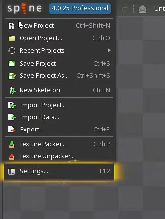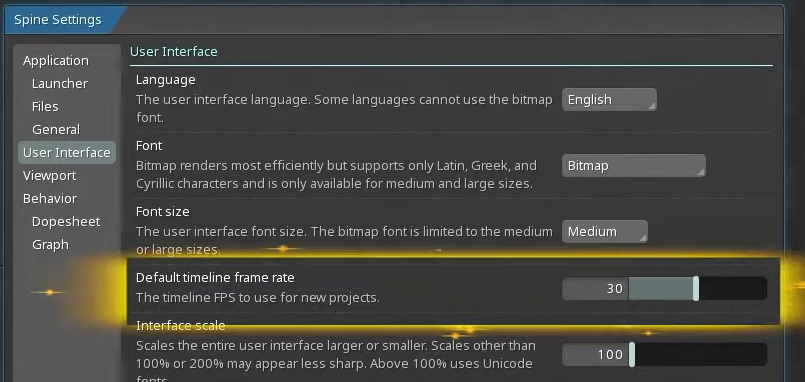

## **❗❗ Auto Backup ❗❗**

> **Settings...** ➡ **Behavior** ➡ **Automatic backup**
>
> 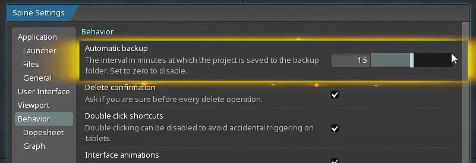

# 📌 **Telegram Workflow Style**

## **1️⃣ Workflow A**

> Spine software ➡ Output as WEBM format with VP9 codec (Telegram resolution) ➡ Import into Telegram for final check

### **📹 Creating from Videos**

> To create stickers and emoji from video files, you only need an editing software that lets you export your project as a .WEBM video file.
>
> **The video has to...**

- Be in .WEBM format, up to 30 FPS

- Be encoded with the VP9 codec

- Have no audio stream

> **If you are creating emojis...**

- The resolution must be exactly 100x100 pixels

- Duration must not exceed 3 seconds

- Video should be looped for optimal user experience

- Video size should not exceed 256KB after encoding

> **If you are creating stickers...**

- One side must be exactly 512 pixels in size - the other side can be 512 pixels or less.

- For emoji, the video must be exactly 100x100 pixels in size.

- Video duration must not exceed 3 seconds.

- Frame rate can be up to 30 FPS.

- Video should be looped for optimal user experience

- Video size should not exceed 256KB.

- Video must be in .WEBM format encoded with the VP9 codec.

- Video must have no audio stream.

## **2️⃣ Workflow B**

> Spine software ➡ Output as PNG sequence (full sequence) ➡ Import to After Effects to add camera movement and text animation ➡ Use Bodymoving-TG plugin to export .TGS format ➡ Import into Telegram for final check

### 🎴 **Creating Animated Stickers & Emojis**

> To create vector-animated stickers and emoji you will need the following:

- Any vector graphics editor that allows exporting vector objects to Adobe After Effects to turn them into animations.

- Adobe After Effects

- The Bodymovin-TG plugin, a fork of Bodymovin for Adobe After Effects that can be used to export animations to Telegram's. TGS format.

> The Lottie-based.TGS format allows for incredible animations that are less than 30KB in size - six times smaller than the average photo.
>
> Animation Requirements

- The canvas size must be 512x512 pixels.

- Objects must not leave the canvas.

- Animation length must not exceed 3 seconds.

- All animations must be looped.

- Final file size must not exceed 64KB after rendering in Bodymovin

- You must not use the following Adobe After Effects functionality when animating your artwork: Auto-bezier keys, Expressions, Masks, Layer Effects, Images, Solids, Texts, 3D layers, Merge Paths, Star Shapes, Gradient Strokes, Repeaters, Time Stretching, Time Remapping, Auto-Oriented Layers.

# **🧭 Navigation**

## **🤖 Interface**

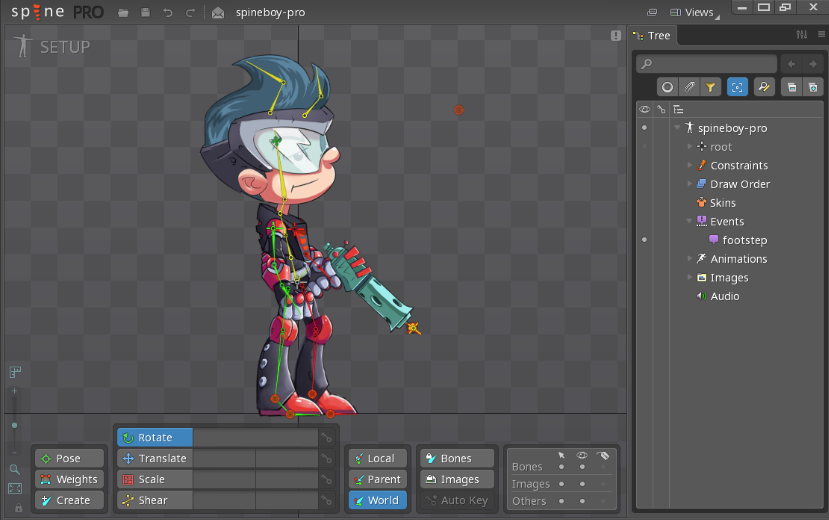

> **Pan:** Hold RMB + Move the mouse
>
> **Zoom In/Out:** Scroll mouse wheel or Hold RMB move the mouse up/down
>
> 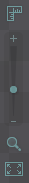
>
> 👈 zooms to actual size of the image
>
> 👈 adjust the view to fit the size of the skeleton

## 

> 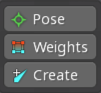👈 Allows posing by moving the bones around
>
> 👈 Allows manipulation of the weight of the meshes
>
> through the Weights Viewer
>
> 👈 Creates new bones
>
> 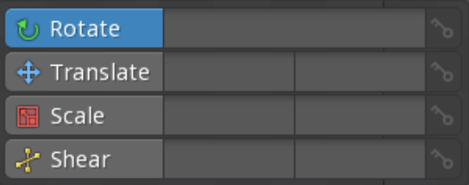
>
> **[Rotate]{.mark} ➡ [Press C]{.mark}**
>
> **Translate ➡ Press V**
>
> **Scale ➡ Press X**
>
> **Shear ➡ Press Z**
>
> To control the orientation of the manipulation
>
> 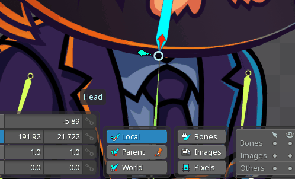
>
> Allow to re-arrange bones and attachments without affecting others in the hierarchy
>
> 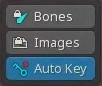
>
> 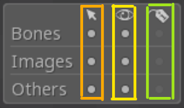Orange column ➡ Selection
>
> Green column ➡ toggling visibility
>
> Green column ➡ Naming

## **🌳 Tree View** 

> 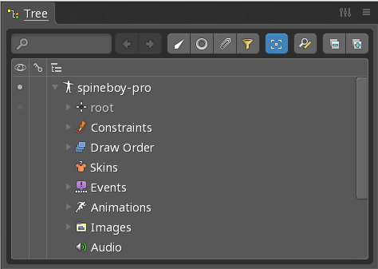
>
> **[Nodes]{.underline} [Definition]{.underline}**
>
> 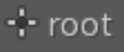 ➡ The topmost bone in the skeleton hierarchy
>
> (acts as the origin point of the entire rig)
>
> 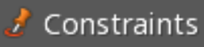 ➡ Mainly allows you to organize and manage
>
> bone constraints
>
> 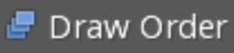 ➡ The order in which images are drawn (similar
>
> like Photoshop)
>
> 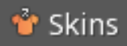 ➡ Allows swapping out visual elements on a
>
> skeleton without needing to create a new skeleton rig (eg. clothing / hairstyles / weapons)
>
>  ➡ Mainly to sync gameplay code or audio with
>
> animation (eg. playing sound effects / triggering hitboxes / notifying the game to do something)
>
> 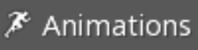 ➡ Shows all animation timelines
>
> 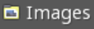 ➡ Points to the image folder in your project folder
>
>  ➡ Points to an audio folder & allows you to
>
> incorporate sound into your timeline

## **🔥 Hotkeys**

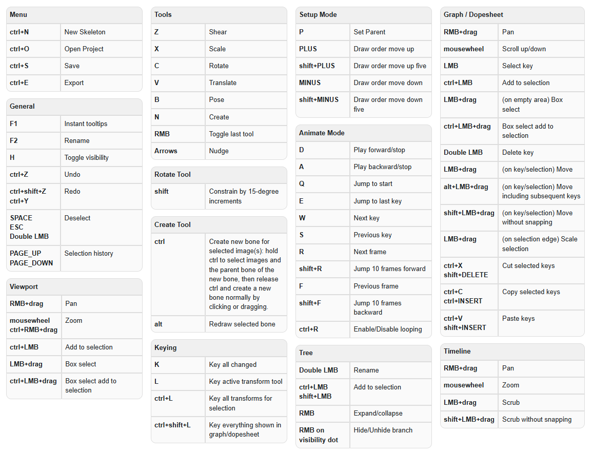

# **🔌 Import Data**

**Spine ➡ Import Data ➡ find JSON File & Rename your skeleton ➡ Import**

> 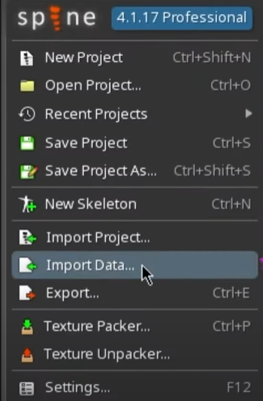
>
> **[If a JSON file is unavailable, you can simply drag images or PSD file into Spine from the Tree View images folder]{.mark}**
>
> 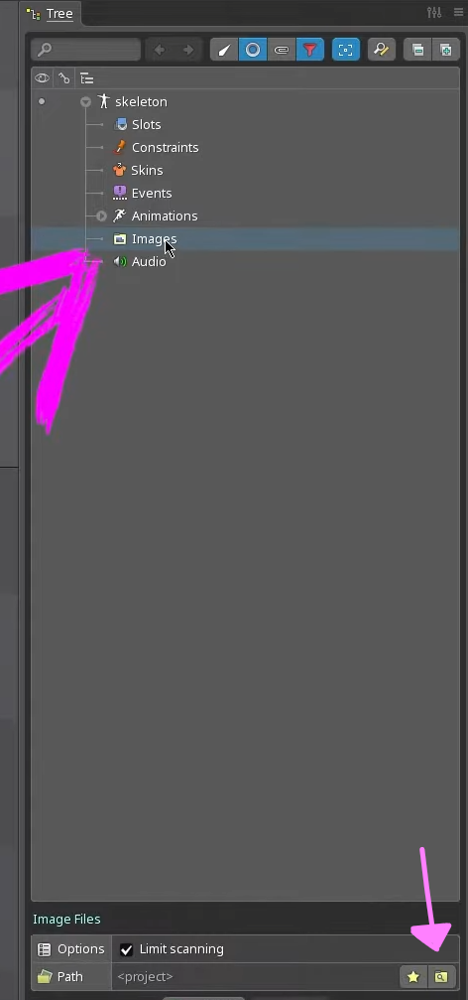
>
> ⭐⭐ **To make sure files don't become unlinked by accident, please make sure to save the project inside the project folder (next to image folder)** ⭐⭐
>
> 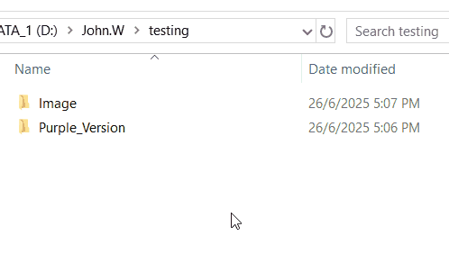

# **👷‍♀️ SETUP Mode**

> 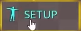

- Setup mode is where you'll build and prepare your skeleton...in other words, rigging

- You will be able to find it at the top left corner of the Spine Interface

## **🦾 Character Setup**

> Select all the meshes except ROOT from the Tree View, then move everything up above the grid line.
>
> 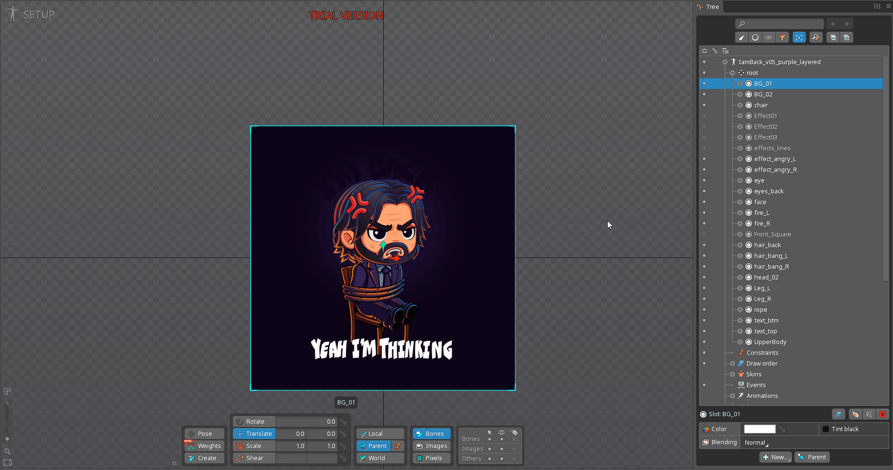

### **Create Bones**

> Click on Create \> Hold Left Mouse Button and drag in the viewport OR can just click once to make a bone with no link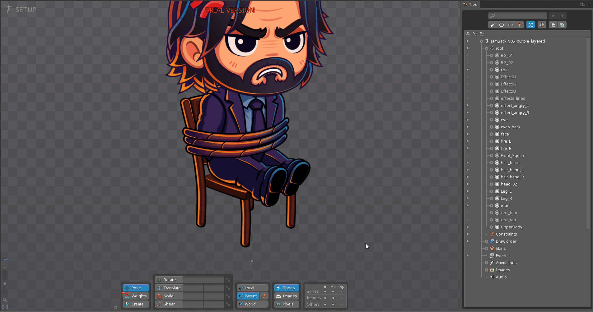
>
> You can **change the Bone's length** by using the crosshair OR under the Tree View.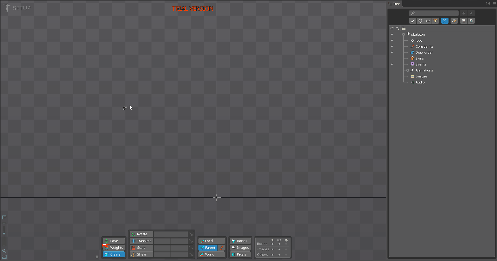
>
> **[❗ DO NOT adjust the length using the scale tool ❗]{.mark}**
>
> **If a bone is created and it's parented to the wrong bone**...
>
> Select the wrong bone ➡ click Set Parent under the Tree View ➡ click the new parent bone
>
> The first bone will become the child of the second bone
>
> 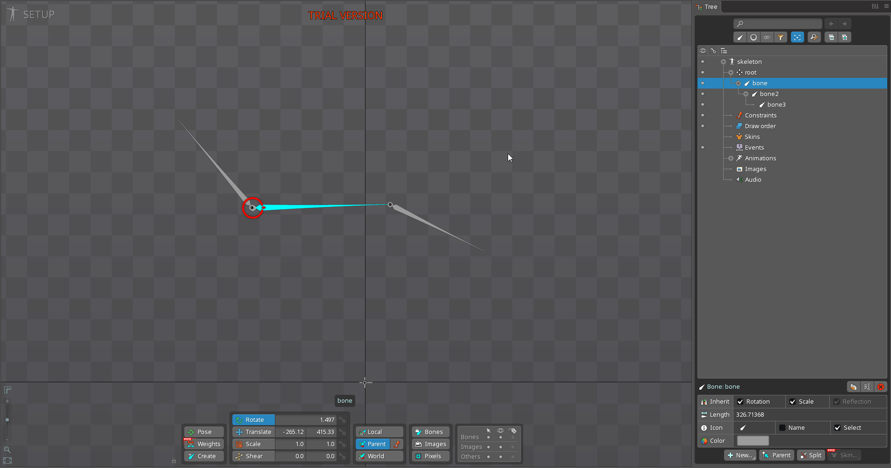

### **Create IK Bone**

> Select the Bones that need to be IK ➡ New (under the Tree View) ➡ IK Constraint ➡ Again Select the last bone ➡ Rename
>
> 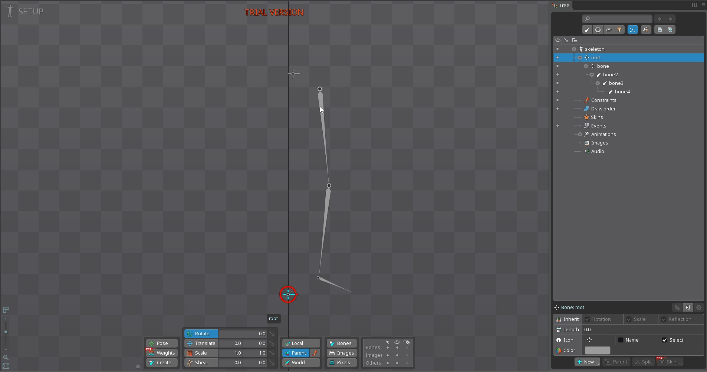

### **Rename Your Bones**

> Select bones ➡ Find and Replace ➡ For Find, key in the name you wanted to search in Tree View ➡ Key in the new name for the bones ➡ Select the Tree Selection from the Scope ➡ Replace
>
> 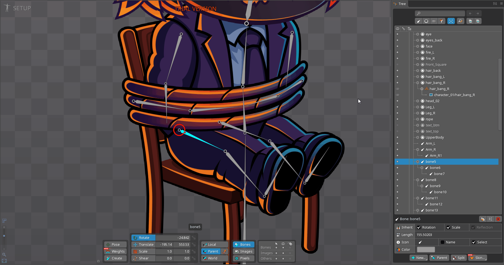

### **Start Meshing**

> Select the mesh ➡ Edit Mesh (under Tree View) and start to create a new mesh box
>
> 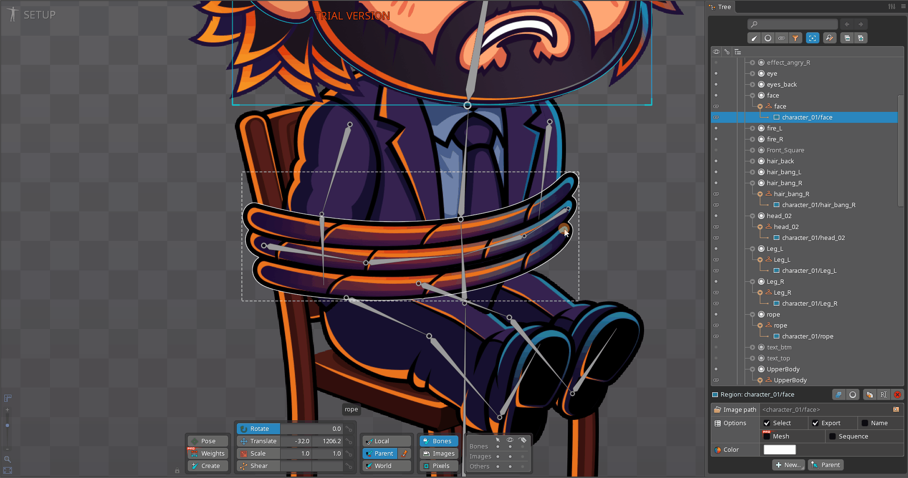
>
> Then, add vertices in the mesh box
>
> 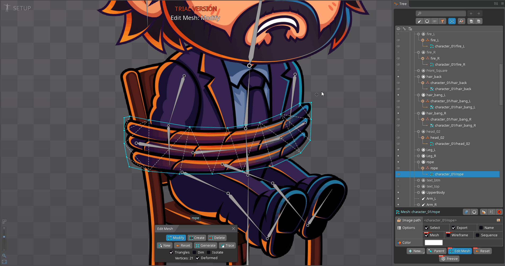

### **Bind Bones**

> Can go to left bottom click "Weight" or go to View ➡ Weights or Alt+W ➡ click Bind ➡ then select all the bones ➡ Bind
>
> 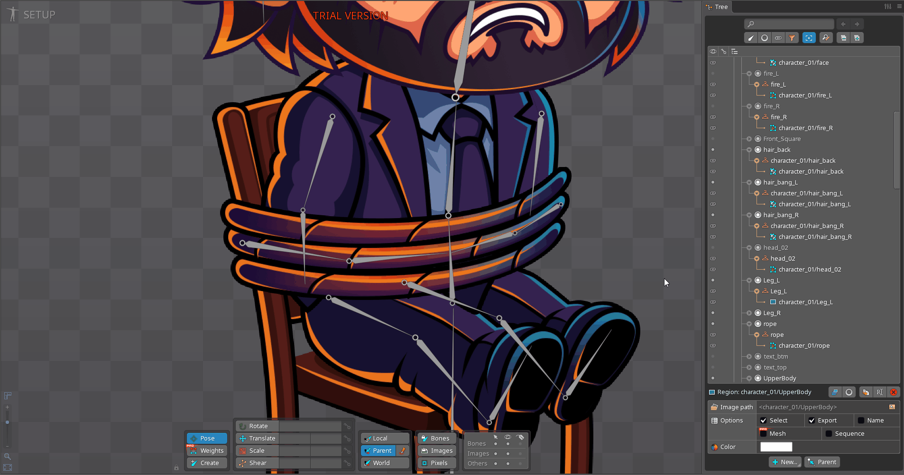

### **Fix/Adjust Nodes Weight**

> Weights are automatically calculated, but sometimes it will mixed up with other bone's weight like image below
>
> 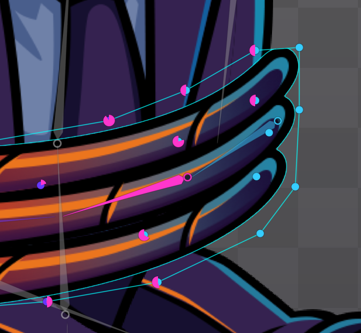
>
> To fix this, click Weight ➡ Hold Ctrl ➡ Click on every node affected by the other bone ➡ Select the bone that wanted to remove the nodes under the tree view ➡ Hold Left Mouse Button and move down or up to adjust the value
>
> 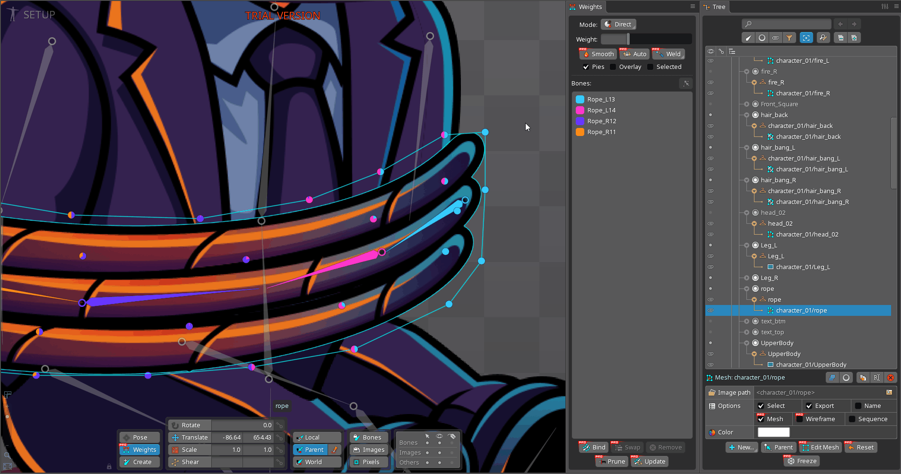

### **Coloring The Bones**

> Highly recommend to do this, because it makes it easier to notice the bones while animating the character
>
> Hold Ctrl ➡ Select the bones ➡ Click Color (under Tree View) ➡ Pick any color
>
> 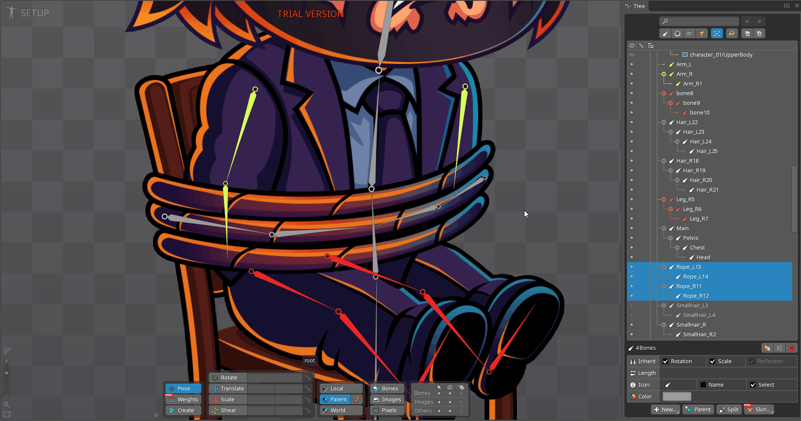

### **Separate Skins**

> Add Skin Placeholder for the first set of your skin
>
> 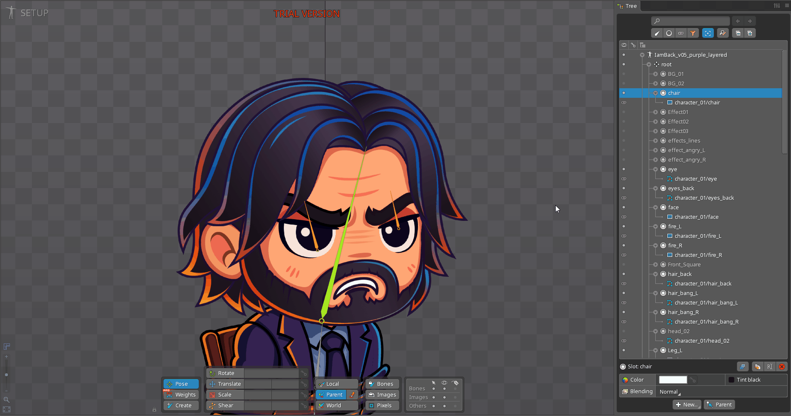
>
> Once done adding for the first skin, go to Skin ➡ New ➡ Skin
>
> Then add your second skin into a Skin Placeholder
>
> 
>
> And now you have 2 different skins in your tree view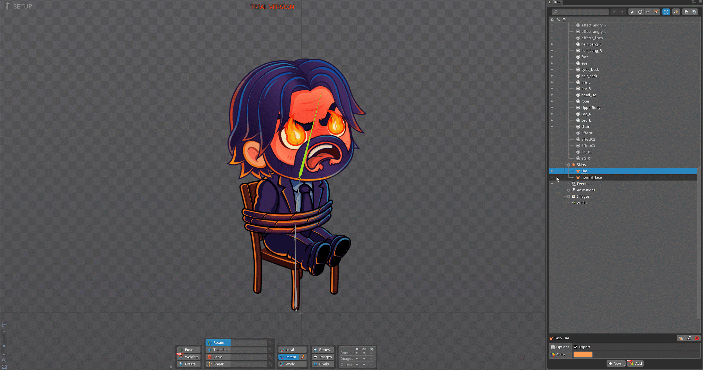

# **🏃‍♂️ ANIMATE Mode**

> 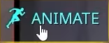

- Animate mode is where you'll breathe life into the character

- You will be able to find it at the top left corner of the Spine Interface

- Each animation created will be under the Animation node in the Tree

- Animate mode does not affect the default pose since you are just creating motions on top of it

  - If something goes wrong, revert back to Setup Mode

> **Play Animation ➡ Press D**
>
> **Scrub to a different frame ➡ Click anywhere on the timeline**
>
> **and drag the playhead around**
>
> **Move one frame to the left/right ➡ Press F + R**
>
> **Move to the next left/right frame ➡ Press S + W**
>
> **Scroll the Timeslider ➡ RMB Click + Drag left/right**
>
> **Zoom In/Out ➡ Scroll middle mouse wheel inside**
>
> **the time slider viewer**

## **🕺 Animating**

> Change to Animate View on the top left corner
>
> Select the bone you want to animate **➡**click on the Rotate/Translate etc **➡** Click the Green Key logo **➡** go to the Dopesheet view **➡** Press K to set key

### **Graph**

> You can change the type of curve in the graph editor
>
> 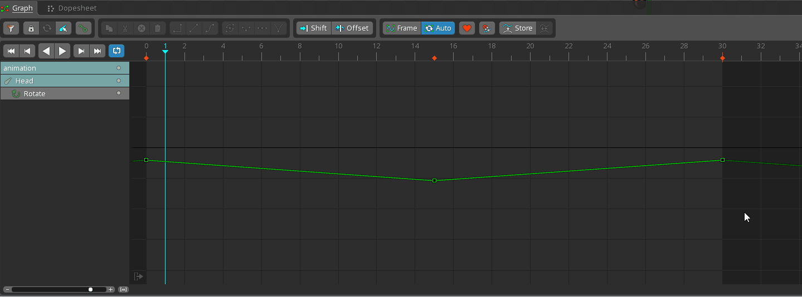

### **Set Key to change Skin**

> Open Tree View **➡** Go to the skin that need to set key **➡** Click on the Key icon to set a key **➡** Go to the frame number **➡** Click on the Safety Pin icon to hide or unhide the skin

### **Setting Up 2.5D**

> 2.5D refers to a technique used to create a pseudo-3D effect in 2D animations. It involves using a combination of skeletal animation and mesh deformation to simulate depth and perspective, making 2D characters or objects appear to rotate or move in three dimensions.
>
> 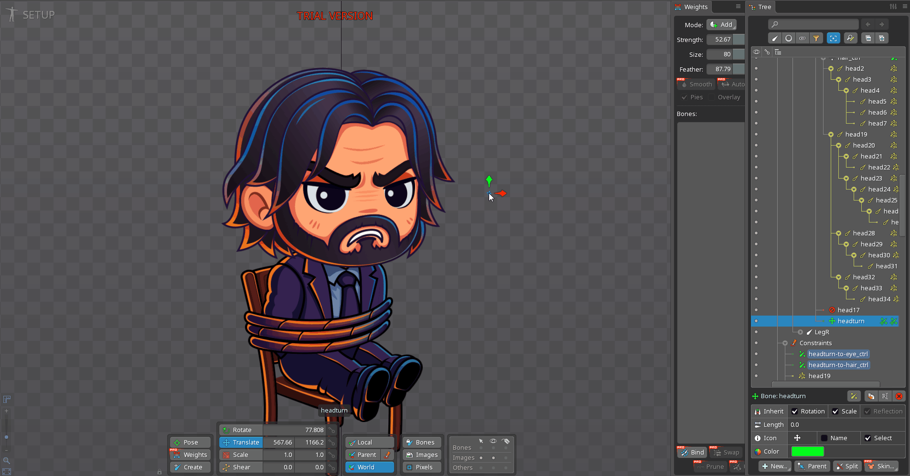
>
> Create two individual controllers first, you can change the icon and color under the Tree View
>
> 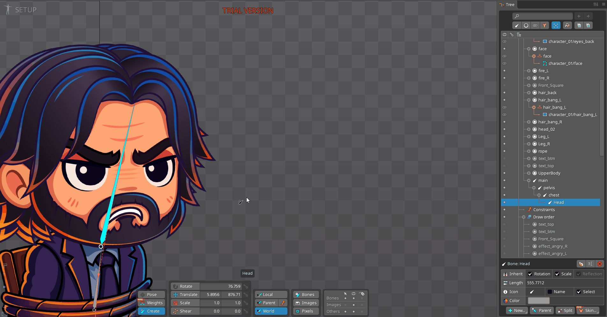
>
> Set the controllers moving reverse by using transform constraints, and link Rotate, Translate X and Y under the tree view. Then click Match in the offset box and turn on the Link Sliders. Under the Mix option change the rotate value to -100.
>
> 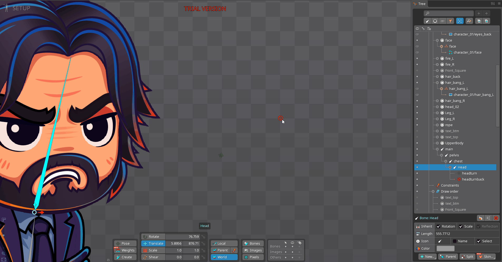
>
> When creating mesh vertices, try to place it followed by muscle
>
> 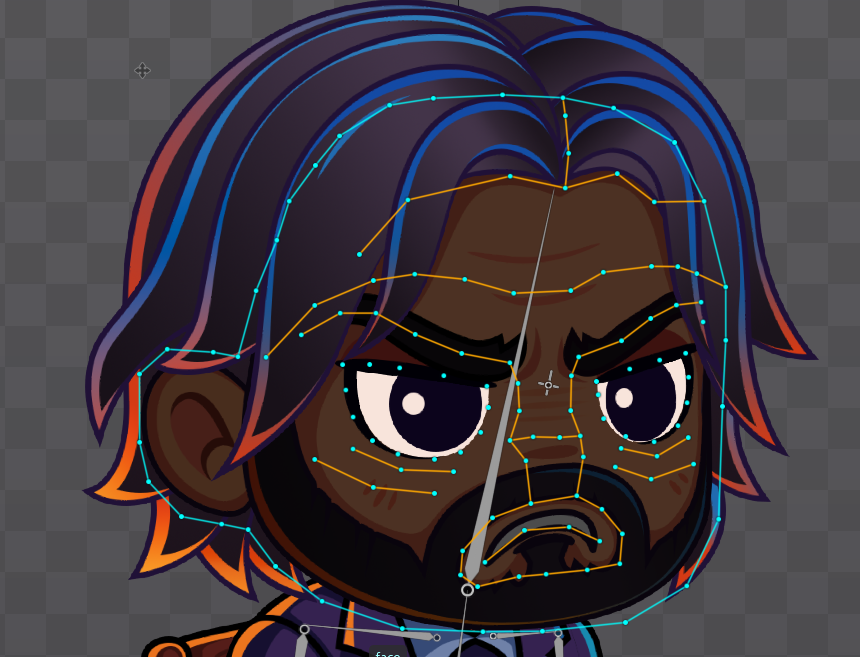
>
> Bind the face to the 2 individual controllers
>
> 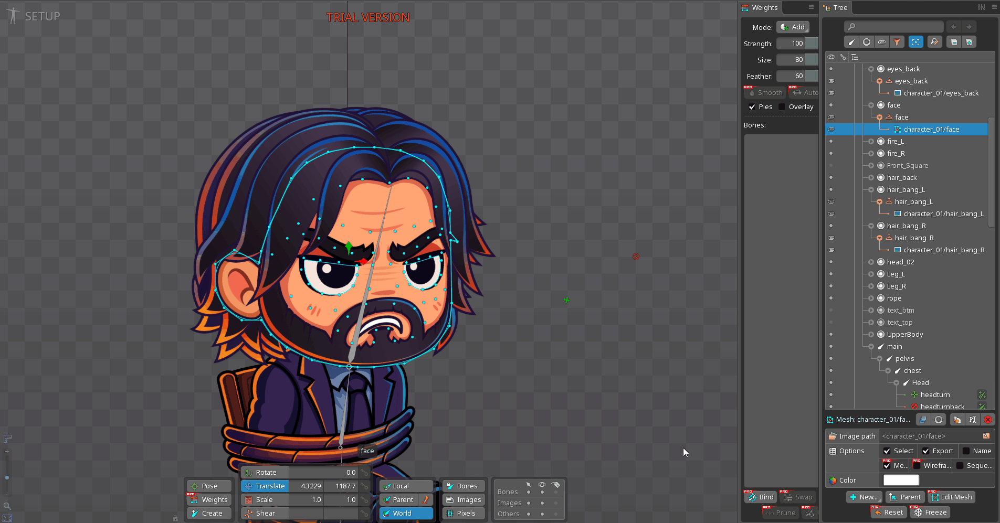
>
> Paint the "headturn" weight inside the face area, followed by the "headturnback"'s weight at the outside area
>
> 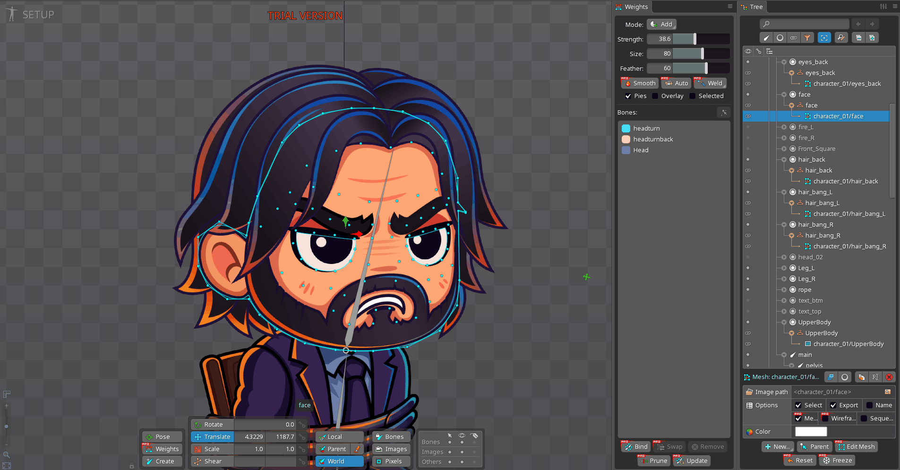
>
> 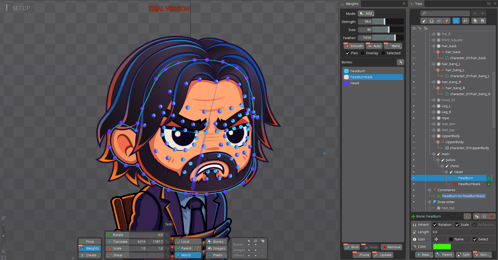
>
> Then remember to polish and adjust the weight to make it smooth
>
> 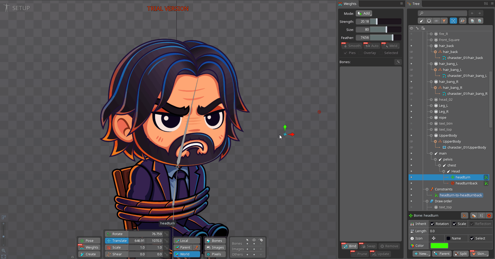
>
> If you want make the eyes move together with the "headturn", you can make a new bone then bind skin to Head, then transform constraints to "headturn" controllers
>
> 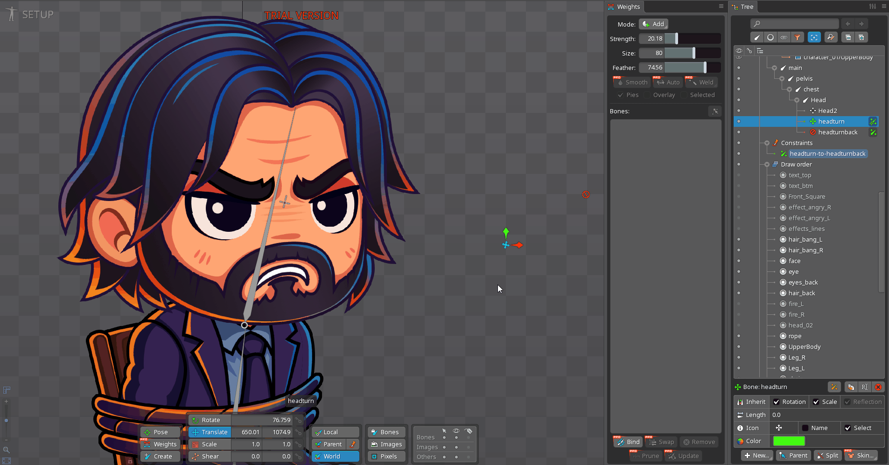

### **📓 Extra notes**

> There is no camera function in Spine 2D, so the suggested workflow is for you to parent all the elements/images into a group/joint and scale/move the elements to make it look like the camera movement (in this case, scaling up the image to make it look like camera is zooming in) It's a manual cheat way to simulate the feeling of the camera movement.
