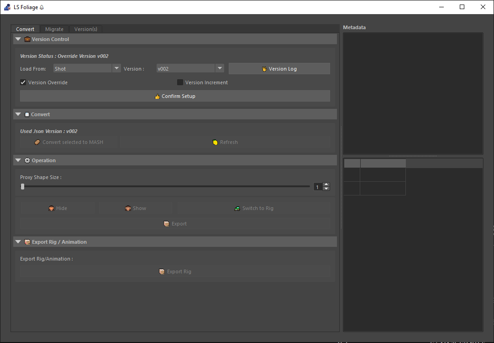
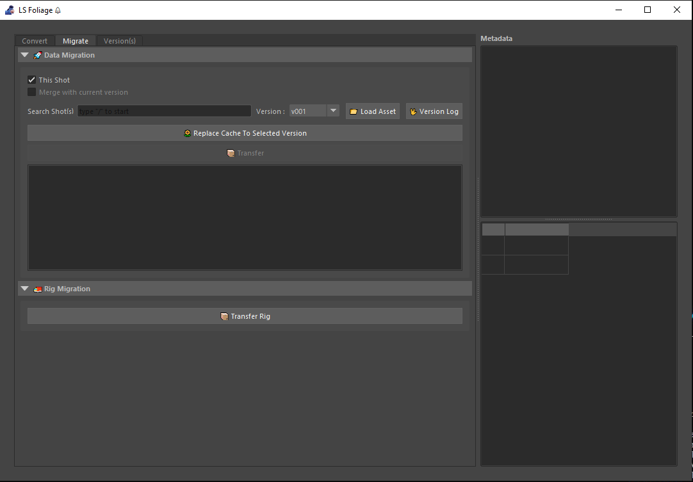
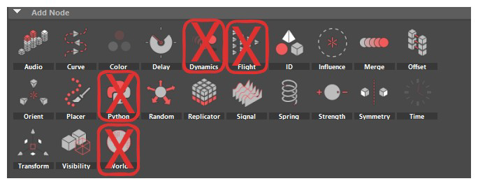
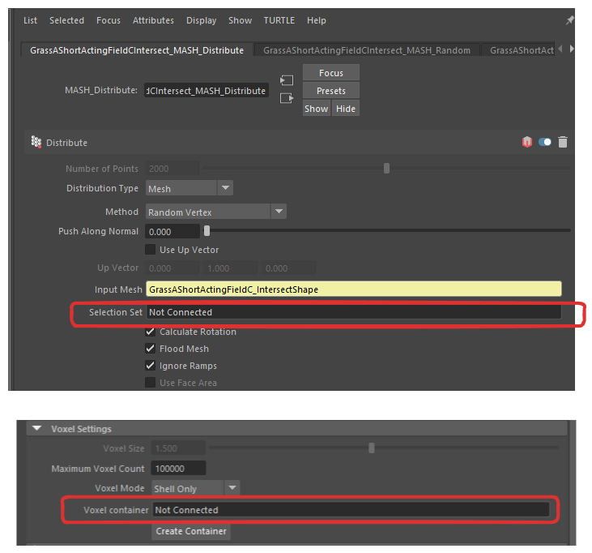
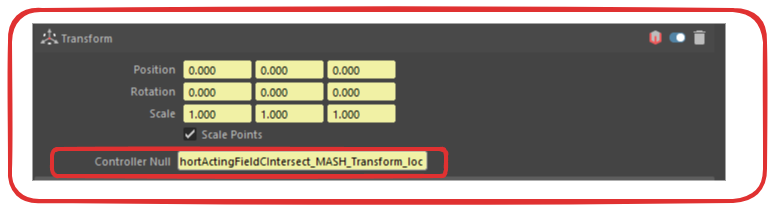

version 2.0.0

1. # **User Interface Intro** 

   1. ## **Convert Tab**

   

### **Version Control**

1. Load From

      * Asset; load data from asset folder. 

      * Shot; load data from shot cache folder.

2. Version

      * select which version in the cache folder to load from.

3. Version Log

      * View metadata of the selected cache data.

4. Version Override & Version Increment

      * Option to export the data in a new version folder or override current data.

5. Confirm Setup

      * Confirm selection of all the controls above.  

### **Convert**

1. **Convert selected to MASH**

      * Converts a gpuCache asset in the scene to a pre-cached MASH asset.

2. **Refresh**

      * Recalculates the number of points in the instancer. 

      * Users are recommended to use the refresh operation after every MASH network edits. 

      * Also refreshes the viewport

### **Operation**

1. **Proxy Shape Size**

      * Allows users to visualise/identify assets in the scene that are available to manipulate.

      * Available assets are highlighted in red. 

      * Multiplier for proxy shapes that are too small or larger than its asset. 

2. **Hide**

      * Allows users to hide selected instance(s). Hidden assets are highlighted in green.

3. **Show**

      * Allows users to reveal selected instances(s). Hidden assets are highlighted in green.

4. **Switch to Rig**

      * Allows users to convert selected assets(s) into animateable/manipulatable control rig asset.

5. **Export**

      * Allows users to cache edited assets back to gpuCache and aiStandIn format. 

### **Export Rig / Animation**

1. **Export Rig**

      * Export all SWITCH\_TO\_RIG asset(s).

2. ## **Migrate Tab** 

### **Data Migration**

1. **This Shot**
      - Scene Cache Data

2. **Merge with current version**

      * Merge migrated data into current cache version

3. **Search Shot(s)**

      * Search shots that have data ready to migrate to the current scene. 

4. **Version**

      * Select version folder available in selected shot.

5. **Load Asset**

      * Load Assets into a table box. Assets displayed are available to be migrated into the current scene. 

6. **Version Log**

      * View metadata of the selected cache data.

7. **Replace Cache to Selected Version**

      * Repath gpuCache and aiStandIn to the current scene.

8. **Transfer**

       Initiate data migration from selected shot,version and asset to current scene. 

### 

### **Rig Migration**

1. **Transfer Rig**

      * Migrates MASH\_RIG data from selected shot to current shot. 

# **Tips Edit Foliage in Sequence**

- Convert to MASH

<video width="640" height="360" controls>
<source src="../source/Convert_To_MASH.mp4" type="video/mp4">
Your browser does not support the video tag.
</video>

- Version Increment

<video width="640" height="360" controls>
<source src="../source/Version_Increment.mp4" type="video/mp4">
</video>

- Read_Version_Log

<video width="640" height="360" controls>
<source src="../source/Read_Version_Log.mp4" type="video/mp4">
Your browser does not support the video tag.
</video>

- Export Animation

<video width="640" height="360" controls>
<source src="../source/Export_Animation.mp4" type="video/mp4">
Your browser does not support the video tag.
</video>

- Replace_Rock_To_Tree

<video width="640" height="360" controls>
<source src="../source/Replace_Rock_To_Tree.mp4" type="video/mp4">
Your browser does not support the video tag.
</video>

1\. Increase / Add Foliage

   - Select GPU cache Convert  

   - Open Mash editor (Placer Node)

   - Add 

2\. Replace / Switch model in convert mash

- Select GPU cache Convert  

- Reference new asset in scene

- Select Instancer and add the new asset

- Replace asset ID 

3\. Reset all edit

- Select GPU cache Convert  

- Load the data from Server

# **Tools Limitations** 

1. Cannot be used for creating **Asset OPT** 

2. Not support some of the MASH node and attribute  (Please find the detail listed below)

3. Convert to rig asset only support reference 

MASHs nodes that are not supported for convert 

1. Dynamics node 

2. Flight

3. Python 

4. World 

MASH Distribute node Attribute that are not supported for convert 

1. Selection Set 

2. Voxel Container 

MASH Transform node Attribute that are not supported for convert 

1. No Support Controller Null Attribute 

