# Modeling

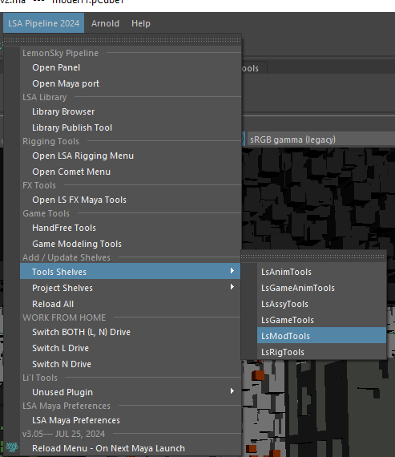 
 

##  **Ref Chooser**

- Select reference from reference editor before using the tool.

- Choose which cache type to load for the selected reference.

> 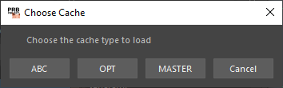 
 

##  **joTools / LS Tools**

- MAYA 2020 use joTools

- Other MAYA version use LS Tools

- **\[Submit to Deadline\]** Mainly used to send huge assets mostly set/MASH to render farms for render preview.

- **\[Delete Animation Layers\]** Delete Base Animation in the Anim layer.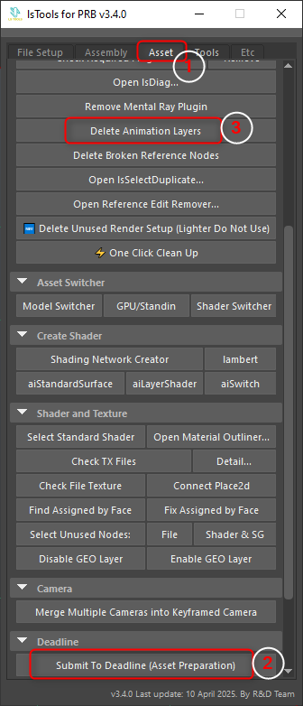

> 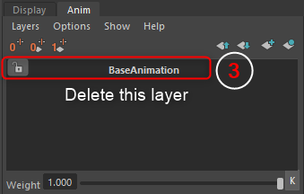 
 

##  **Asset**

- Import default template of the outliner hierarchy.

> 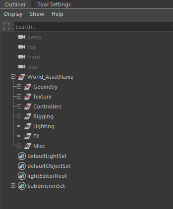 
 

##  **Renamer**

- Tools to ease in renaming task which include generic and frequently used suffix.

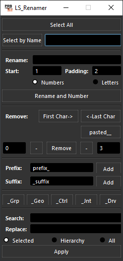 
 

##  **abSymMesh**

- Blendshape tools.

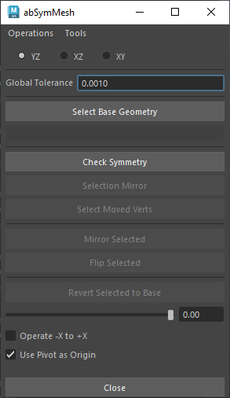 
 

## 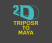 **TripoSr To Maya**

- Our first ever ai tool to generate 3d model from image- runs individual pc, accessed inside maya 
 

## 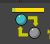 **Ls Shader Migrate**

- Material and texture transfer tool that can auto assign the material to the correct mesh . 
 

##  **Material Builder**

- Create material with proper naming based on the project naming convention.

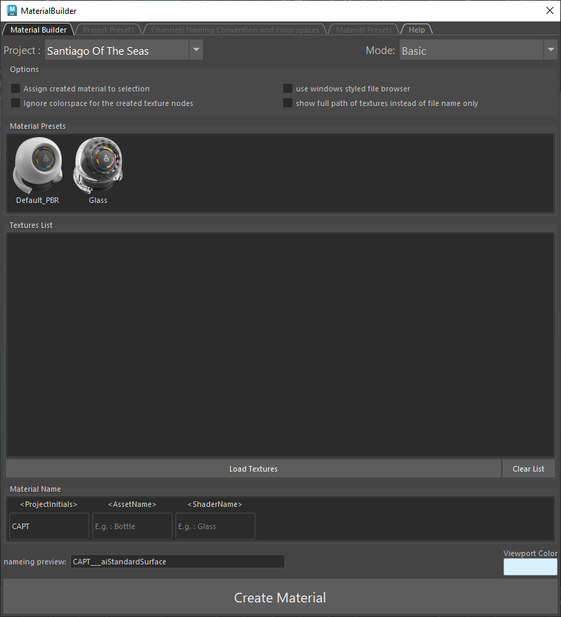 
 

##  **UV Checker**

- Tools to quickly assign checker, wood , rope or custom tiling texture. 
 

##  **Generate All UV Tiles**

- Generate all texture preview. 
 

##  **Transfer UV**

- Transfer UV cleanly without leaving history. 
 

##  **Foliage Tool**

- Foliage management toolset, that helps transfer, modify, replace foliages in shot for Maya. 
 

##  **Ls Asset File Clean Up**

- Clean up tool for Maya 
 

##  **Ls Asset Checklist**

- Checklist tool for Maya 
 

## **Project Tools**

###  **Mono Asset Checklist Tool**

Asset tool for Monopoly project that checks and fixes (selected) issues:

  - Naming and Hierarchy

    - Asset Naming and World Objects 
        Check asset name and unwanted objects at world level 
         

    - Hierarchy Naming 
        Search for incorrect hierarchy 
         

    - Namespace 
        Check for existing namespace 
         

    - Display Layers 
        Check for missing and extra display layers 
         

    - Display Layers Membership 
        Check for layer memberships 
         

  - Shader

    - Shader Naming 
        Check if shader assigned are correctly named 
         

    - Default Shader 
        Check if mesh assigned to default shader 
         

    - Unused Shader 
        Search for unused shaders 
         

  - Surfacing

    - Color Set 
        Check no multiple existing color set on the geometries and no color sets for characters 
         

    - Export Vertex Color 
        Check for \"Export Vertex Color\" is enabled for geometries with color set 
         

    - UV Set Editor 
        Check for geometries with color set does not have UV shells 
         

    - UV CH Editor 
        Check if Characters contain \"map1\" and \"Expressions\" uv sets 
         

  - Clean-Ups

    - Unknown Plugins 
        Check for unknown plugins 
         

    - History 
        Check geometry does not have any history 
         

    - Freeze Transform 
        Check all non-anim geometries have freeze transformation applied 
         

    - Reset Pivot 
        Check all non-anim geometries have pivot at origin 
         

    - Toggle soft edge display 
        Check soft/hard edge display are toggled for all geometries 
         

    - Ngons 
        Search for ngons in geometries 
         

  - Extra

    - Citizen Pivot 
        Check all character pivots matches perfect citizen 
         

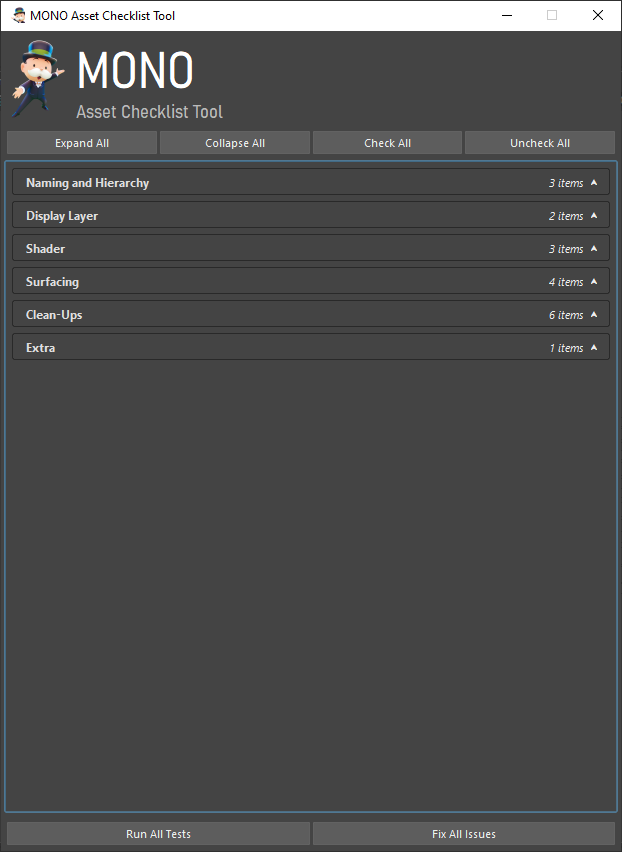
