# LS Rigging Tools Documentation

 LAST UPDATED
 
Author - Robin Koh Li Wen, May 6, 2025
 
Collaborators - Anis | Wen Hong | Sumesh

# **🦴 LsRigTools**

- The LsRigTools shelf caters towards rigging for projects

> 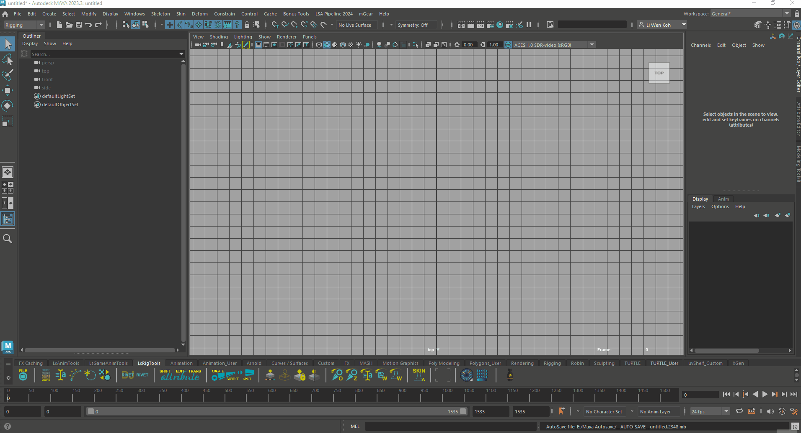

## 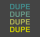 **List Duplicate Names**

- It will basically list out duplicate names in the script editor

  - If there are no duplicate names, it will not be shown in the script editor

> 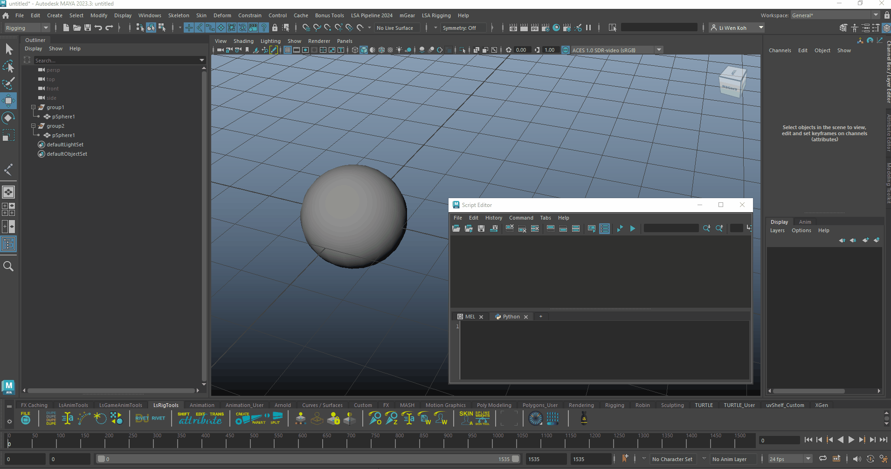

## 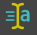 **Fast Renamer**

- Allows the selection to be renamed either based on hierarchy or by individual selection

  - Able to change prefix and suffix

> 

- Able to find and replace a specific name

> 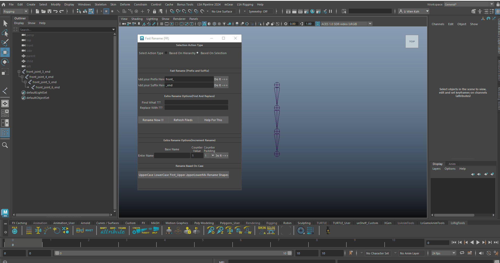

- Able to change the base name of the selection as well as the counter values & padding

> 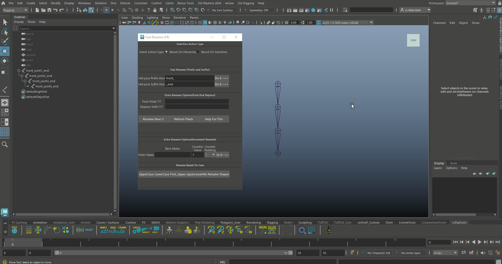

- Able to change uppercase and lowercase of the name

> 

- If all else fails for some reason, Maya has a default option for you to perform the same action in a more basic manner

> 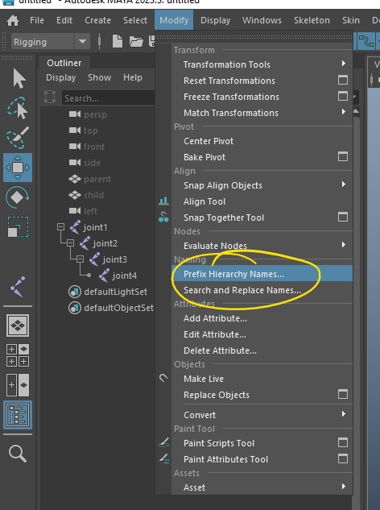

##  **IK Spline Setup (can remove according to Anis)**

> 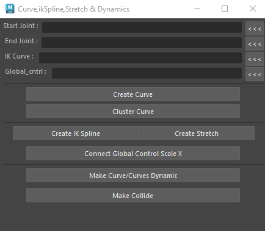

- Creating a IK Spline rig

##  **Pin Locator to Curve**

- Normally used for eyes and props

  - Eg. a locator will basically follow the curve

> 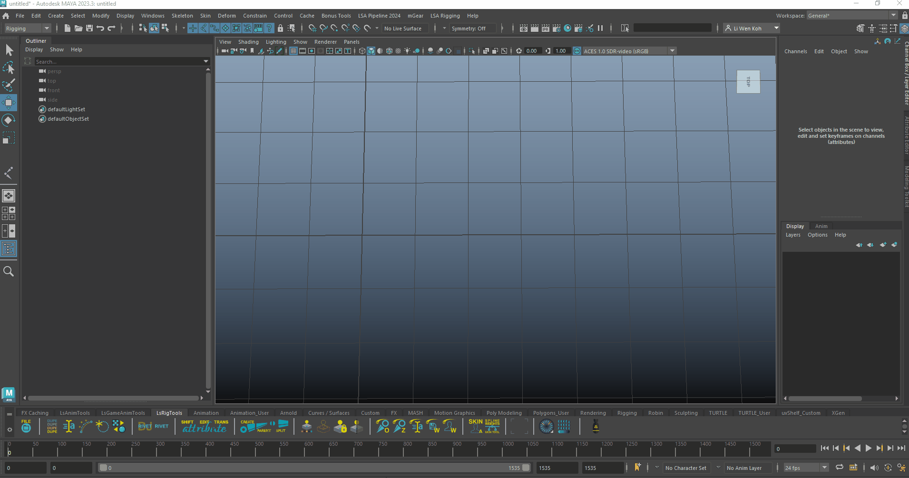

##  **Transfer UV/Shader**

> 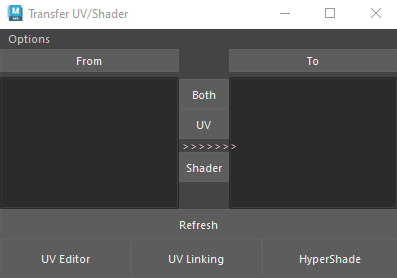

- More towards modeling tool

  - Takes the unfinished model to be rigged first (while waiting for the model to be completed)

  - Once the model is done, then the UV is transferred to the finished rigged model

##  **DJ Rivet \| Rivet**

- DJ Rivet - creates a follicle and constrains controller to mesh

- Rivet - creates a locator on the edge/face and attaches to the mesh

- Maya default Rivet - creates a UV pin

##  **SHIFT \| EDIT \| TRANS attribute**

- Shift Attribute (shifting the arrangement of the attribute)

- Edit Attribute (could be the same default edit attribute in maya)

- Transfer Attribute (refer pic below)

> 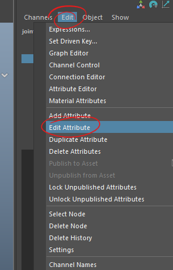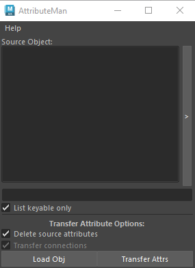

- Transfer attribute from one ctrl to another

##  **CREATE \| PARENT \| SPLIT**

### **Create Joint**

### 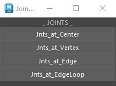

- Very straight forward in how to create a joint base on the 4 options given

### **Parent Joint**

- Very straight forward in setting up the parent and child in the joint order

> 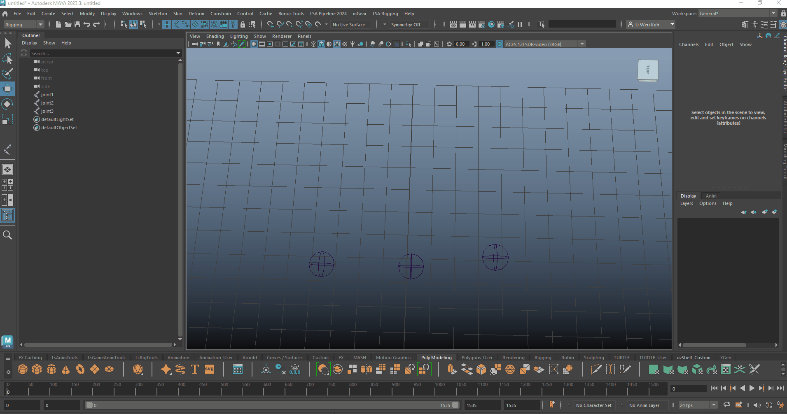

### **Split Joint**

> 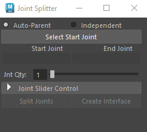

- When the Start Joint is selected, it will auto detect the end joint

> 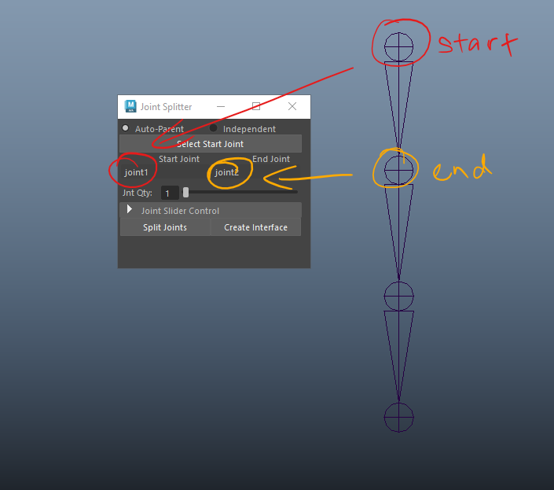

- To add inbetween joints, change the joint quantity and hit Split Joints

> 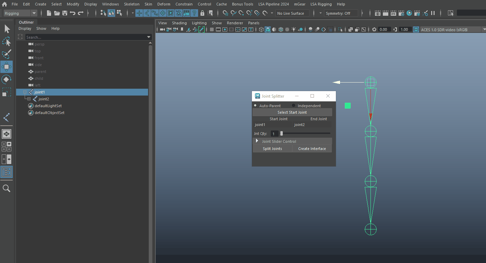

- If it was set to independent, the inbetween joint created will not be part of the hierarchy

> 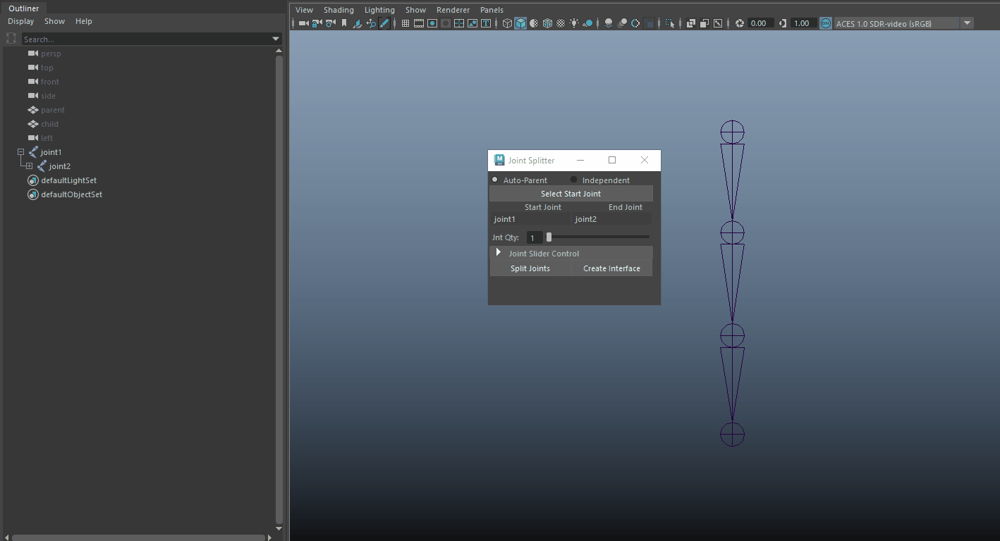

## 

##  **Override Colour**

- Changes the colour of the curves

> 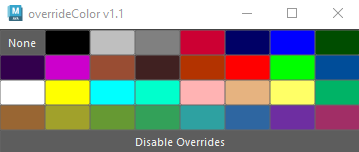
>
> 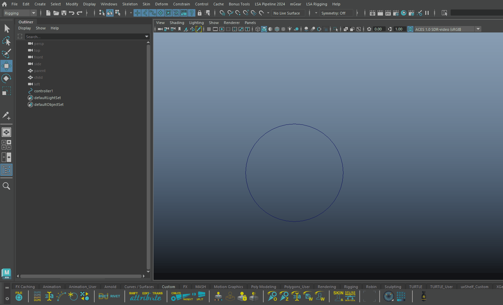

##  **Wire Controllers**

- A simple click and a controller is created

> 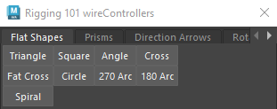

##  **Lock 'n Hide**

> 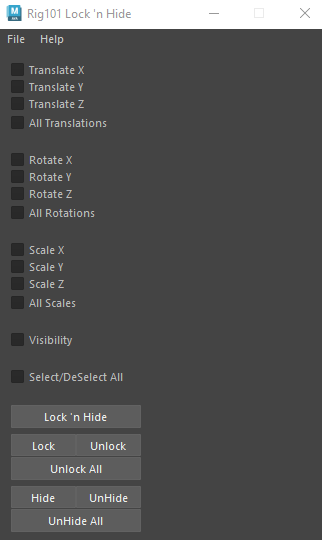
>
> 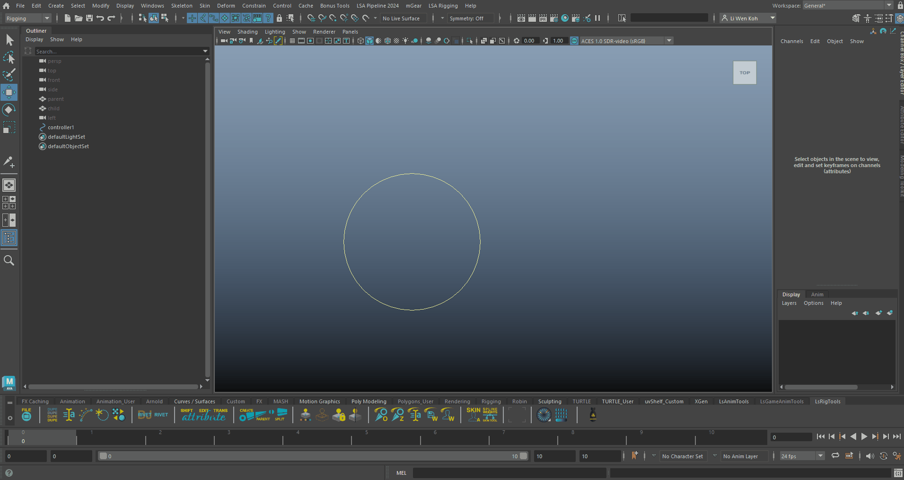

- Mainly for locking and hiding the attributes

## 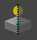 **Controller Mirror UI**

> 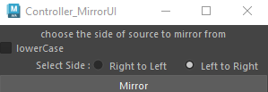

- Literally mirrors curve shapes to the other opposing side

##  **Joint Orient**

- Orient joints based on project requirements

##  **Z Up/Down**

- Changes the Z orientation upwards or downwards

  - Mainly for game engines

## 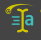 **Rename**

- Rename controllers/joints

- Very similar to Fast Rename

- Search and Replace (make sure to select the hierarchy and the name of what you want to change and the final output name)

##  **Save Weights (not applicable/working - can remove)**

##  **Skin Weights (not applicable/working - can remove)**

##  **Skin As**

- Transferring the skinning of a mesh to another mesh that has no joints

##  **Spline Weight Skin Tool**

- Refer to [https://arturocoso.gumroad.com/l/SplineWeights](https://arturocoso.gumroad.com/l/SplineWeights)

- Tutorials :

<iframe src="https://player.vimeo.com/video/1053249940?badge=0&amp;autopause=0&amp;player_id=0&amp;app_id=58479" frameborder="0" allow="autoplay; fullscreen; picture-in-picture; clipboard-write; encrypted-media; web-share" style="position:absolute;top:0;left:0;width:100%;height:100%;" title="01 - Installation"></iframe>

<iframe src="https://player.vimeo.com/video/1053252450?badge=0&amp;autopause=0&amp;player_id=0&amp;app_id=58479" frameborder="0" allow="autoplay; fullscreen; picture-in-picture; clipboard-write; encrypted-media; web-share" style="position:absolute;top:0;left:0;width:100%;height:100%;" title="02 - Introduction"></iframe>

<iframe src="https://player.vimeo.com/video/1053257452?badge=0&amp;autopause=0&amp;player_id=0&amp;app_id=58479" frameborder="0" allow="autoplay; fullscreen; picture-in-picture; clipboard-write; encrypted-media; web-share" style="position:absolute;top:0;left:0;width:100%;height:100%;" title="03 - leg_skin"></iframe>

<iframe src="https://player.vimeo.com/video/1053289672?badge=0&amp;autopause=0&amp;player_id=0&amp;app_id=58479" frameborder="0" allow="autoplay; fullscreen; picture-in-picture; clipboard-write; encrypted-media; web-share" style="position:absolute;top:0;left:0;width:100%;height:100%;" title="04 - arm_skin"></iframe>

<iframe src="https://player.vimeo.com/video/1054022900?badge=0&amp;autopause=0&amp;player_id=0&amp;app_id=58479" frameborder="0" allow="autoplay; fullscreen; picture-in-picture; clipboard-write; encrypted-media; web-share" style="position:absolute;top:0;left:0;width:100%;height:100%;" title="05 - neck_skin"></iframe>

<iframe src="https://player.vimeo.com/video/1054031864?badge=0&autopause=0&player_id=0&app_id=58479/embed" allow="autoplay; fullscreen; picture-in-picture" allowfullscreen frameborder="0" style="position:absolute;top:0;left:0;width:100%;height:100%;"></iframe>

<!-- -->

- Paid script (one time)

## **ngSkinTools**

- Refer to [https://www.ngskintools.com/](https://www.ngskintools.com/)

- Paid script

## 
