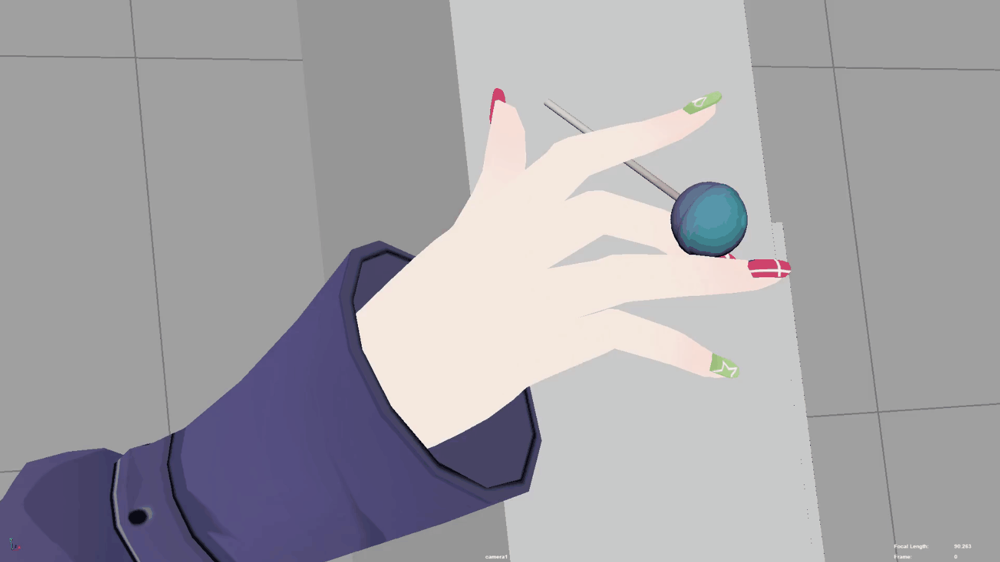
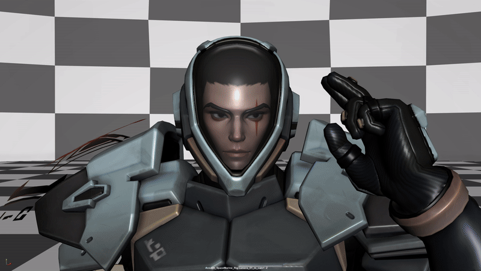
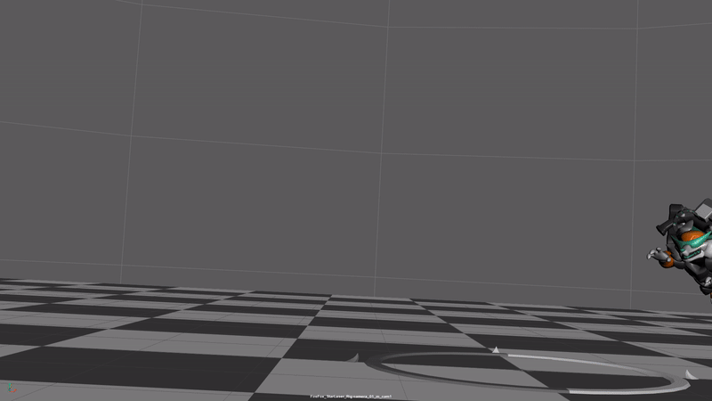
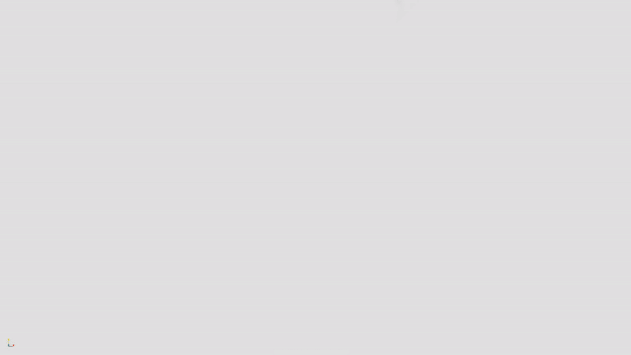
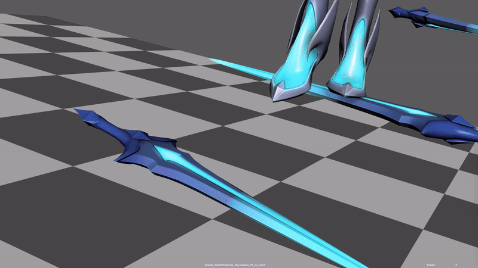
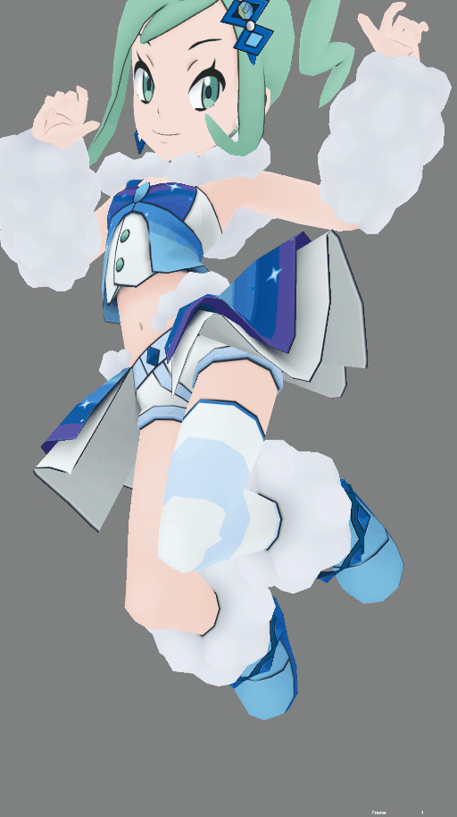
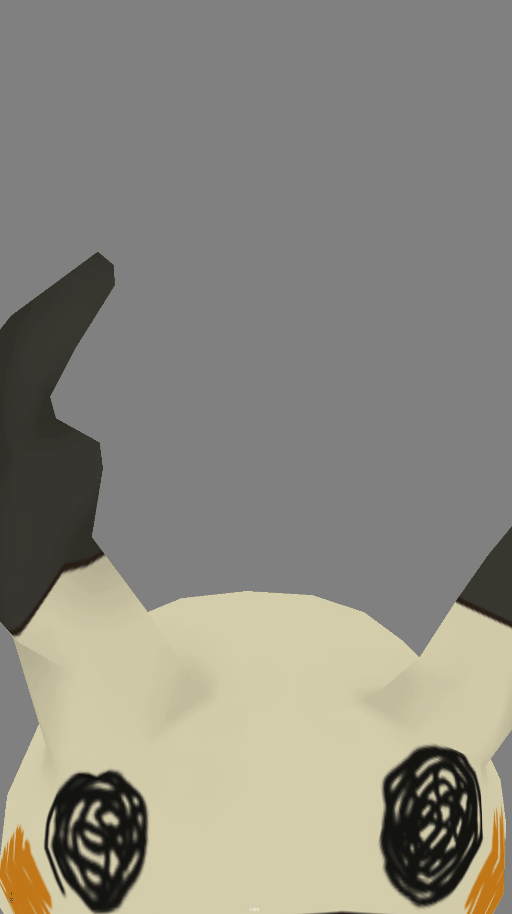
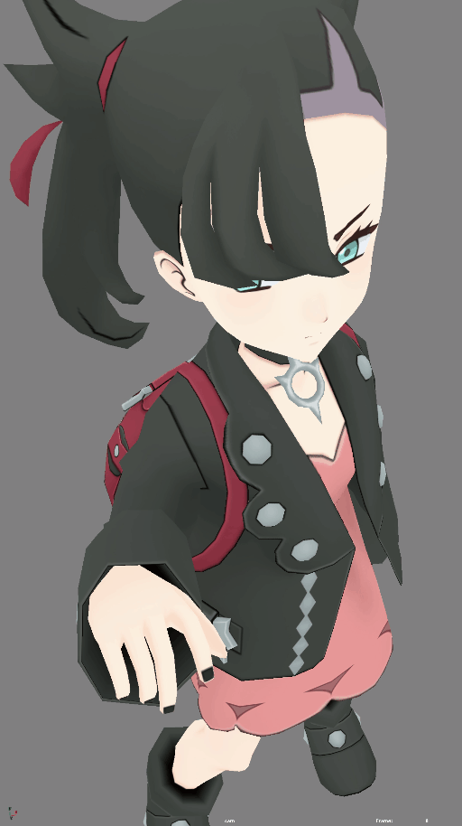
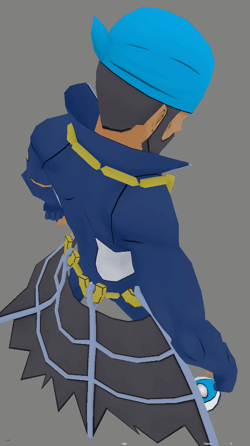

## **👀 In-game Cutscene**

- This motion should be around 60 \~ 300 frames

- The duration of this motion should be around 5 \~ 7 MDs depending on the complexity of it (from blocking all the way to polish)

- You are allowed to use more than 1 shot for the entire duration

> Here are some "Ara ara..." examples, courtesy of the DSG project 😘

## **🎭 Character Intro/Outro**

- This motion should be around 120 \~ 140 frames (Please do not exceed 140 frames)

- The duration of this motion should be around 5 \~ 7 MDs depending on the complexity of it (from blocking all the way to polish)

- You are allowed to use more than 1 shot for the entire duration

> Here are some examples, courtesy of the LOKI project 😎
>
> 
>
> 
>
> Here are some examples, courtesy of the KENYA project 🌎

