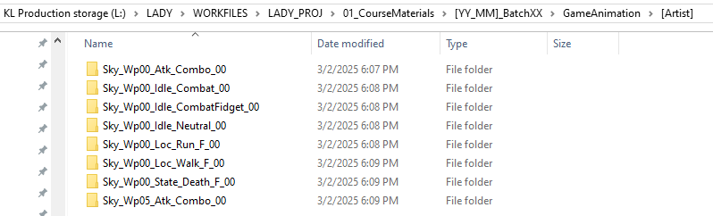
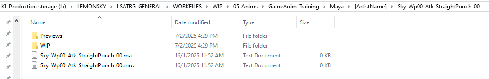
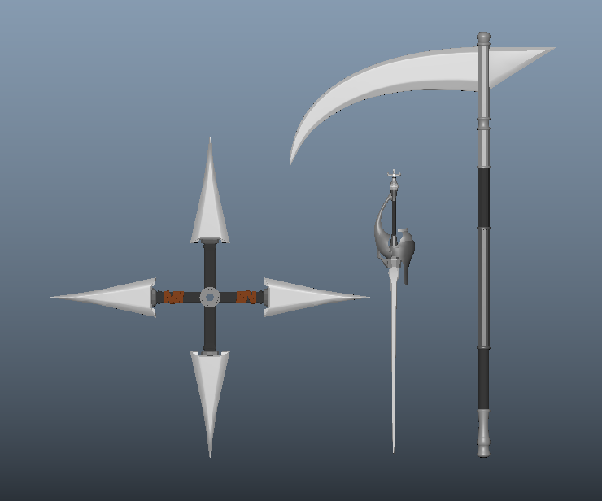

# Game Animation Training Overview

## **🥅 Goal**

Game Animation

- To further improve on the necessary fundamentals for game animation

- To give the artist a general idea of what is to be expected of game animation

- To expose artists to basic technical skills that are fundamental to game animation

- To make it a habit for the artist to use self reference or video reference to better understand body mechanics

# **🎬 Style**

- Realistic exaggeration for game animation (Realistic body weight and physics but with exaggerated poses and timing)

# **[📁]{.mark} Folder Structure**

Generally, the folders can be divided into 2 directories, they are;

- LADY_PROJ

- WIP

### **⭐ LADY_PROJ** 

- This directory is considered the **Master Directory**

- Once the motion is considered approved, both maya and playblast files will be safely stored under their respective type of training for each individual artist for future references or as material for Lemon Sky's Animation Reel

> **L:\\LADY\\WORKFILES\\LADY_PROJ\\01_CourseMaterials\\\[YY_MM\]\_BatchXX\\\[GameAnimation\]\\\[ArtistName\]\\\[MotionName\]**
>
> 

### **👷🏻‍♀️ WIP** 

- This directory is where all Work-In-Progress (WIP) files will go to under their respective artist name

- Each respective motion folder should always have a Previews and WIP folder to store your working maya and playblast files

- You may put the finalized and cleaned up files outside the folders so that it may be copied to the Master Directory

#### **Playblast files**

> **L:\\LADY\\WORKFILES\\WIP\\01_CourseMaterials\\\[YY_MM\]\_BatchXX\\\[GameAnimation\]\\\[ArtistName\]\\\[MotionName\]\\\[Previews\]**

#### **WIP Maya files**

> **L:\\LADY\\WORKFILES\\WIP\\01_CourseMaterials\\\[YY_MM\]\_BatchXX\\\[GameAnimation\]\\\[ArtistName\]\\\[MotionName\]\\\[WIP\]**

# **💬 File Naming Conventions**

### **📔 Terminology Description for Basic & Advance**

> **\[Character\]** ➡ Lemon *(Female)* \| Sky *(Male)*
>
> **\[WeaponType\]** ➡ Fist \| Dagger \| Rapier \| etc
>
> *(Wp01 / Wp02 / Wp03 / etc)*
>
> **\[MotionType\]** ➡ Idle \| Locomotion \| Attack \|
>
> Skill \| State \| Emote
>
> **\[MotionSubType_Direction\]** ➡ Further description of the
>
> MotionType with the intended
>
> direction (Locomotion and
>
> Attack will be shortened to Loc
>
> and Atk)
>
> ➡ **[❕❕❕ Only Locomotion,]{.mark}**
>
> **[Attacks and Death will]{.mark}**
>
> **[have direction *(other* ]{.mark}**
>
> ***[motions will generally be]{.mark}***
>
> **[*facing to the front)* ❕❕❕]{.mark}**
>
> Attack has 9 directions ➡ CL \| CR \| L \| R \| UL \| UR \| U \|
>
> DL \| DR
>
> Locomotion has 8 directions ➡ F \| B \| L \| R \| FL \| FR \| BL \|
>
> BR
>
> Death has 4 directions ➡ F \| B \| L \| R
>
> **\[Variation\]** ➡ Variation of the motion
>
> **\[ClientVersion\]** ➡ Versioning for the client side
>
> *(VXXX eg. V001 )*
>
> **\[AnimationStage\]** ➡ Blocking \| Spline \| Final *(BLK \|*
>
> *SPL \| FNL)*
>
> **\[InternalRevision\]** ➡ Versioning for internal
>
> revisions *(RXXX eg. R001)*
>
> The naming convention of both working maya file and working playblast should be as the following;
>
> **\[Character\]**\_**\[WeaponType\]**\_**\[MotionType\]**\_**\[Motio**
>
> **nSubType_Direction\]**\_**\[Variation\]**\_**\[ClientVersion\]**\_**\[AnimationStage\]**\_**\[InternalRevision\]**
>
> Examples:
>
> **Lemon**\_**Wp00**\_**Idle**\_**Neutral**\_**00**\_**V001**\_**BLK**\_**R001**
>
> **Lemon**\_**Wp01**\_**Loc**\_**Walk_F**\_**01**\_**V002**\_**BLK**\_**R010**
>
> **Lemon**\_**Wp02**\_**Atk**\_**Melee_CR**\_**00**\_**V010**\_**BLK**\_**R004**
>
> **Sky**\_**Wp03**\_**Atk**\_**Slash_DL**\_**00**\_**V003**\_**SPL**\_**R100**
>
> **Sky**\_**Wp04**\_**Skill**\_**Blizzard**\_**00**\_**V100**\_**SPL**\_**R200**
>
> **Sky**\_**Wp05**\_**State**\_**Death**\_**00**\_**V999**\_**FNL**\_**R999**
>
> **Sky**\_**Wp05**\_**Emote**\_**Happy**\_**00**\_**V100**\_**FNL**\_**R100**
>
> **[❕❕ For Master Files, please remove... ❕❕]{.mark}**
>
> **\[ClientVersion\]**\_**\[AnimationStage\]**\_**\[InternalRevision\]**

# **🔪 Weapon Choices**

> Wp00 ➡ Fist
>
> Wp01 ➡ Dagger
>
> Wp02 ➡ Rapier
>
> Wp03 ➡ One-handed Sword
>
> Wp04 ➡ Two-handed Sword
>
> Wp05 ➡ Long Stick
>
> Wp06 ➡ Axe
>
> Wp07 ➡ Scythe
>
> Wp07 ➡ Sword & Shield
>
> Wp08 ➡ Wand
>
> Wp09 ➡ Staff
>
> Wp10 ➡ Fuma Shuriken
>
> Wp11 ➡ Bow & Arrow
>
> 
