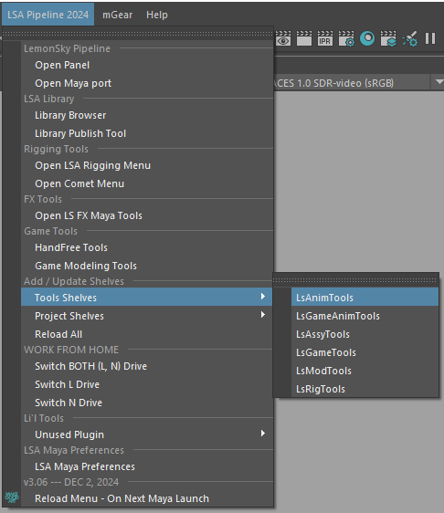
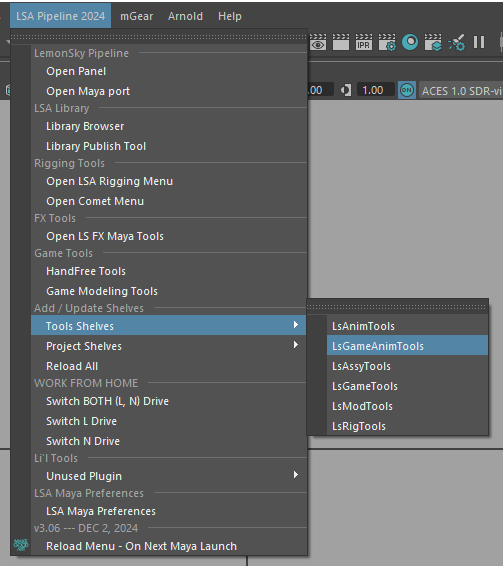
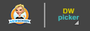
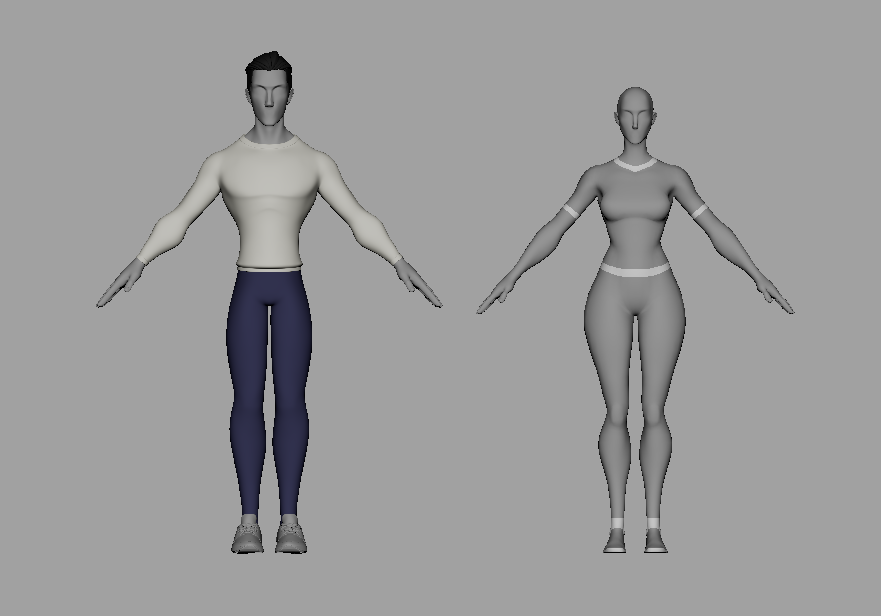
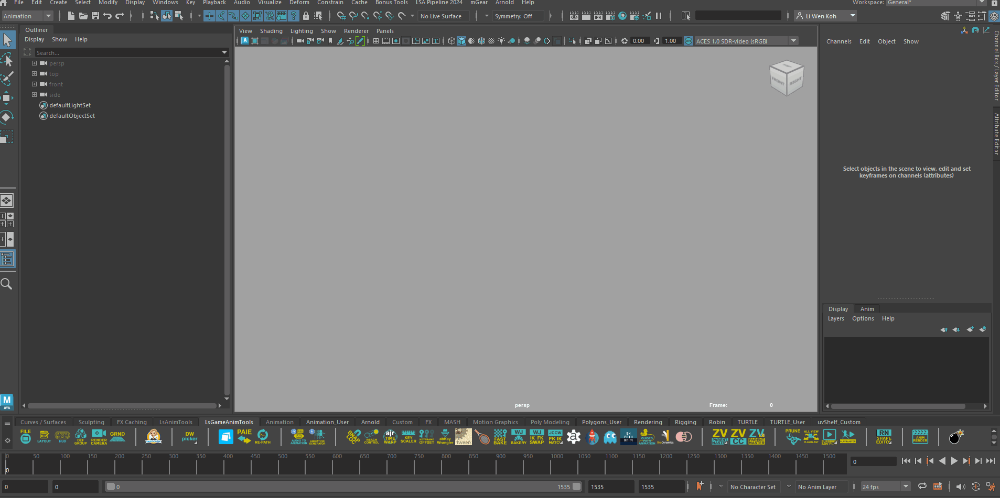
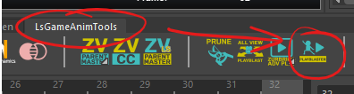
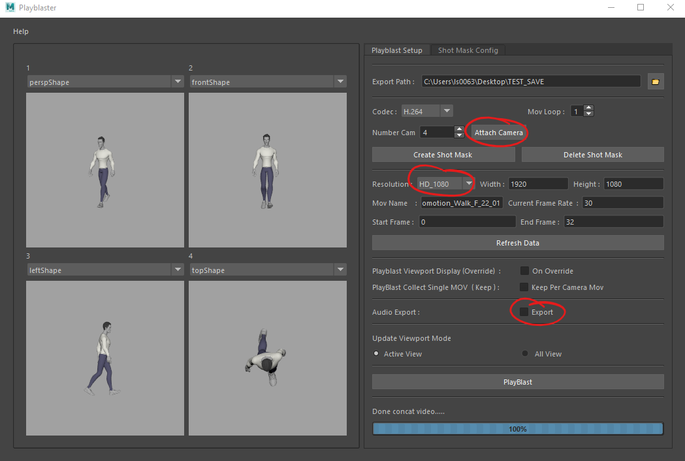

**💻 Pipeline Requirement**

- Maya 2023

- Keyframe Pro 1.15.1 (or higher)

- QuickTime 7.7.9 (for Maya playblasting codec)

- SkyChat

- Google Chrome

- Access to L Drive

# **🧰 Shelf**

> Most of the scripts and tools required will come from this shelf;
>
> LSA Pipeline 2024 ➡ Tools Shelves ➡ LsAnimTools / LsGameAnimTools
>
> 

# **👉🏻 Picker 👈🏻**

> You will have 2 choices of pickers to pick from ;
>
> 
>
> AnimSchool Picker (left)

- uses .pkr

> DreamWall Picker (right)

- uses .json

> Please grab the picker from here
>
> **L:\\LADY\\PRODUCTION\\07_Libraries\\05_Anims\\02_Pickers**

# **[🕺🏻 Rigs (PENDING FEMALE ver)]{.mark}**

> 
>
> You will be using the LADY_LSA_Body_Rig which you will be able to find over here;

**L:\\LADY\\WORKFILES\\LADY_PROJ\\03_Rigs\\SkyA**

Or you can load it from the Library Browser

# **🕴🏻 Studio Library** 

> Please link your studio library to this path so that you may use/share poses and animations
>
> **L:\\LADY\\PRODUCTION\\07_Libraries\\05_Anims\\01_StudioLibrary**

# **📦 Cache**

- Alternative method for checking poses

- If you have a cache that you want to share or use, please use this path

> **L:\\LADY\\PRODUCTION\\07_Libraries\\05_Anims\\03_Cache**

# **💿 Format**

> Maya files

- Game Animation

  - Maya ASCII (.ma)

  - 30 FPS

  - **[❗❗❗ Start your motion at frame 0 ❗❗❗]{.mark}**

- Cinematic

  - Maya ASCII (.ma)

  - 24 FPS

  - **❗❗❗ Start your motion at frame 101 ❗❗❗**

> Playblast files

- Quicktime (H.264 & .mov)

- 1920 x 1080 (HD 1080p)

- Game Animation

  - 4 angles (perspective, front, side (left or right) and top)

- Cinematic

  - Depends on how many cameras you have set up; if more than 1, please use a camera sequencer

# **📹 Playblast**

Game Animation

- Use the Playblaster tool from the LsGameAnimTools shelf to create a video

> 

- Ensure the following are set correctly

  - 4 cameras are attached

    - Perspective view (top screen left)

    - Front view (top screen right)

    - Left/Right view (bottom screen left)

    - Top view (bottom screen right)

  - The background is light grey

  - Turn off the wireframe/grid/controls (all you need is the mesh)

  - HD 1080p resolution

  - check/uncheck the box for the audio export

> 

# **📏 Working Units**

- 1cm ➡ 1 unit (u)

- u is for Unreal units

# **🎭 Reference**

Please refer to the link below or if you find something that piqued your interest,

let your lead know, so that it may be downloaded and stored here 👇🏻

**L:\\LADY\\PRODUCTION\\06_References\\05_Anims**
