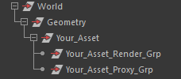
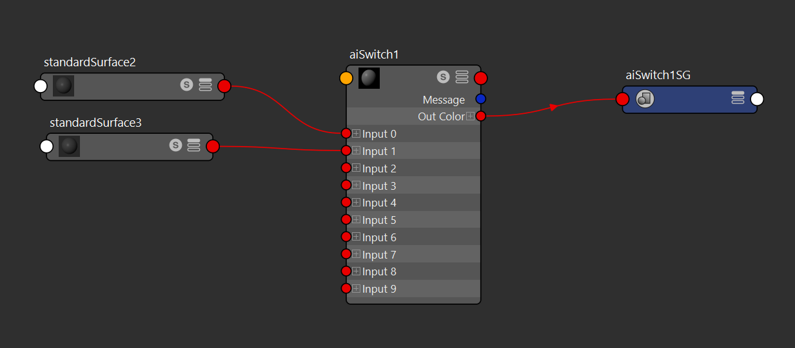
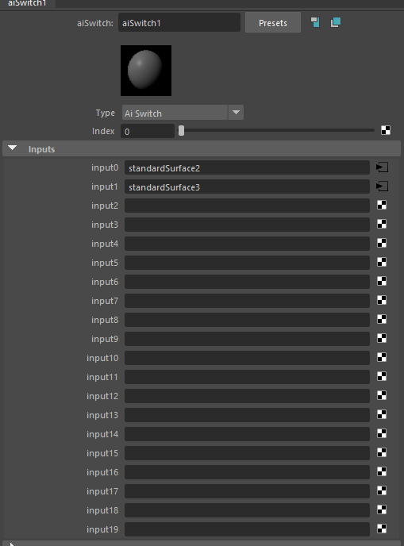

# Exports

## Exports - Setting up the Outliner

This toolset will export maya geometry to usd geometry given a coorect outliner structuring. Note that the toolset will initiate a "parent to world". However the geometry will be sorted back how it was after the export is complete. 

Important Geometry structuring to adhere:

> TAKE NOTE:  Your_Asset should be without _Grp or _Group or anything else alike. This to to ensure the export name is Your_Asset. 
 
 

## Exports - Setting up for material export

This toolset will export materials that are attached to the geometry, both in the render and proxy group. Note that this toolset will look for the common `aiSwitch` node that is widely used in materials buidling in Lemonsky. 

> In this example standardSurface2 and standardSurface3 will be exported as matVariants. 

 
 

> Total of 19 possible matVariants
 

