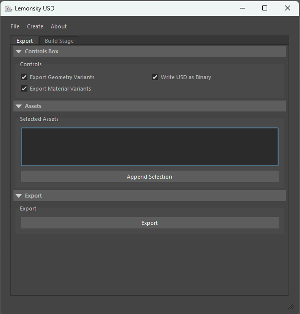
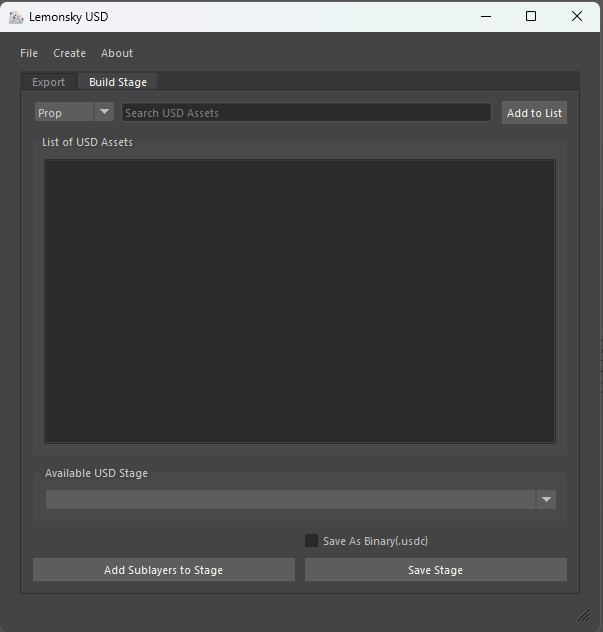
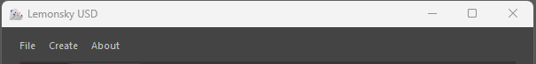

# Lemonsky USD User Guide

Lemonsky custom UI is designed to export Maya's native geometry to USD asset; supporting multiple variants, payload and stage building for studio workflow. The features of Lemonsky USD toolset is to automate I/O of USD data in Maya. The unique feature of proxy and render assets, payload, geometry variants and material variants are added in as part of a custom addition.  

## Getting Started
### Interface

|  |  |
| ----------------------------------------------------------------| --------------------------------------------------------------------------|

### Export Tab

#### Control Box

1. `Export Geometry Variants` - Enables export of multiple variants of geometry
2. `Export Material Variants` - Enables export of multiple variants of materials in each geometry
3. `Write USD as Binary` - Enables USD export of binary or ASCII file content. 

#### Assets

1. `Selected Asset` - Drag and drop selected assets from the outliner in to the box. Selected assets are asset that will be exported as a USD data.

#### Export

1. `Export` - Exports the selected assets in the selected asset box.  

### Build Stage Tab

Category Selection allows user to toggle between assets category before selecting asset in the search box. 


```markdown
> Notable Shortcuts
1. Press `ENTER` after selecting a USD Asset, this will automatically add the asset into the list.
2. Press `DELETE` in the list of USD item to remove the selected asset. 
3. `Ctrl + F5` refresh the list of stages in the UI.
```
<br>

1. `Search USD Asset` - Search for assets available in the project directory. 
2. `Add to list` - Append the selected asset in to the list of USD assets. 
3. `Available USD Stage` - List down all the stages in the scene.
4. `Save As Binary(.usdc)` - Enables the stage export content to be written as a binary. Defaults as ASCII.
5. `Add Sublayers to Stage` - Add all the USD assets in the list to the selected stage. NOTE: This does not save the stage
6. `Save Stage` - Save the stage to disk. 

### Dropdown Functions



#### File

1. `Update Database` - This toolset is supported by a data file that store all the asset name and path. Updating the database once in a while to get the latest assets in the project directory. 
2. `Load custom database` - Disabled feature.
3. `Refresh Stages` - refresh the list of stages in the UI.
4. `Save All Stages` - Save all stages in the disk to disk. Disabled feature. 
5. `Create USD Stage With New Layer` - Creates an empty stage with an anonymous layer.
6. `Create USD Stage From Existing File` - Creates a stage from an existing file.
